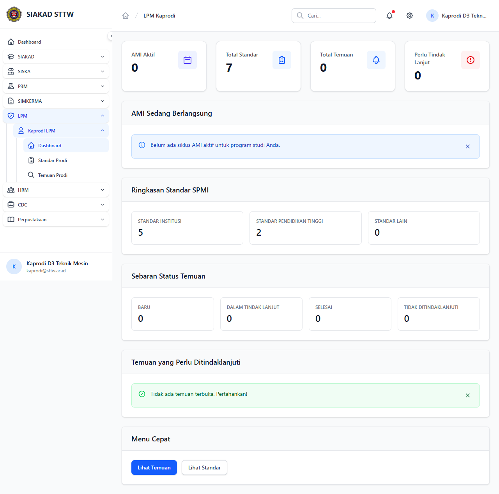

# Workflow Report: Dashboard Kaprodi

**Tanggal**: 2026-04-18  
**Role**: Kaprodi  
**Modul**: LPM > Kaprodi  
**Fitur**: Dashboard Kaprodi  
**Status**: ✅ Berhasil

## Ringkasan

Dashboard kaprodi menampilkan temuan AMI untuk program studi yang dipimpin.

Semua 1 langkah pada scan ini lolos tanpa error.

## Langkah-langkah

### 1. Dashboard Kaprodi

Halaman utama kaprodi dengan ringkasan temuan dan status tindak lanjut.

## Temuan & Masalah

Tidak ada temuan kritis pada scan ini.

## Catatan

- Screenshot diambil secara otomatis menggunakan Playwright.
- Data yang ditampilkan berasal dari data dummy/seeder yang tersedia pada saat scan.
- Status report mengikuti hasil scan aktual; langkah yang gagal tidak lagi ditandai sebagai sukses.
