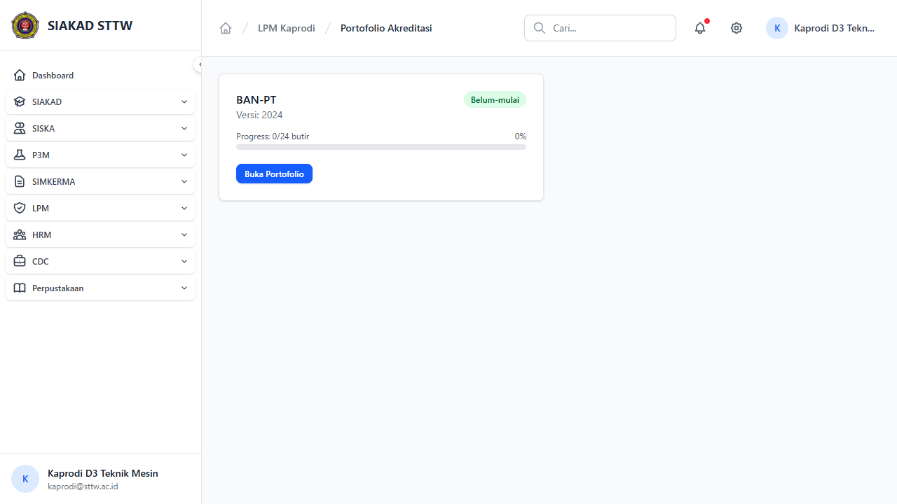

# Workflow Report: LPM Kaprodi Portofolio Akreditasi

**Tanggal**: 2026-05-12
**Role**: kaprodi
**Modul**: lpm
**Fitur**: kaprodi-portofolio
**Status**: ✅ Berhasil

## Deskripsi Workflow

Portofolio akreditasi prodi.

## Ringkasan

Halaman diakses pada delta scan pertengahan April 2026.

## Langkah-langkah

### 1. Buka halaman LPM Kaprodi Portofolio Akreditasi

**Deskripsi**: Pengguna (kaprodi) membuka `/lpm/kaprodi/portofolio`.

**URL**: `http://127.0.0.1:8000/lpm/kaprodi/portofolio`

## Temuan & Masalah

_Tidak ada temuan signifikan._

## Catatan

- Diambil otomatis pada batch scan delta pertengahan April 2026.
