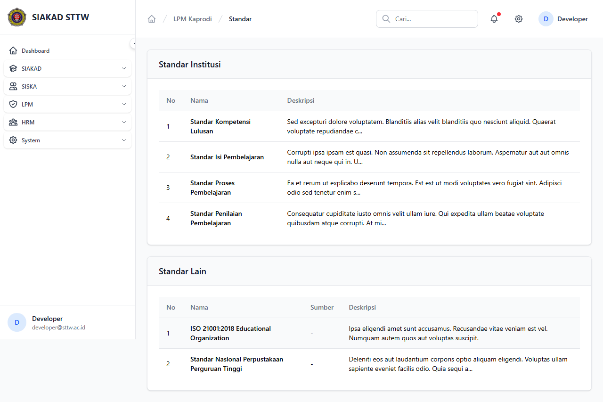

# Workflow Report: Standar Prodi

**Tanggal**: 2026-04-18  
**Role**: Kaprodi  
**Modul**: LPM > Kaprodi  
**Status**: ✅ Berhasil

## Ringkasan

Melihat standar yang berlaku untuk program studi yang dipimpin.

## Langkah-langkah

### 1. Daftar Standar

Tabel standar yang berlaku untuk prodi kaprodi.

## Catatan

- Screenshot diambil secara otomatis menggunakan Playwright
- Data yang ditampilkan adalah dummy data dari LpmDummySeeder

