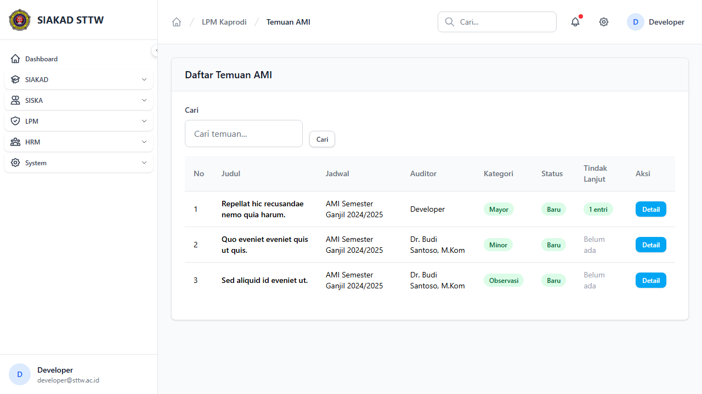
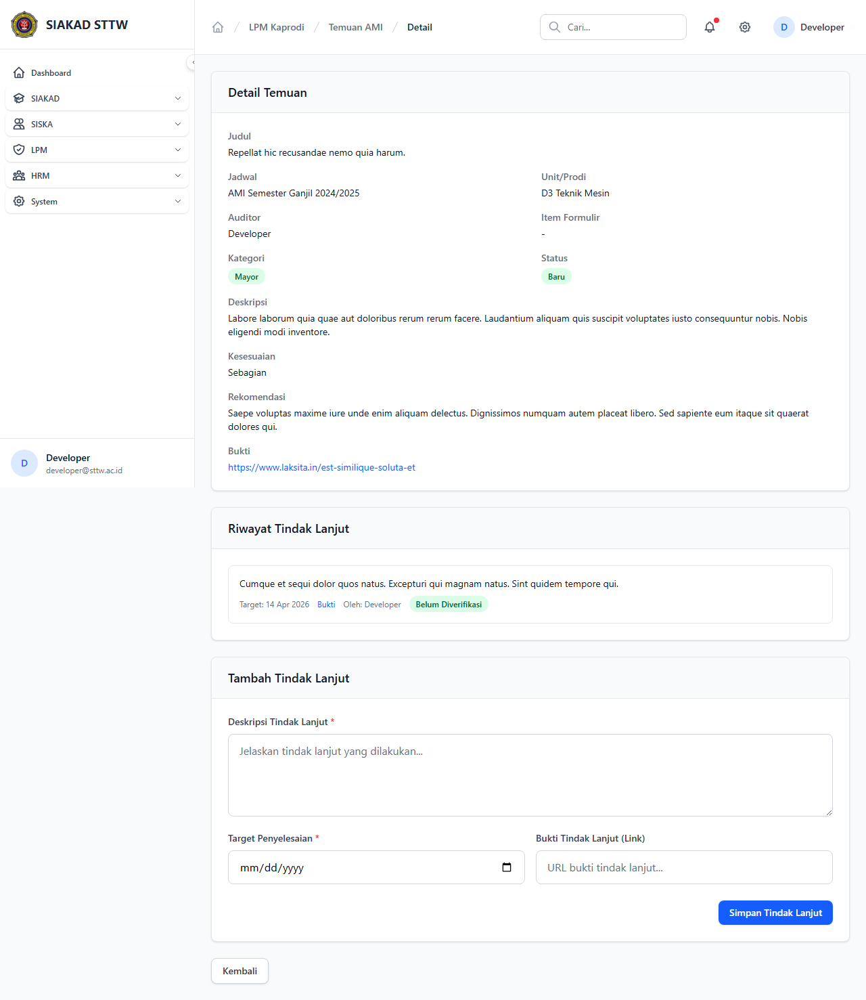

# Workflow Report: Temuan Prodi

**Tanggal**: 2026-04-18  
**Role**: Kaprodi  
**Modul**: LPM > Kaprodi  
**Status**: ✅ Berhasil

## Ringkasan

Melihat temuan AMI untuk prodi dan memberikan tindak lanjut.

## Langkah-langkah

### 1. Daftar Temuan Prodi

Tabel temuan AMI untuk program studi kaprodi.

### 2. Detail Temuan & Tindak Lanjut

Detail temuan dengan form tindak lanjut yang bisa diisi kaprodi.

## Catatan

- Screenshot diambil secara otomatis menggunakan Playwright
- Data yang ditampilkan adalah dummy data dari LpmDummySeeder

