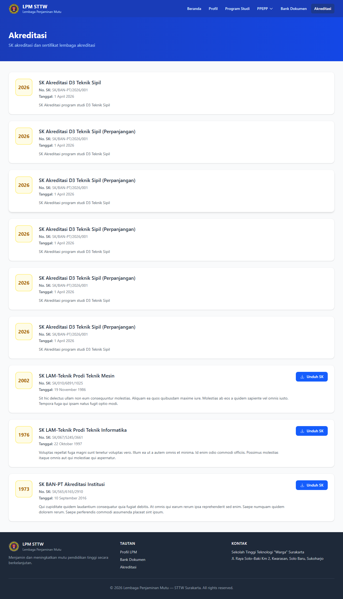

# Workflow Report: Portal LPM - Akreditasi

**Tanggal**: 2026-04-18  
**Role**: Publik  
**Modul**: LPM Portal  
**Fitur**: Portal LPM - Akreditasi  
**Status**: ✅ Berhasil

## Ringkasan

Daftar SK akreditasi institusi dan program studi pada portal publik.

Semua 1 langkah pada scan ini lolos tanpa error.

## Langkah-langkah

### 1. SK Akreditasi

Daftar surat keputusan akreditasi yang bersifat publik.

## Temuan & Masalah

Tidak ada temuan kritis pada scan ini.

## Catatan

- Screenshot diambil secara otomatis menggunakan Playwright.
- Data yang ditampilkan berasal dari data dummy/seeder yang tersedia pada saat scan.
- Status report mengikuti hasil scan aktual; langkah yang gagal tidak lagi ditandai sebagai sukses.
- Halaman ini dapat diakses tanpa login (portal publik).
- Hanya menampilkan dokumen dengan akses "Publik".
