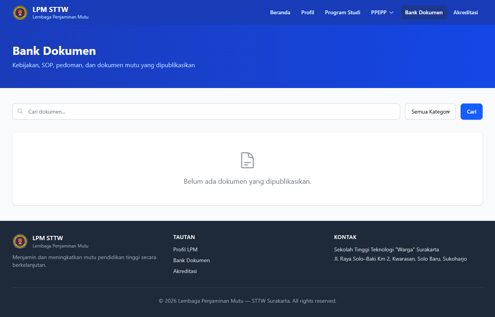

# Workflow Report: LPM Portal Dokumen (Public)

**Tanggal**: 2026-05-12
**Role**: public
**Modul**: lpm
**Fitur**: portal-dokumen
**Status**: ✅ Berhasil

## Deskripsi Workflow

Bank dokumen publik LPM.

## Ringkasan

Halaman diakses pada delta scan pertengahan April 2026.

## Langkah-langkah

### 1. Buka halaman LPM Portal Dokumen (Public)

**Deskripsi**: Pengguna (public) membuka `/lpm/portal/dokumen`.

**URL**: `http://127.0.0.1:8000/lpm/portal/dokumen`

## Temuan & Masalah

_Tidak ada temuan signifikan._

## Catatan

- Diambil otomatis pada batch scan delta pertengahan April 2026.
