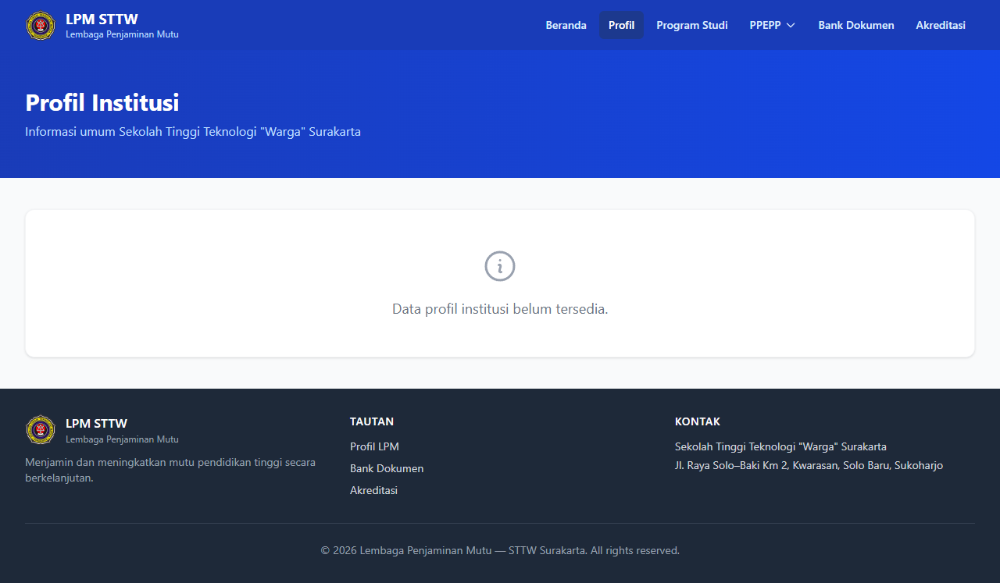

# Workflow Report: LPM Portal Profil (Public)

**Tanggal**: 2026-05-12
**Role**: public
**Modul**: lpm
**Fitur**: portal-profil
**Status**: ✅ Berhasil

## Deskripsi Workflow

Profil institusi STTW (publik).

## Ringkasan

Halaman diakses pada delta scan pertengahan April 2026.

## Langkah-langkah

### 1. Buka halaman LPM Portal Profil (Public)

**Deskripsi**: Pengguna (public) membuka `/lpm/portal/profil`.

**URL**: `http://127.0.0.1:8000/lpm/portal/profil`

## Temuan & Masalah

_Tidak ada temuan signifikan._

## Catatan

- Diambil otomatis pada batch scan delta pertengahan April 2026.
