# P3M Admin - Arsip

**Role:** Admin

## Deskripsi

Manajemen arsip lengkap P3M: arsip penelitian, arsip pengabdian, arsip dosen, katalog, publikasi, dan HKI.

## Fitur

- Arsip Penelitian: CRUD arsip historis penelitian (judul, tahun, sumber dana, dll)
- Arsip Pengabdian: CRUD arsip historis pengabdian
- Arsip Dosen: Daftar rekap arsip per dosen
- Arsip Katalog: Daftar katalog produk penelitian/pengabdian
- Arsip Publikasi: Daftar publikasi ilmiah dosen
- Arsip HKI: Daftar Hak Kekayaan Intelektual
- Export: Export data arsip ke Excel

## Screenshots

### Arsip penelitian index

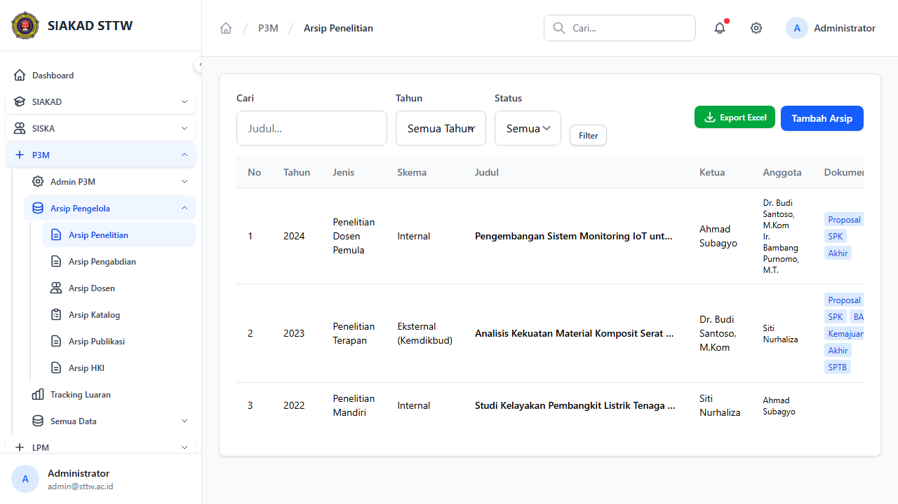

### Arsip penelitian create (scrolled)

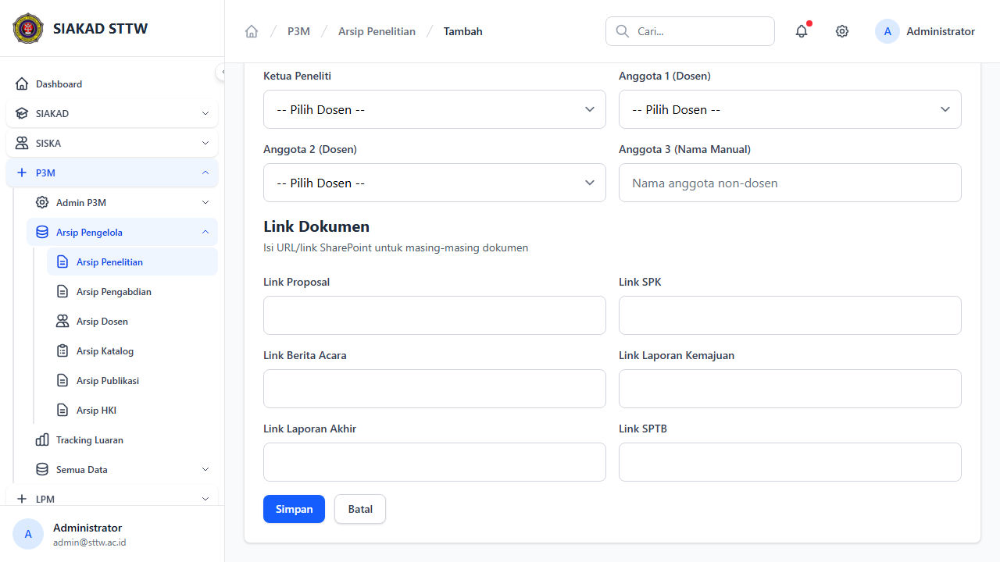

### Arsip penelitian create

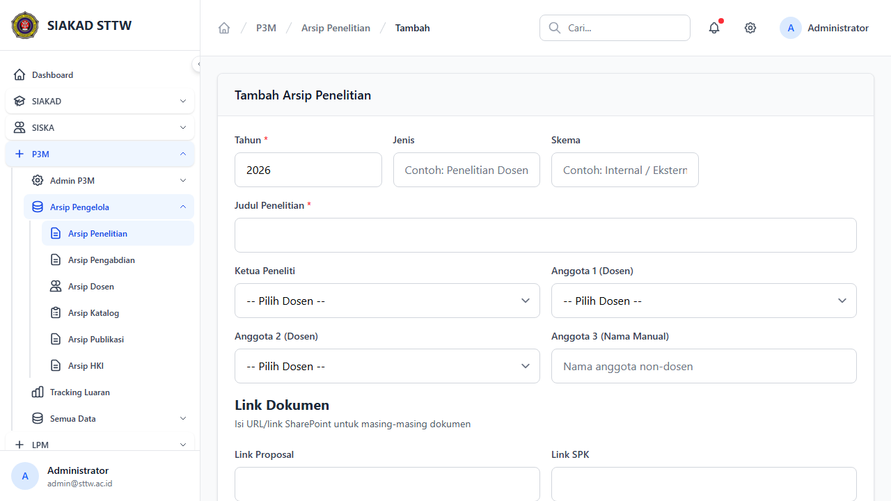

### Arsip penelitian edit (scrolled)

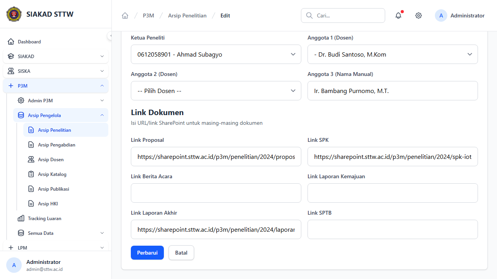

### Arsip penelitian edit

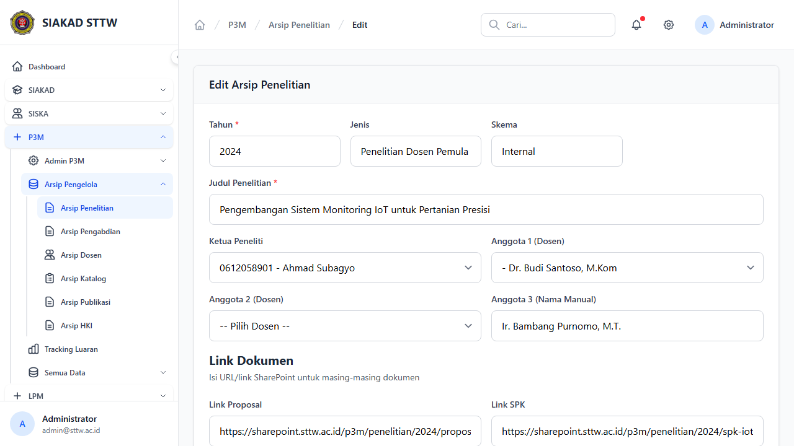

### Arsip pengabdian index

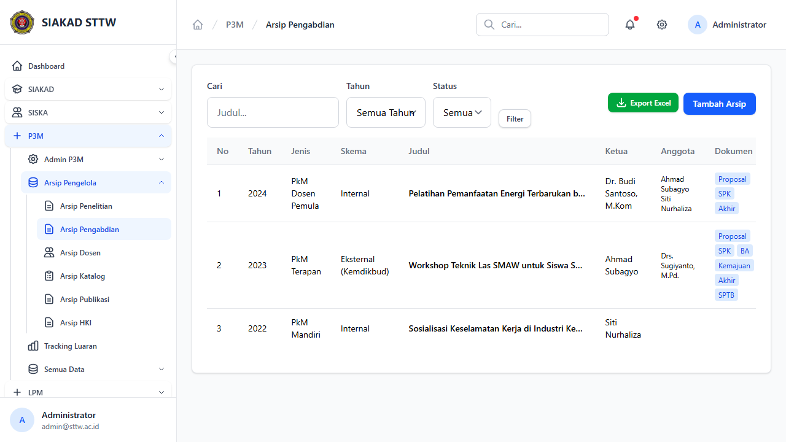

### Arsip pengabdian create (scrolled)

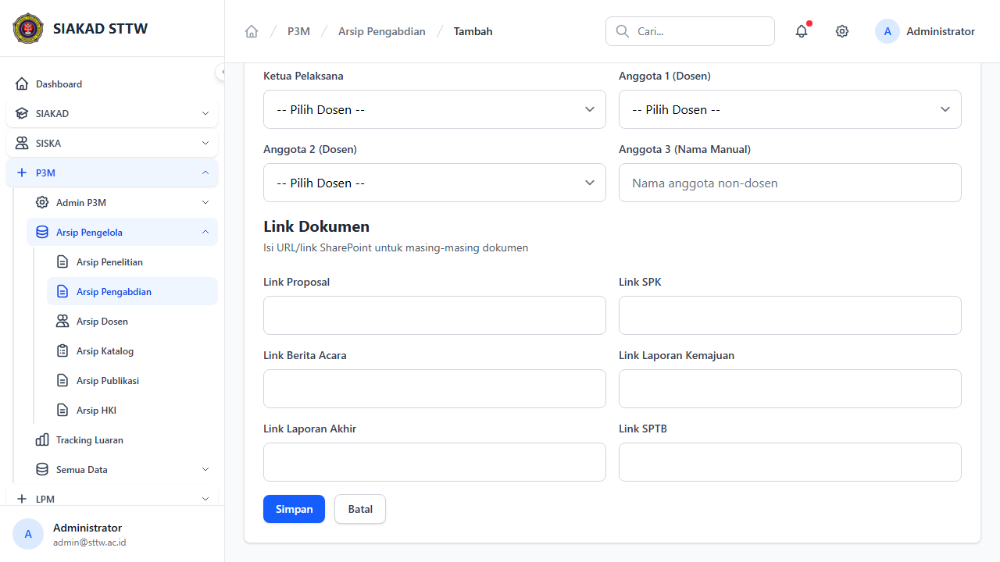

### Arsip pengabdian create

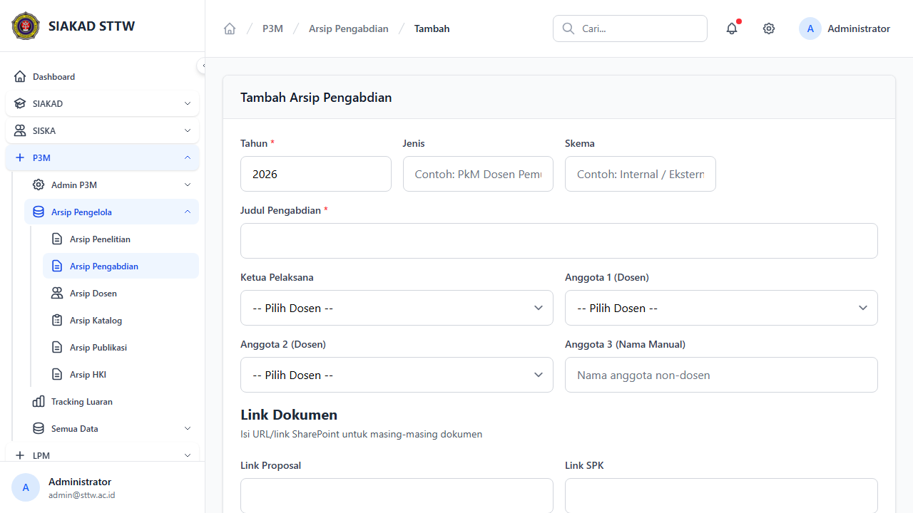

### Arsip pengabdian edit (scrolled)

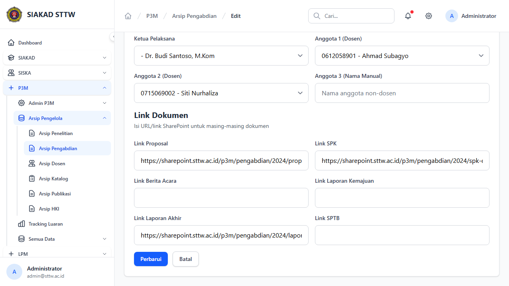

### Arsip pengabdian edit

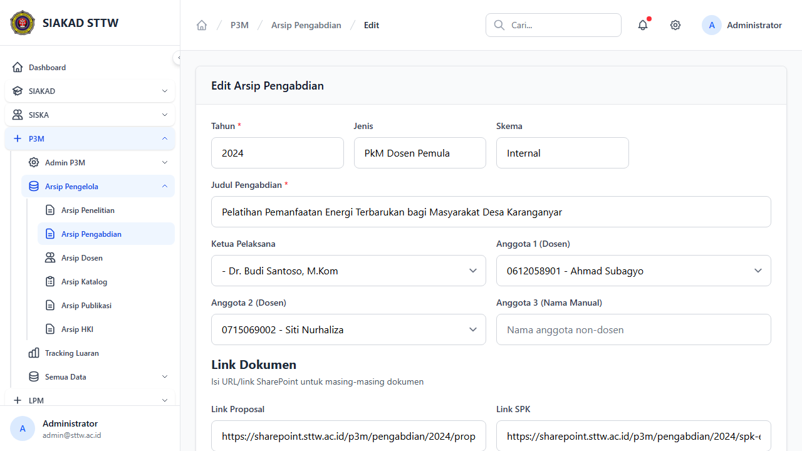

### Arsip dosen index (scrolled)

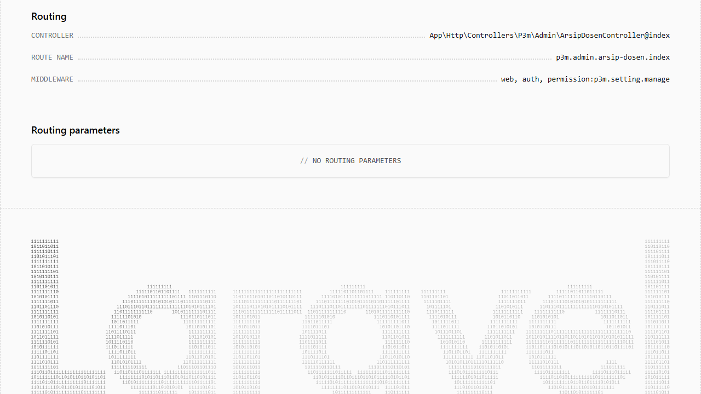

### Arsip dosen index

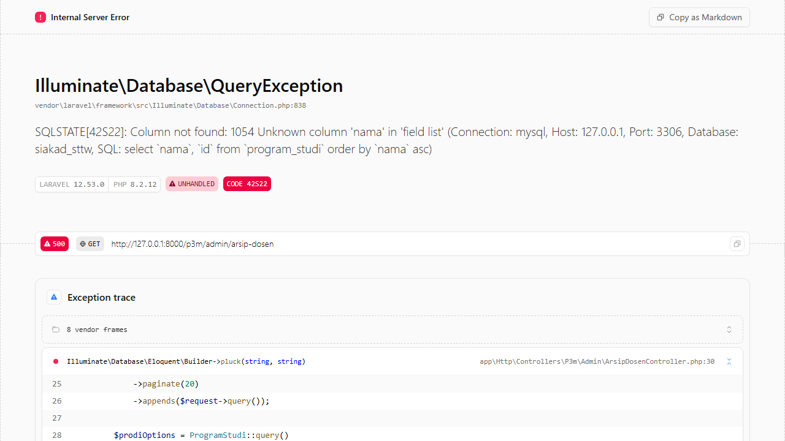

### Arsip katalog index

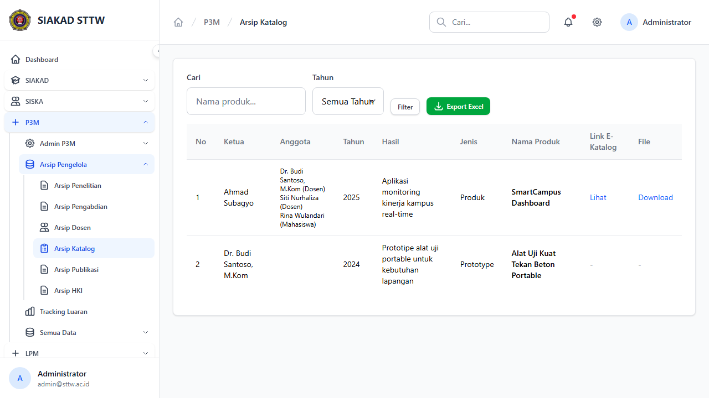

### Arsip publikasi index

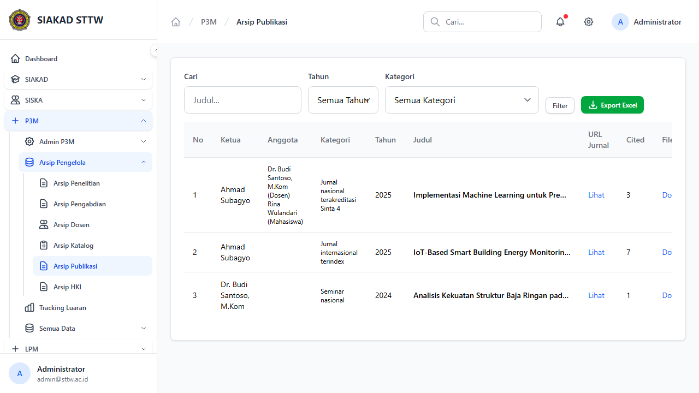

### Arsip hki index

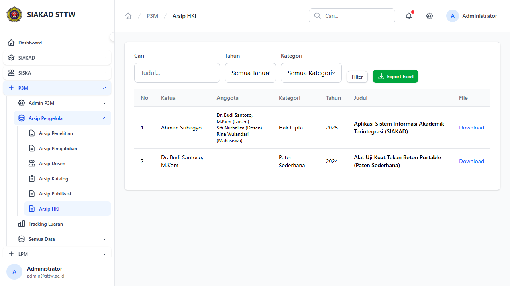

---
*Generated: 2026-04-13*
