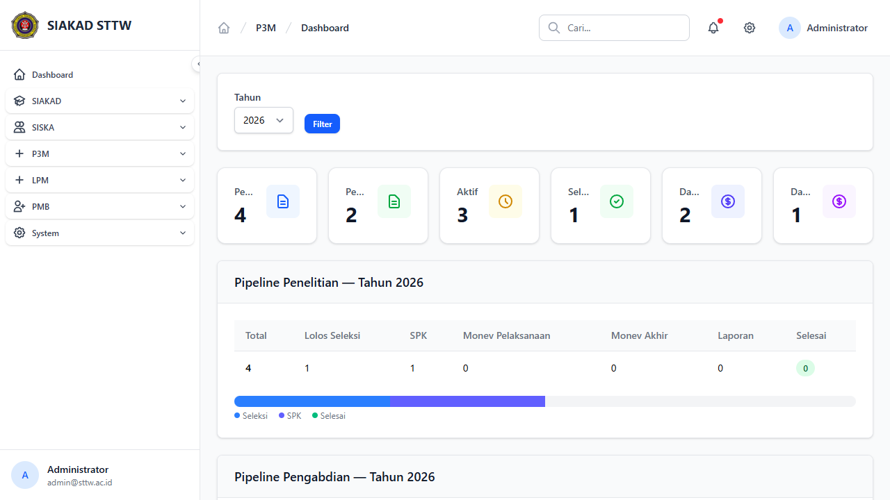
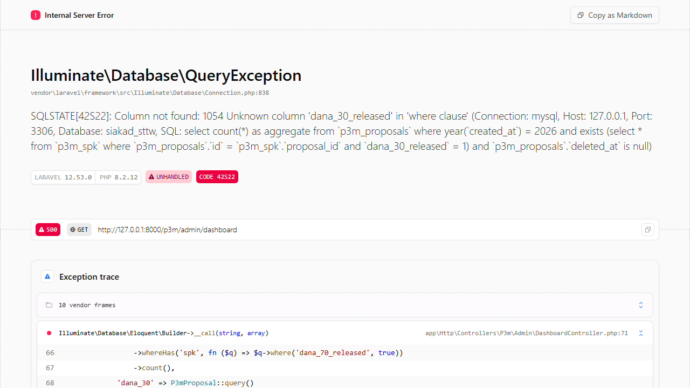
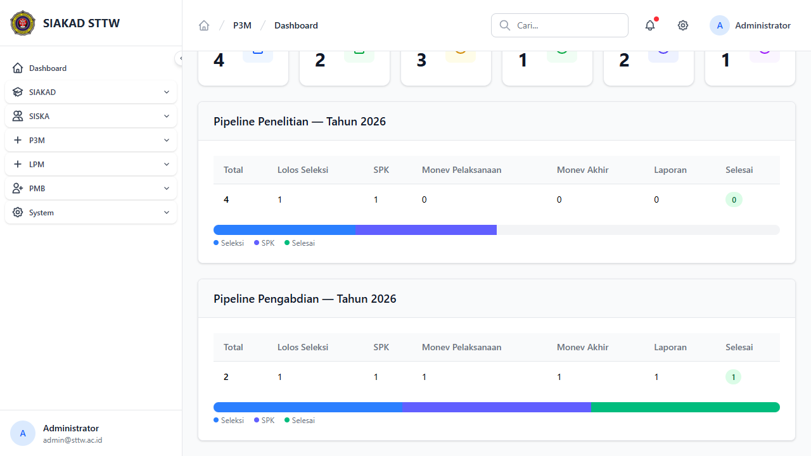

# P3M Admin Dashboard

**Role:** Admin

## Deskripsi

Dashboard utama modul P3M untuk admin. Menampilkan statistik proposal penelitian & pengabdian, status seleksi, SPK, monev, laporan, dan pencairan dana per tahun.

## Fitur

- Statistik ringkasan: total penelitian, total pengabdian, aktif, selesai, dana 70%, dana 30%
- Pipeline tracking per jenis (Penelitian & Pengabdian): total → seleksi → SPK → monev pelaksanaan → monev akhir → laporan → selesai
- Filter berdasarkan tahun

## Screenshots

### Admin dashboard top

### Admin dashboard

### Login page

### Admin dashboard bottom

---
*Generated: 2026-04-13*
