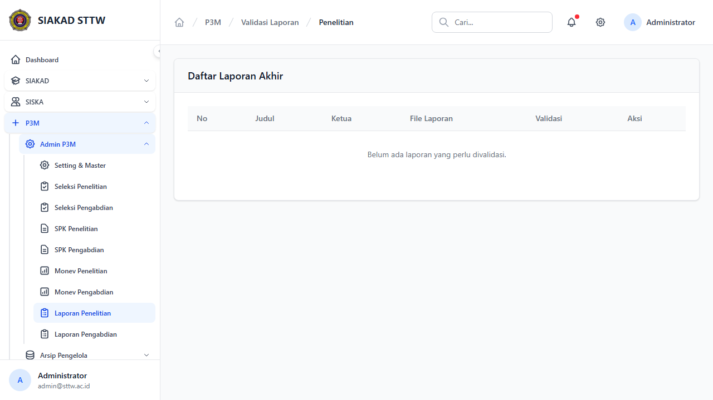
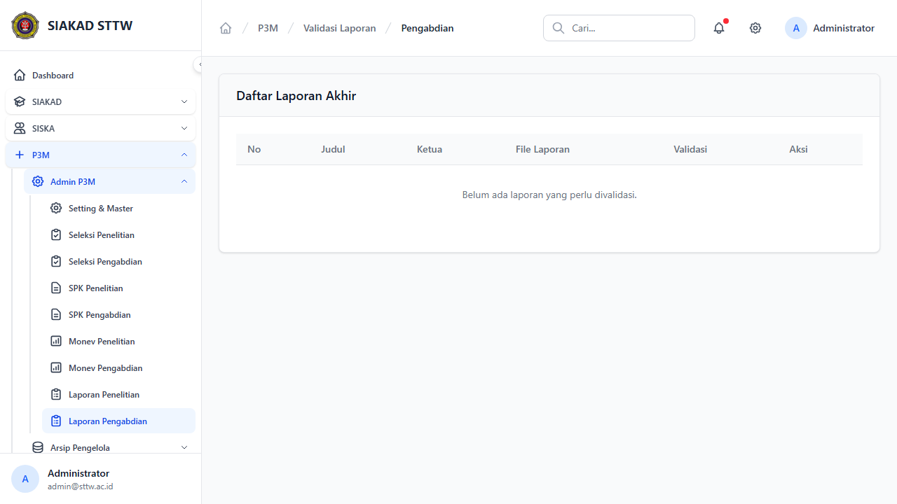
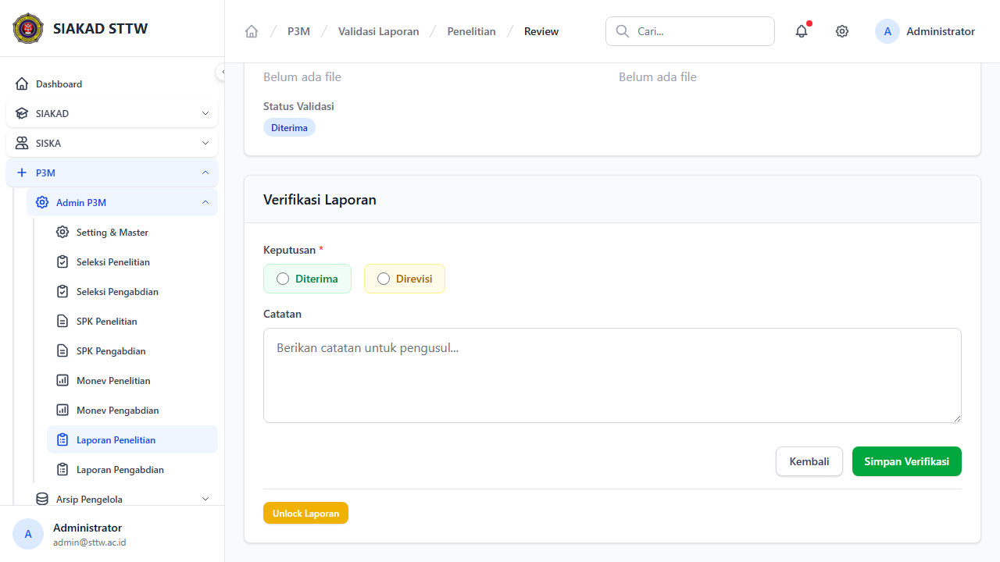
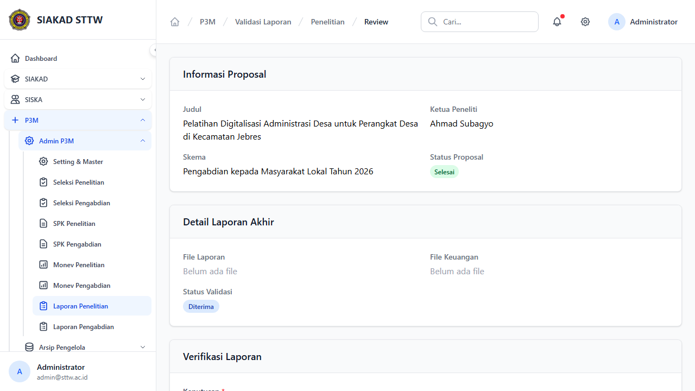

# P3M Admin - Validasi Laporan Akhir

**Role:** Admin

## Deskripsi

Validasi laporan akhir penelitian dan pengabdian. Admin dapat menerima atau merevisi laporan, serta merelease dana 30%.

## Fitur

- Index Penelitian: Daftar laporan akhir penelitian yang disubmit
- Index Pengabdian: Daftar laporan akhir pengabdian yang disubmit
- Detail/Show: Detail laporan akhir dengan dokumen, luaran wajib/tambahan
- Verifikasi: Terima/Revisi laporan akhir
- Release Dana 30%: Tandai pencairan dana tahap 2 setelah validasi

## Screenshots

### Laporan penelitian index

### Laporan pengabdian index

### Laporan show (scrolled)

### Laporan show

---
*Generated: 2026-04-13*
