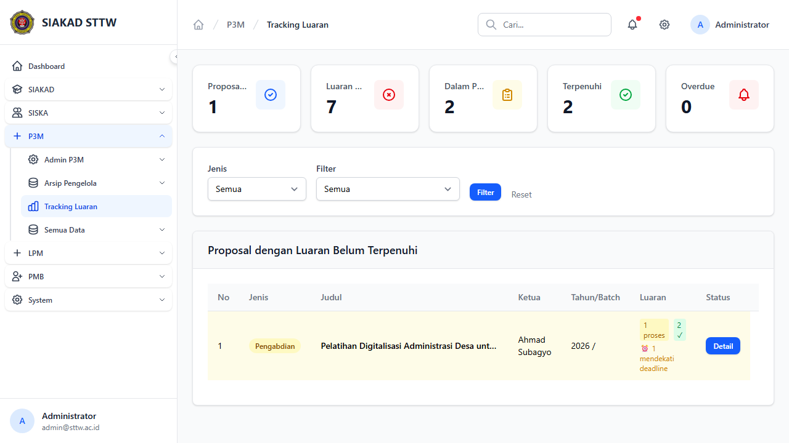
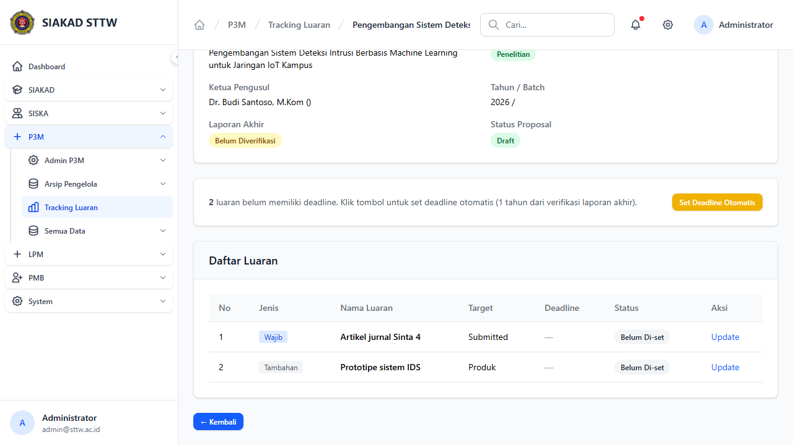
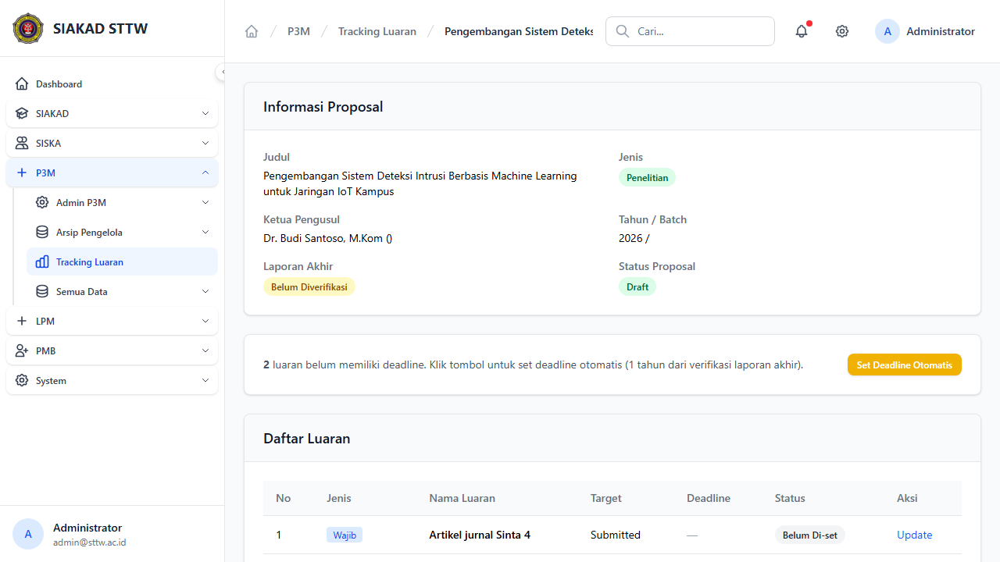

# P3M Admin - Tracking Luaran

**Role:** Admin

## Deskripsi

Monitoring luaran wajib dan tambahan dari proposal yang sedang berjalan. Admin dapat set deadline dan track progres.

## Fitur

- Index: Daftar proposal dengan status luaran
- Detail/Show: Detail luaran per proposal (wajib & tambahan)
- Update Status: Update status luaran (tercapai/belum)
- Set Deadline: Tentukan deadline pengumpulan luaran

## Screenshots

### Luaran index

### Luaran show (scrolled)

### Luaran show

---
*Generated: 2026-04-13*
