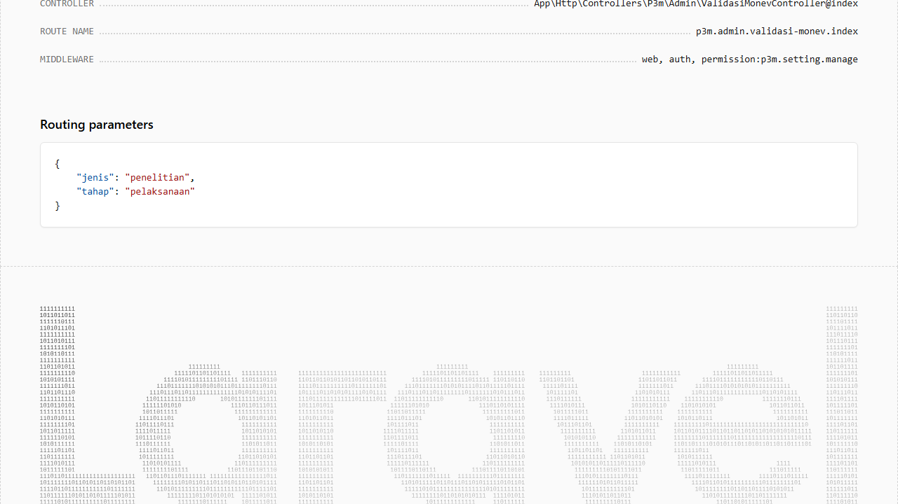
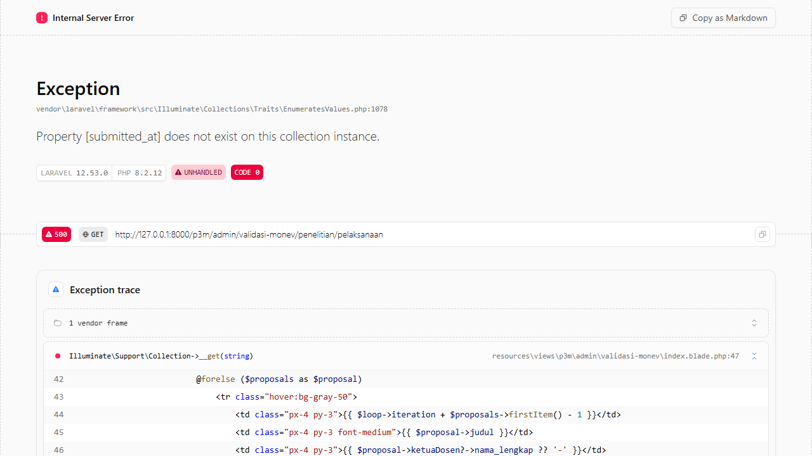
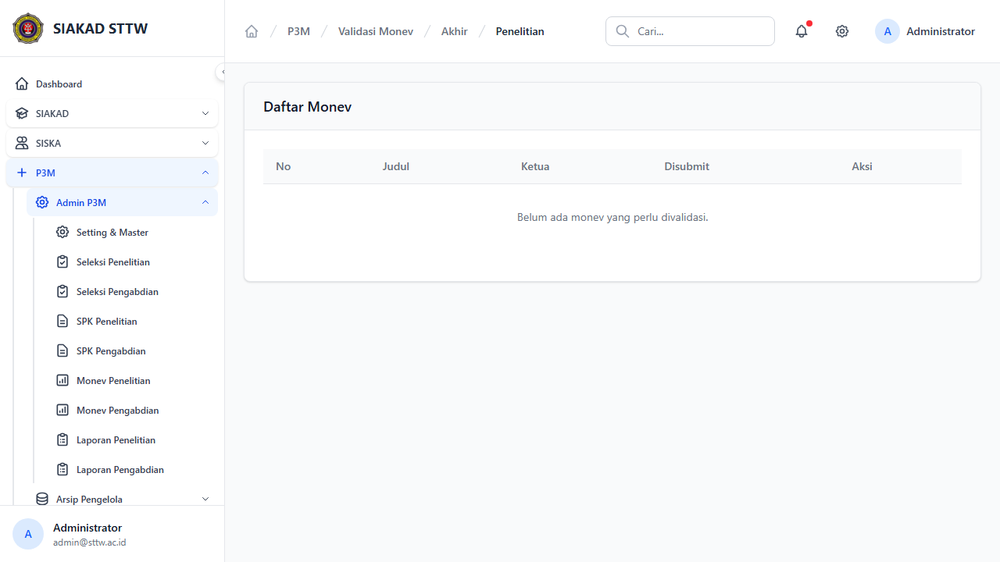
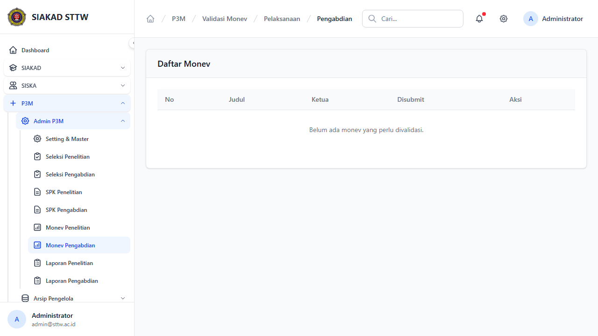
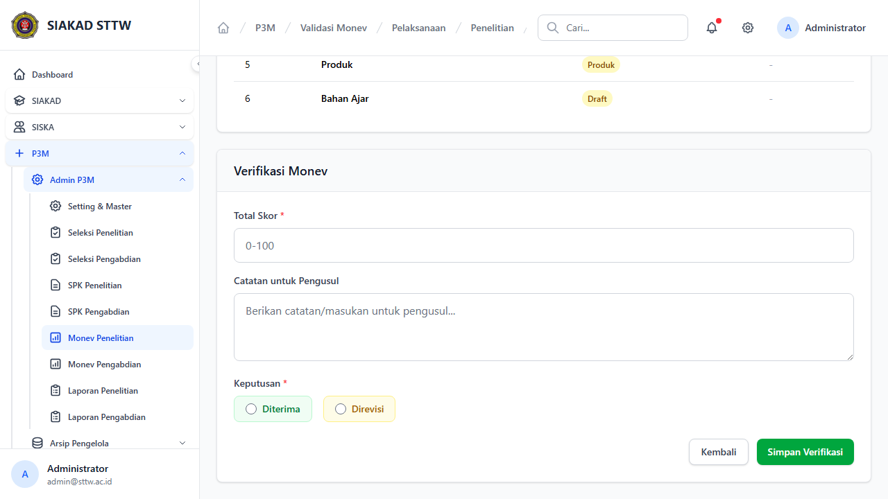
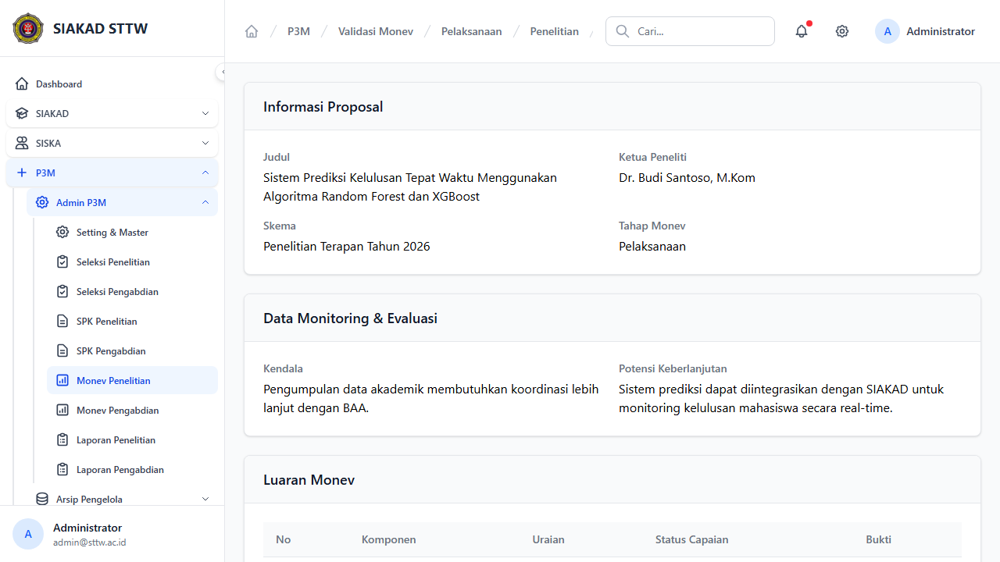

# P3M Admin - Validasi Monitoring & Evaluasi

**Role:** Admin

## Deskripsi

Validasi laporan monev pelaksanaan dan monev akhir dari dosen. Admin dapat menerima, merevisi, atau membuka kembali monev.

## Fitur

- Monev Pelaksanaan - Penelitian: Daftar monev pelaksanaan penelitian
- Monev Akhir - Penelitian: Daftar monev akhir penelitian
- Monev Pelaksanaan - Pengabdian: Daftar monev pelaksanaan pengabdian
- Detail/Show: Detail monev dengan capaian, kendala, dokumen pendukung
- Verifikasi: Terima/Revisi monev
- Unlock: Buka kembali monev yang sudah diverifikasi
- Cetak: Cetak laporan monev (PDF)

## Screenshots

### Monev penelitian pelaksanaan (scrolled)

### Monev penelitian pelaksanaan

### Monev penelitian akhir

### Monev pengabdian pelaksanaan

### Monev show (scrolled)

### Monev show

---
*Generated: 2026-04-13*
