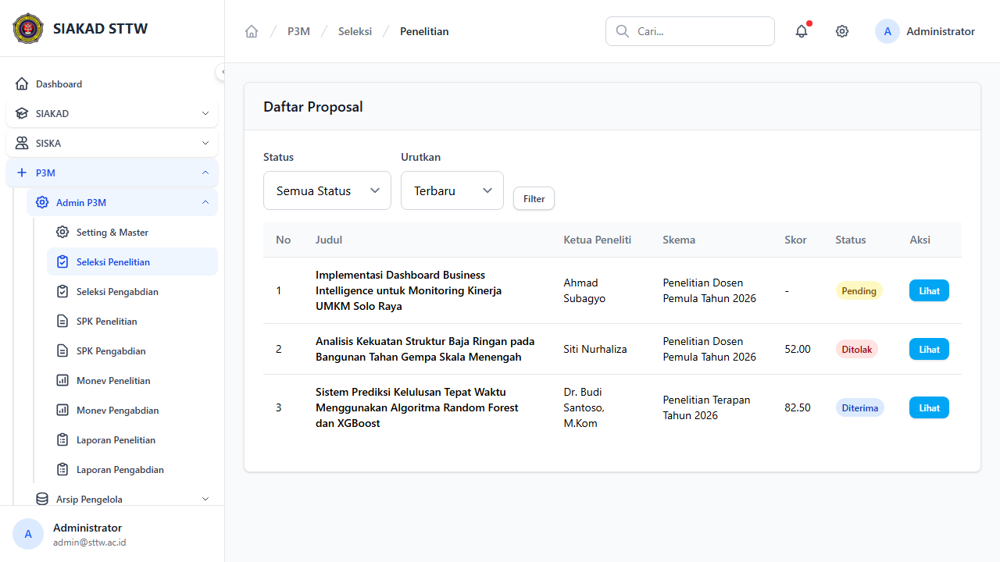
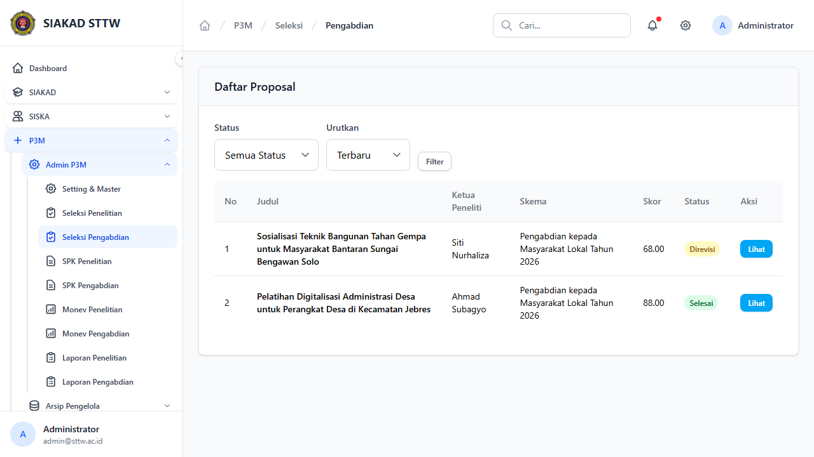
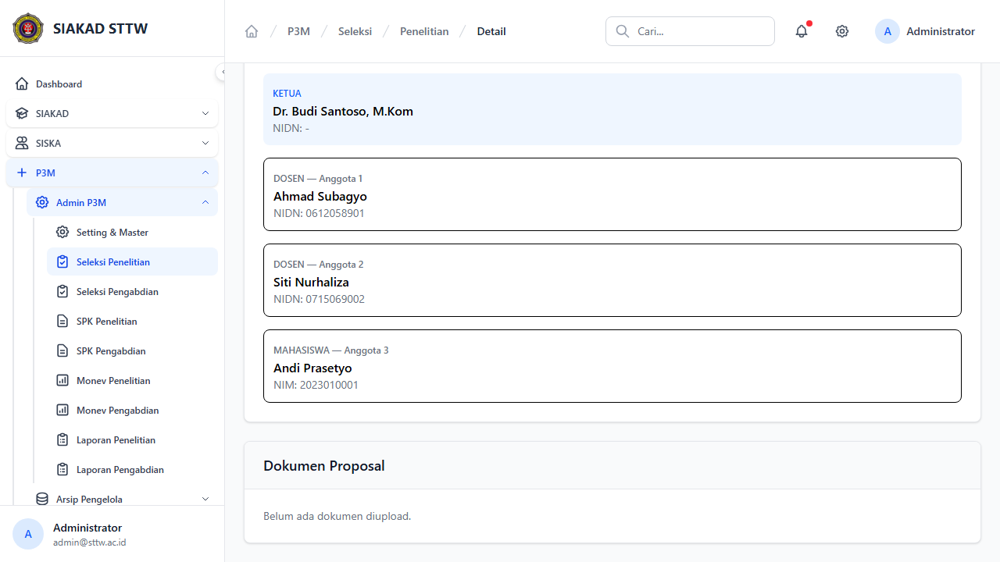
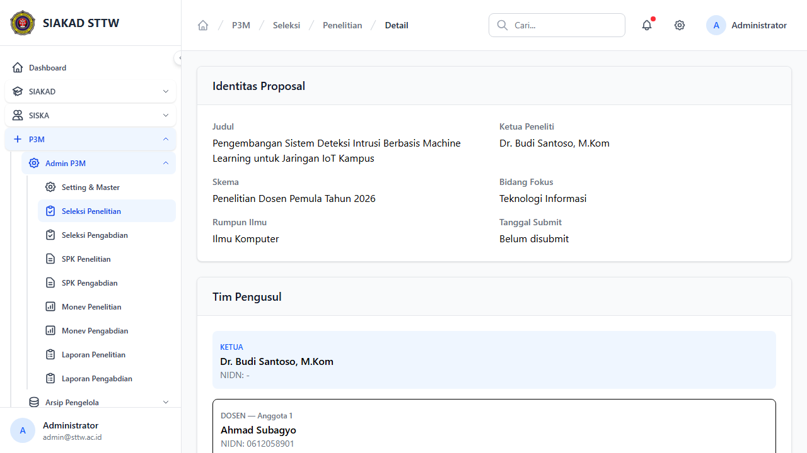

# P3M Admin - Seleksi Proposal

**Role:** Admin

## Deskripsi

Proses seleksi proposal penelitian dan pengabdian. Admin dapat melihat, menilai, dan memutuskan status proposal.

## Fitur

- Index Penelitian: Daftar proposal penelitian yang masuk untuk seleksi
- Index Pengabdian: Daftar proposal pengabdian yang masuk untuk seleksi
- Detail/Show: Detail proposal lengkap dengan dokumen, anggota, RAB
- Penilaian: Form penilaian per kriteria (skor 1-5 × bobot)
- Keputusan: Terima/Tolak proposal
- Cetak: Cetak berita acara seleksi (PDF)

## Screenshots

### Seleksi penelitian index

### Seleksi pengabdian index

### Seleksi penelitian show (scrolled)

### Seleksi penelitian show

---
*Generated: 2026-04-13*
