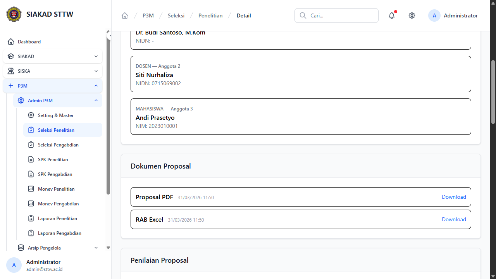
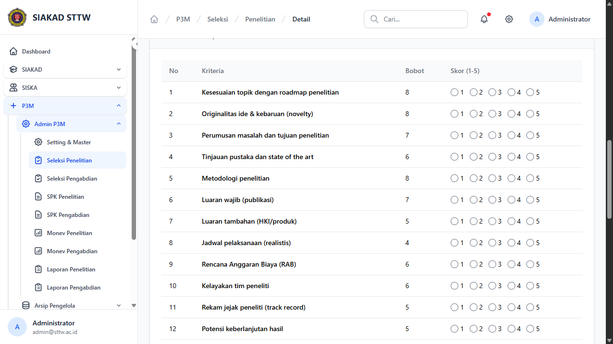

# Workflow Report: P3M Admin — Seleksi Proposal

**Tanggal**: 2026-04-01
**Role**: Admin
**Modul**: P3M (Penelitian & Pengabdian Masyarakat) — Seleksi
**Status**: ✅ Berhasil

## Ringkasan

Dokumentasi alur seleksi proposal P3M dari sisi admin. Admin melihat daftar proposal yang masuk, menilai (grading) berdasarkan kriteria penilaian, dan memberikan keputusan (terima/tolak/revisi).

## Langkah-langkah

### 1. Daftar Seleksi Penelitian

Admin membuka halaman seleksi penelitian yang menampilkan semua proposal yang sudah disubmit. Tabel menampilkan judul, ketua peneliti, skema, skor total, dan status. Dapat di-sort berdasarkan skor.

### 2. Detail Proposal (Pending)

Admin klik "Detail" pada proposal berstatus Pending untuk melihat informasi lengkap: abstrak, anggota tim, rumpun ilmu, bidang fokus, dan dokumen yang dilampirkan.

### 3. Form Penilaian (Grading)

Di halaman detail, admin dapat menilai proposal berdasarkan kriteria yang sudah dikonfigurasi. Setiap kriteria memiliki bobot, dan admin memberikan skor 1-5. Total skor dihitung otomatis (bobot × skor).

### 4. Tombol Keputusan

Setelah menilai, admin dapat memberikan keputusan: Terima, Revisi, atau Tolak proposal. Masing-masing memerlukan catatan/keterangan. Proposal yang diterima otomatis membuat SPK record.

## Catatan

- Skor penilaian dihitung sebagai `bobot × skor` per kriteria, lalu dijumlahkan menjadi `total_skor_seleksi`
- Admin dapat melakukan sort tabel berdasarkan skor total (tertinggi ke terendah) untuk memudahkan ranking
- Proposal yang diterima otomatis generate record SPK (Surat Perjanjian Kerja)
- Proposal yang ditolak/direvisi mengirim notifikasi ke dosen pengaju (fitur 32O — planned)
- Admin dapat "unlock" proposal yang sudah dinilai untuk mengubah keputusan (fitur keamanan)
- Filter berdasarkan status dan skema tersedia di halaman list
