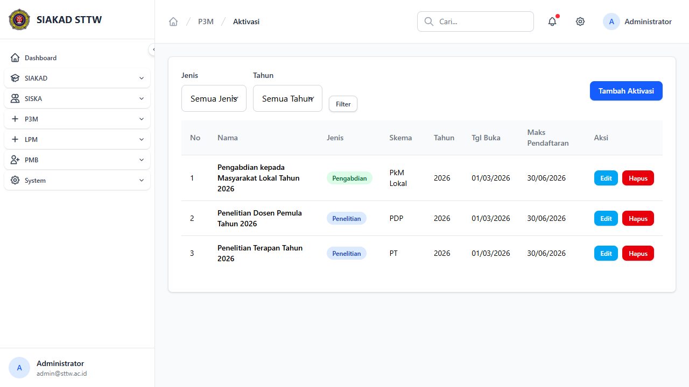
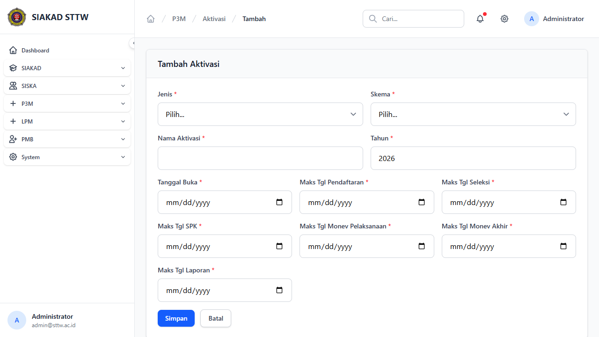
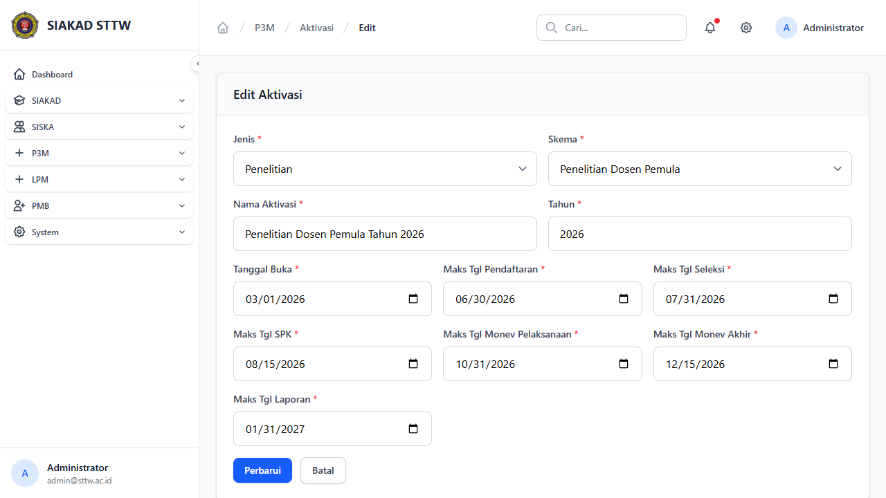

# P3M Admin - Aktivasi

**Role:** Admin

## Deskripsi

Manajemen periode aktivasi P3M. Admin dapat membuka dan menutup periode pengajuan proposal penelitian/pengabdian.

## Fitur

- Index: Daftar semua periode aktivasi dengan status (Dibuka/Ditutup)
- Create: Form tambah aktivasi baru (jenis, tahun, tanggal buka/tutup, deskripsi)
- Edit: Form edit aktivasi yang sudah ada
- Delete: Hapus aktivasi (konfirmasi)

## Screenshots

### Aktivasi index

### Aktivasi create form

### Aktivasi edit form

---
*Generated: 2026-04-13*
