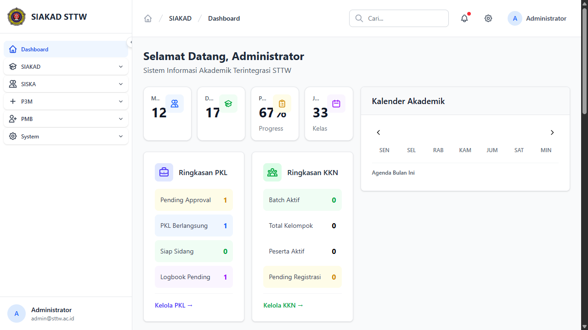
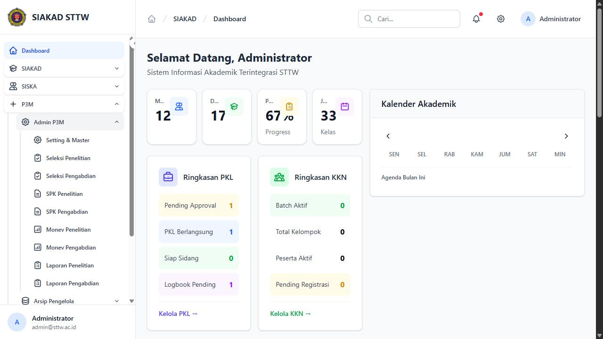
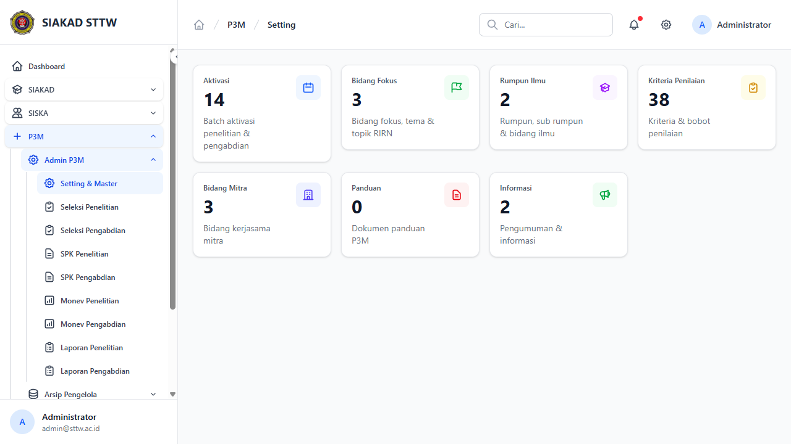
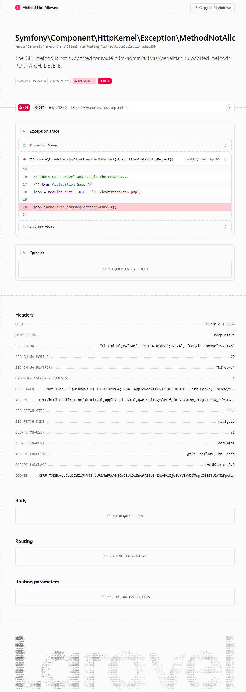
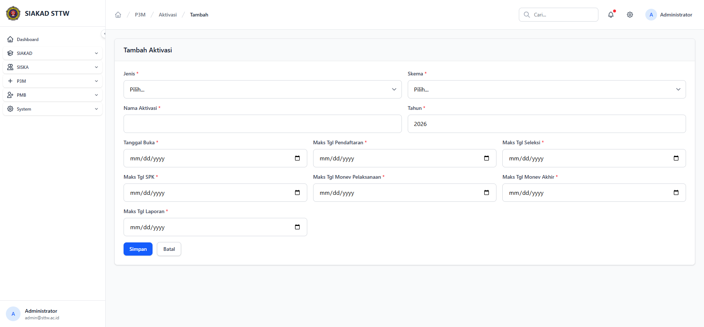
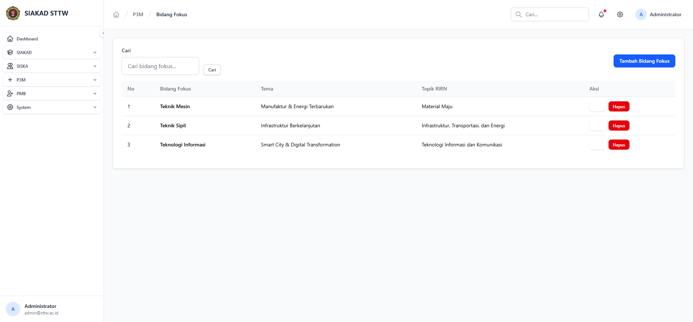
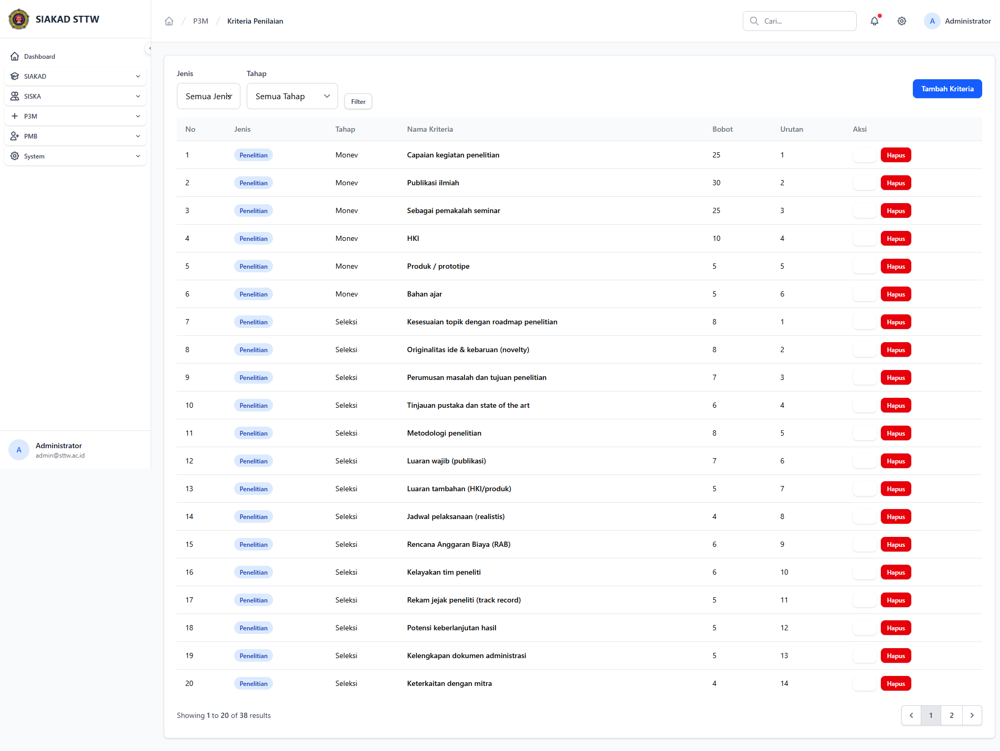

# Workflow Report: P3M Admin — Settings & Master Data

**Tanggal**: 2026-04-01
**Role**: Admin
**Modul**: P3M (Penelitian & Pengabdian Masyarakat)
**Status**: ✅ Berhasil

## Ringkasan

Dokumentasi fitur pengaturan modul P3M dari sisi admin. Meliputi dashboard widget, sidebar menu, dan seluruh halaman master data (aktivasi, bidang fokus, rumpun ilmu, bidang mitra, kriteria penilaian).

## Langkah-langkah

### 1. Dashboard Widget P3M

Admin login dan melihat widget P3M Overview di dashboard utama yang menampilkan statistik proposal, kegiatan aktif, dan distribusi per jenis.

### 2. Sidebar Menu P3M Admin

Menu P3M di sidebar menampilkan sub-menu: Dashboard, Pengaturan (Aktivasi, Bidang Fokus, Rumpun Ilmu, Bidang Mitra, Kriteria Penilaian), Penelitian, dan Pengabdian.

### 3. Halaman Overview Pengaturan

Halaman utama pengaturan P3M menampilkan ringkasan jumlah data master dan navigasi ke masing-masing sub-halaman.

### 4. Daftar Aktivasi P3M

Tabel daftar aktivasi (batch) P3M dengan kolom: judul, skema, jenis, periode, kuota, dan status. Admin dapat menambah, mengedit, atau mengubah status aktivasi.

### 5. Halaman Aktivasi Penelitian

Filter khusus untuk aktivasi jenis Penelitian, menampilkan batch-batch yang tersedia untuk pengajuan proposal penelitian dosen.

### 6. Form Tambah Aktivasi

Form pembuatan aktivasi baru dengan field: judul, jenis (Penelitian/Pengabdian), skema, tahun, tanggal buka/tutup, kuota, dan deskripsi.

### 7. Daftar Bidang Fokus

Tabel master bidang fokus penelitian/pengabdian yang dapat digunakan dosen saat mengajukan proposal. Admin dapat CRUD bidang fokus.

### 8. Daftar Kriteria Penilaian

Tabel kriteria penilaian untuk seleksi proposal. Setiap kriteria memiliki tahap, bobot, dan urutan yang digunakan reviewer saat menilai proposal.

## Catatan

- Semua halaman master data menggunakan pattern CRUD standar dengan modal konfirmasi untuk hapus
- Aktivasi memiliki fitur toggle status (Buka/Tutup) untuk mengontrol periode pengajuan
- Kriteria penilaian dapat dikonfigurasi per tahap seleksi (Administrasi, Substansi, dll)
- Bidang Fokus dan Rumpun Ilmu terintegrasi sebagai dropdown di form proposal dosen
- Data seed mencakup 14 aktivasi, 6 bidang fokus, 5 rumpun ilmu, dan 5 kriteria penilaian
