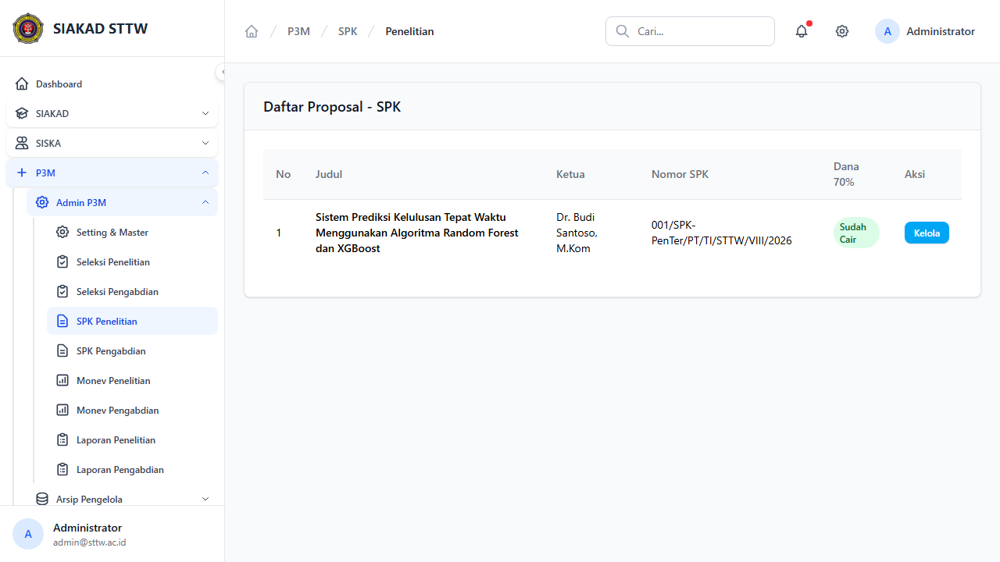
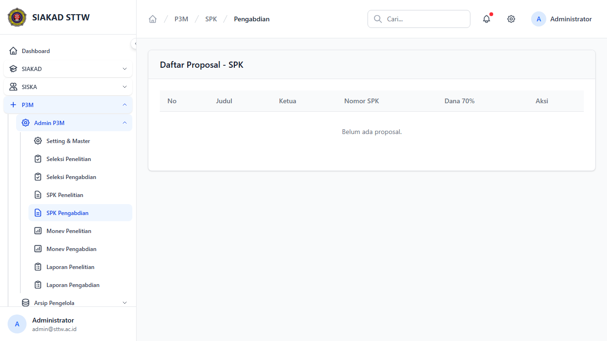
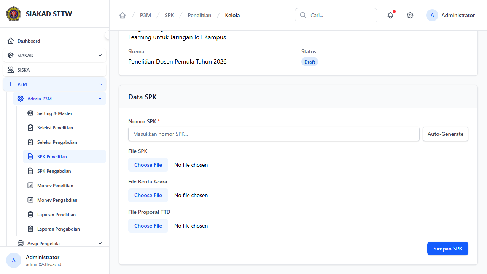
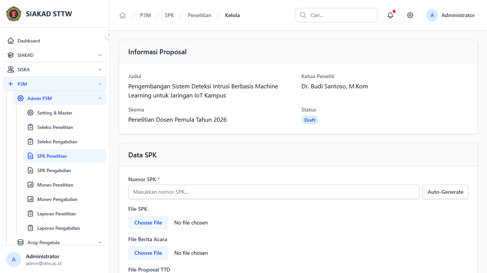

# P3M Admin - SPK (Surat Perjanjian Kerja)

**Role:** Admin

## Deskripsi

Manajemen SPK untuk proposal yang diterima. Admin dapat generate nomor SPK, upload dokumen, dan release dana 70%.

## Fitur

- Index Penelitian: Daftar SPK penelitian
- Index Pengabdian: Daftar SPK pengabdian
- Detail/Show: Detail SPK dengan dokumen-dokumen (SPK, berita acara, proposal TTD)
- Generate Nomor: Auto-generate nomor SPK dengan format standar
- Upload Dokumen: Upload file SPK, berita acara, proposal TTD
- Release Dana 70%: Tandai pencairan dana tahap 1
- Cetak: Cetak SPK (PDF)

## Screenshots

### Spk penelitian index

### Spk pengabdian index

### Spk penelitian show (scrolled)

### Spk penelitian show

---
*Generated: 2026-04-13*
