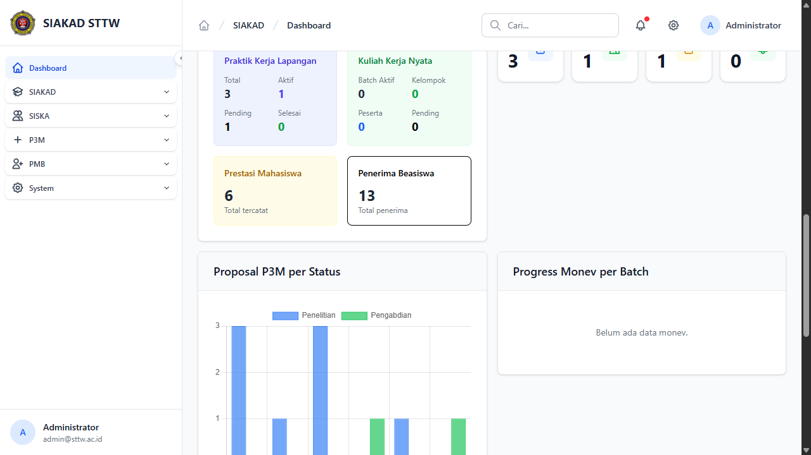
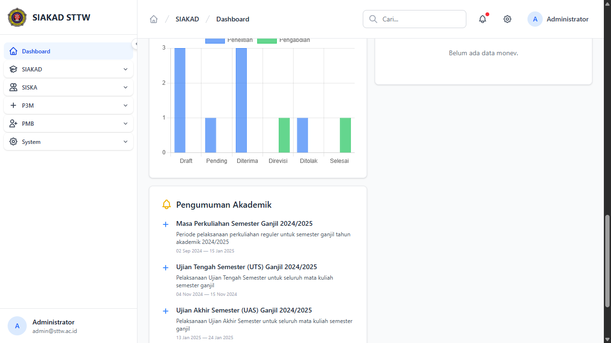

# Workflow Report: P3M Dashboard — Chart Widgets

**Tanggal**: 2026-04-01
**Role**: Admin
**Modul**: P3M (Penelitian & Pengabdian Masyarakat) — Dashboard
**Status**: ✅ Berhasil

## Ringkasan

Dokumentasi 3 widget dashboard P3M yang ditampilkan di halaman dashboard utama SIAKAD untuk role admin, akademik, ketua, dan waket1. Widget menampilkan statistik overview, chart proposal per status, dan progress monev per batch.

## Langkah-langkah

### 1. P3M Overview — Stat Cards

Widget `dashboard.p3m.overview` menampilkan 4 stat cards: Penelitian Aktif (3), Pengabdian Aktif (1), Pending Review (1), dan Luaran Overdue (0). Card Luaran Overdue berwarna merah jika ada yang overdue.

### 2. Proposal P3M per Status — Bar Chart

Widget `dashboard.p3m.proposal-stats` menampilkan bar chart menggunakan Chart.js yang memvisualisasikan jumlah proposal per status (Draft, Pending, Diterima, Direvisi, Ditolak, Selesai) dengan breakdown Penelitian (biru) vs Pengabdian (hijau).

### 3. Progress Monev per Batch — Bar Chart

Widget `dashboard.p3m.monev-tracker` menampilkan progress monev per batch aktivasi. Karena belum ada data monev yang diinput, chart menampilkan pesan "Belum ada data monev." — ini adalah empty state yang benar.

## Catatan

- Ketiga widget dikontrol oleh permission terpisah: `dashboard.p3m.overview`, `dashboard.p3m.proposal-stats`, `dashboard.p3m.monev-tracker`
- Chart menggunakan Chart.js v4.4.0 via CDN (sama dengan chart IPK di StatsKetua)
- Widget proposal-stats dan monev-tracker ditampilkan side-by-side di grid 2 kolom (responsive)
- Monev tracker akan menampilkan data setelah ada proposal yang masuk tahap monev pelaksanaan/akhir/laporan
- Role yang mendapat akses: admin, akademik, ketua, waket1
- Mahasiswa dan dosen tanpa permission tidak melihat widget ini (tested)
