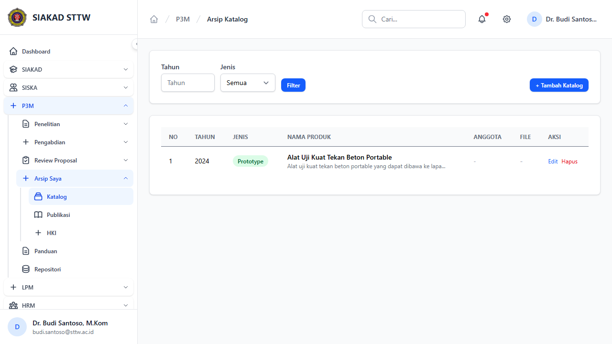
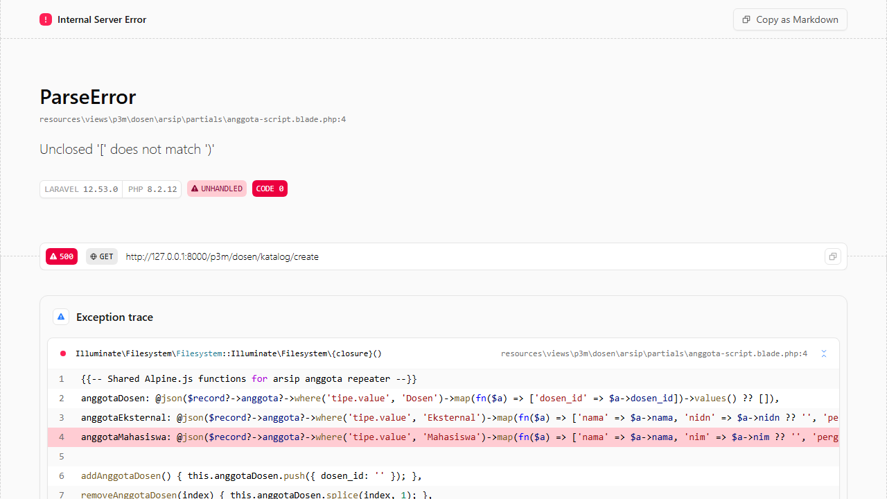
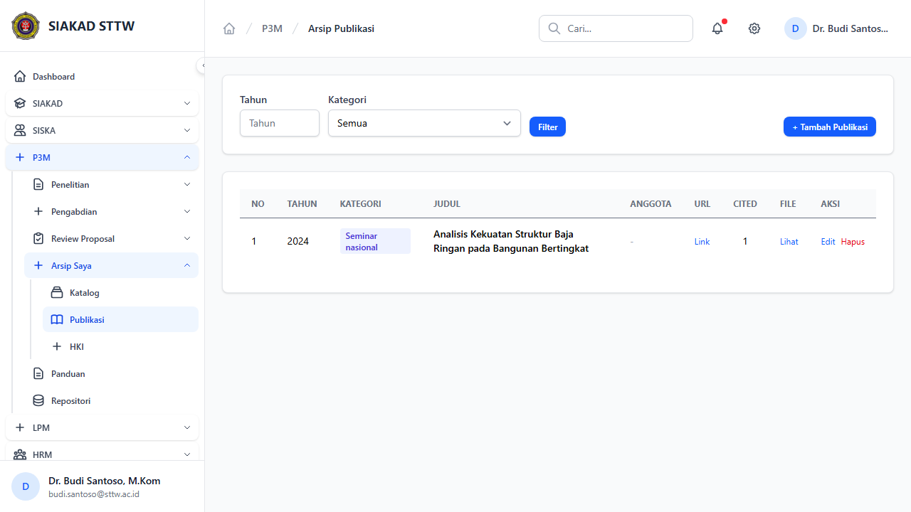
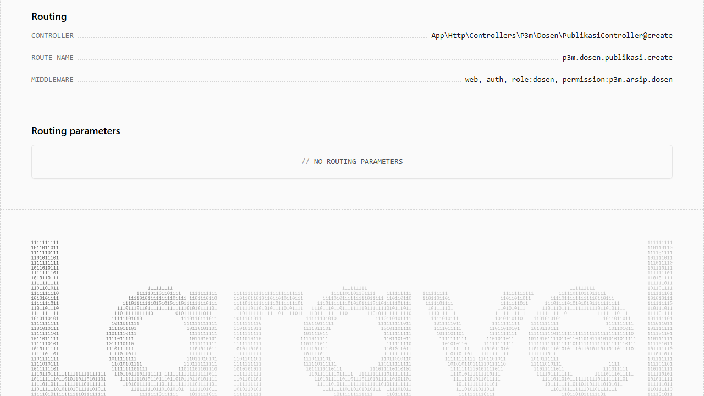
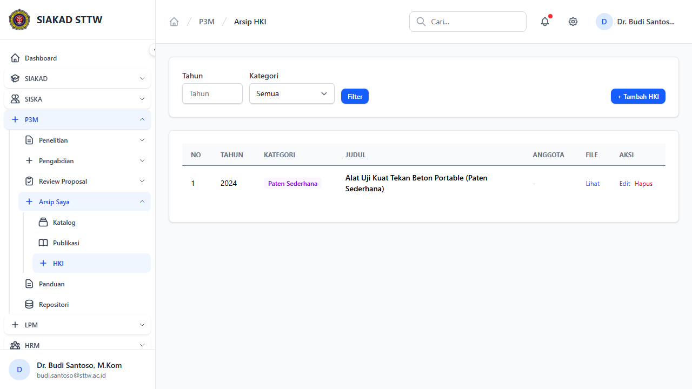
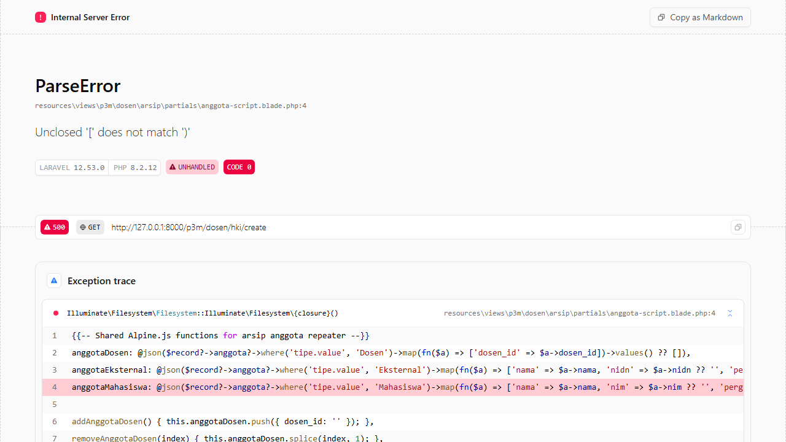

# P3M Dosen - Arsip (Katalog, Publikasi, HKI)

**Role:** Dosen

## Deskripsi

Dosen mengelola arsip luaran: katalog produk, publikasi ilmiah, dan HKI.

## Fitur

- Katalog: CRUD katalog produk penelitian/pengabdian
- Publikasi: CRUD data publikasi ilmiah
- HKI: CRUD data Hak Kekayaan Intelektual

## Screenshots

### Katalog index

### Katalog create (scrolled)

### Katalog create

### Publikasi index

### Publikasi create (scrolled)

### Publikasi create

### Hki index

### Hki create (scrolled)

### Hki create

---
*Generated: 2026-04-13*
