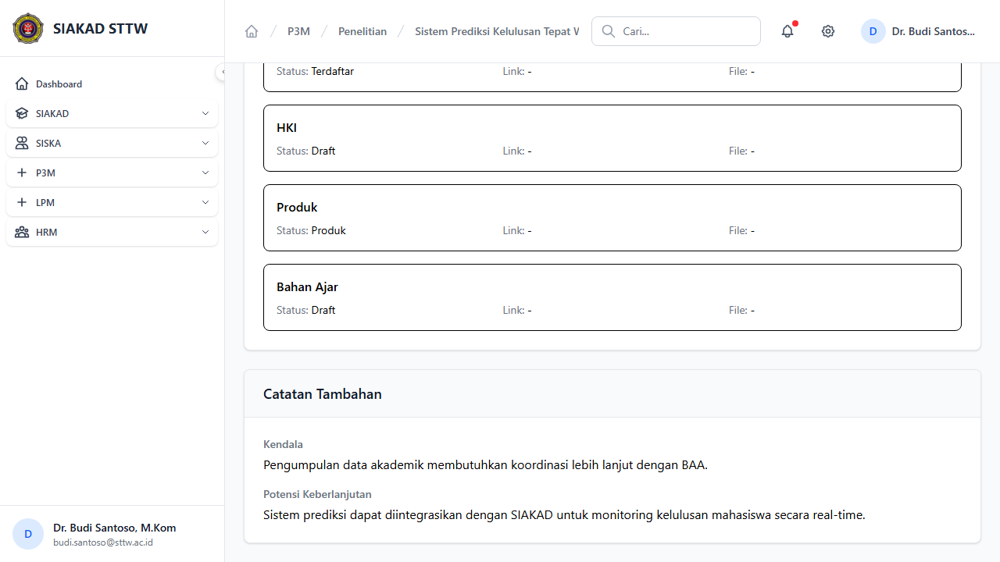
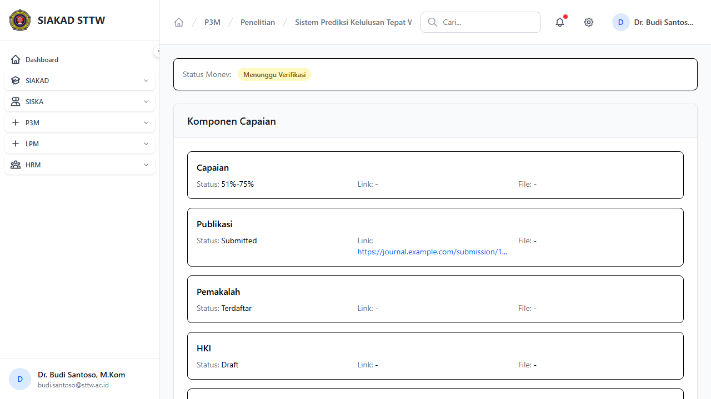
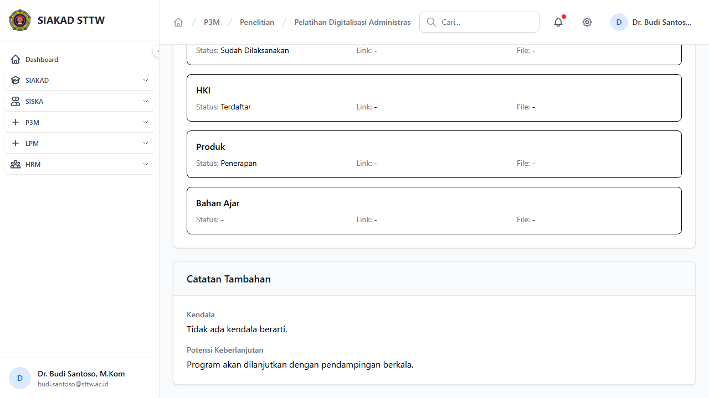
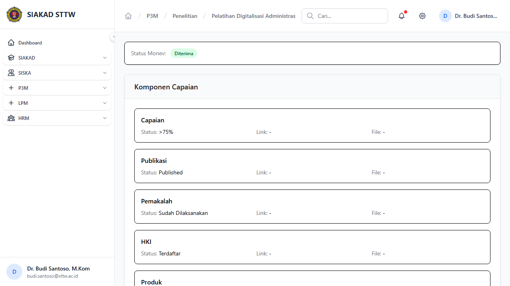
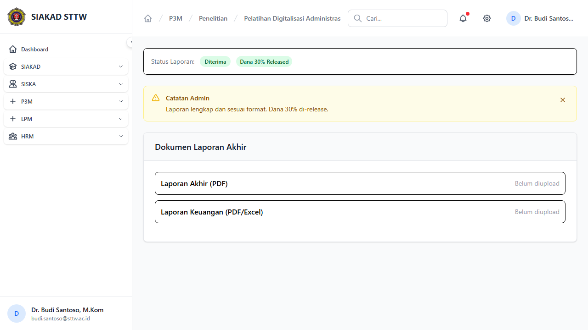

# P3M Dosen - Monev & Laporan Akhir

**Role:** Dosen

## Deskripsi

Dosen mengisi dan mensubmit laporan monev pelaksanaan, monev akhir, dan laporan akhir.

## Fitur

- Monev Pelaksanaan: Form isi capaian, kendala, dan dokumen pendukung tahap pelaksanaan
- Monev Akhir: Form isi capaian akhir, kendala, dan dokumen pendukung
- Laporan Akhir: Form upload laporan akhir dengan luaran wajib dan tambahan
- Submit: Kirim monev/laporan untuk validasi admin

## Screenshots

### Monev pelaksanaan (scrolled)

### Monev pelaksanaan

### Monev akhir (scrolled)

### Monev akhir

### Laporan akhir

---
*Generated: 2026-04-13*
