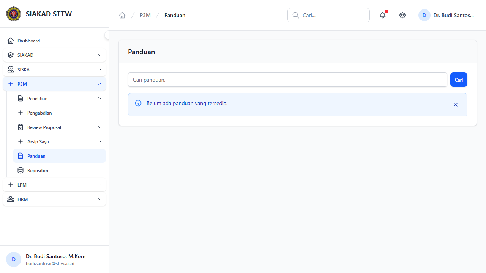
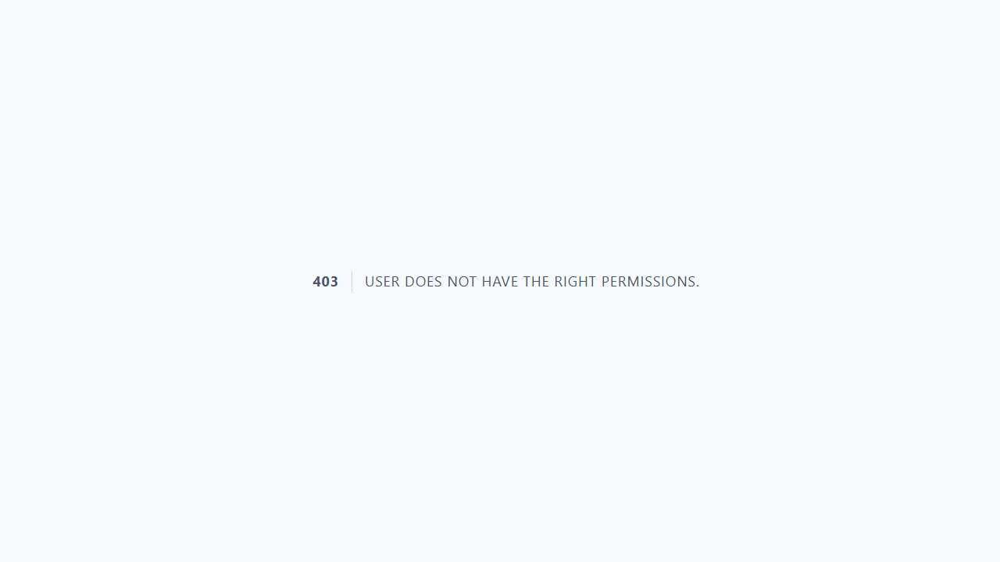

# P3M Dosen - Panduan & Repositori

**Role:** Dosen

## Deskripsi

Akses panduan dari admin dan manajemen repositori dokumen dosen.

## Fitur

- Panduan: Daftar panduan yang dipublikasi admin (download)
- Repositori: CRUD repositori dokumen pribadi dosen
- Share Token: Generate token untuk berbagi dokumen repositori secara publik

## Screenshots

### Panduan index

### Repositori index

### Repositori create

---
*Generated: 2026-04-13*
