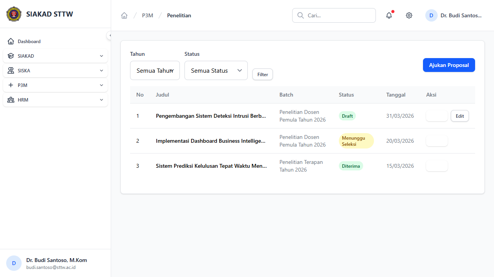
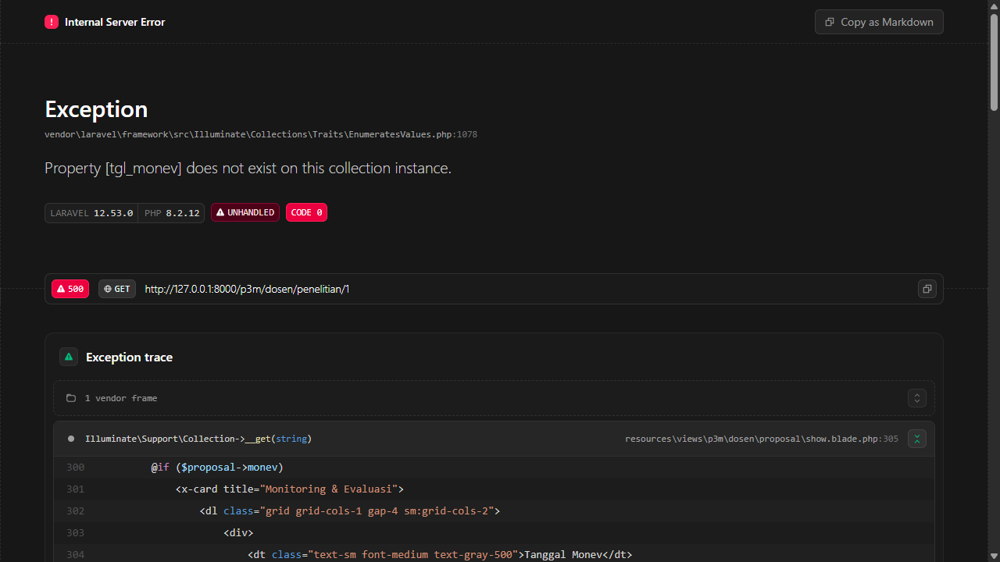
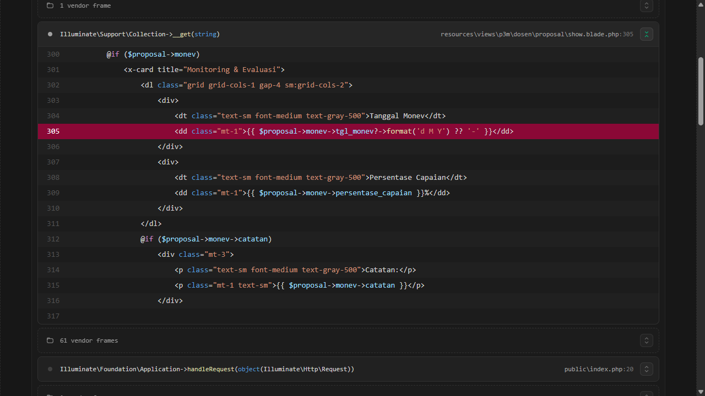
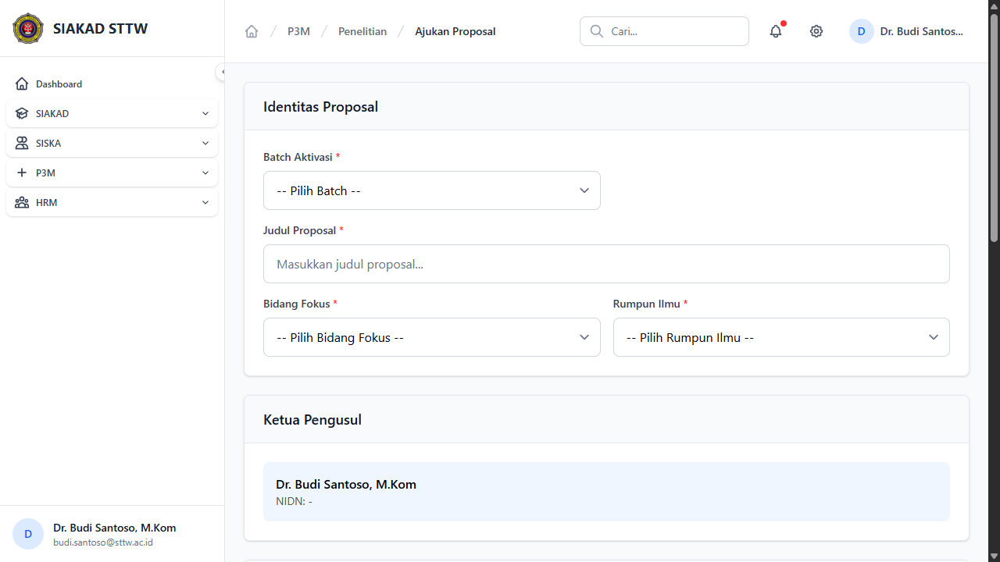

# Workflow Report: P3M Dosen — Pengajuan Proposal

**Tanggal**: 2026-04-01
**Role**: Dosen
**Modul**: P3M (Penelitian & Pengabdian Masyarakat) — Portal Dosen
**Status**: ✅ Berhasil

## Ringkasan

Dokumentasi alur pengajuan proposal penelitian/pengabdian dari sisi dosen. Dosen melihat riwayat proposal, membuat proposal baru, mengisi detail dan anggota, serta submit untuk seleksi.

## Langkah-langkah

### 1. Riwayat Proposal Penelitian

Dosen login dan membuka menu P3M → Penelitian. Halaman menampilkan daftar proposal dengan filter tahun dan status. Tabel menampilkan judul, batch aktivasi, status (Draft/Menunggu Seleksi/Diterima), dan tanggal pengajuan.

### 2. Detail Proposal

Dosen klik "Detail" pada proposal untuk melihat informasi lengkap: judul, abstrak, skema, bidang fokus, rumpun ilmu, anggota tim (dosen & mahasiswa), serta dokumen yang dilampirkan.

### 3. Detail Proposal (Lanjutan)

Scroll ke bawah menampilkan informasi tambahan seperti daftar anggota, dokumen pendukung (proposal PDF, surat tugas, dll), dan histori status proposal.

### 4. Form Ajukan Proposal Baru

Dosen klik "Ajukan Proposal" untuk membuat proposal baru. Form mencakup:
- Pilih batch aktivasi yang sedang dibuka
- Judul penelitian
- Abstrak
- Bidang fokus dan rumpun ilmu
- Anggota tim dosen (search by nama/NIP)
- Anggota tim mahasiswa (search by nama/NIM)
- Upload dokumen (Proposal PDF wajib)

## Catatan

- Dosen hanya bisa mengajukan proposal pada aktivasi yang statusnya "Buka" dan belum melewati tanggal tutup
- Proposal berstatus Draft bisa diedit dan dihapus; yang sudah disubmit hanya bisa dilihat
- Submit proposal memerlukan minimal 1 dokumen Proposal PDF yang sudah diunggah
- Proposal yang ditolak bisa disubmit ulang setelah direvisi (status Ditolak → bisa submit ulang)
- Pencarian anggota dosen menggunakan AJAX endpoint `api.siakad.dosen.search`
- Eligibility check: jika dosen memiliki luaran yang belum dipenuhi dari proposal sebelumnya, akan ditampilkan peringatan di halaman create
- Status proposal: Draft → Pending (Menunggu Seleksi) → Diterima/Ditolak/Direvisi → Selesai
