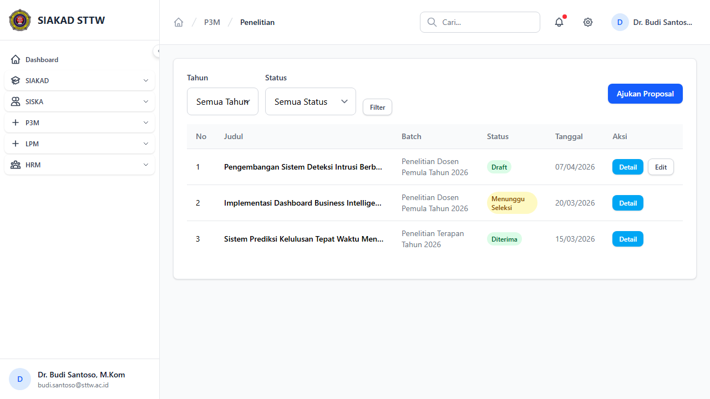
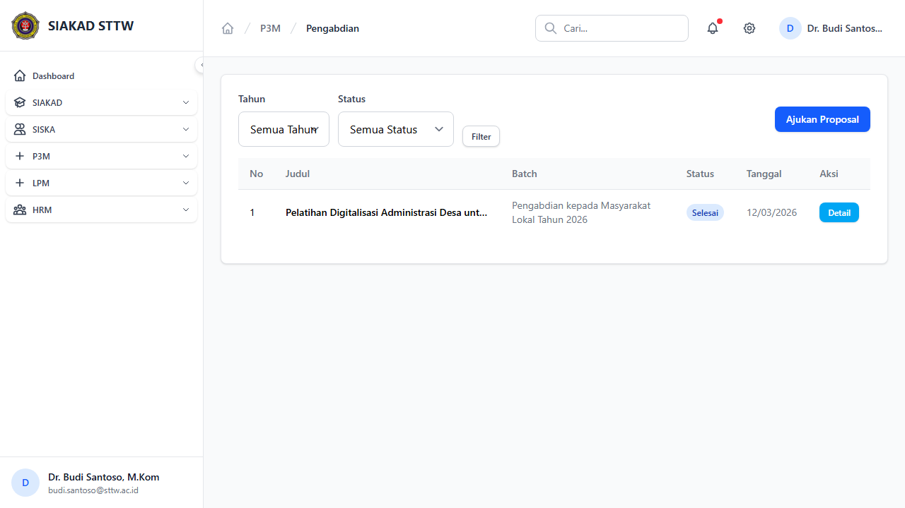
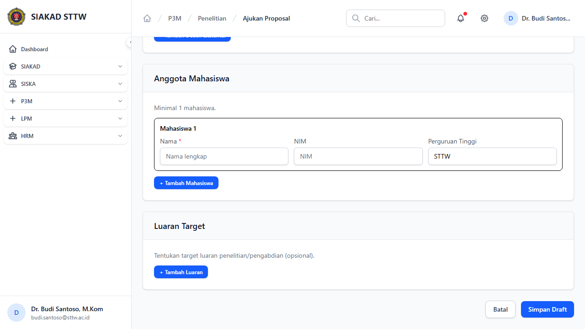
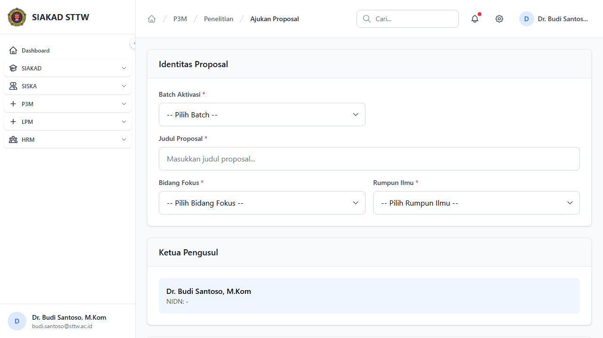
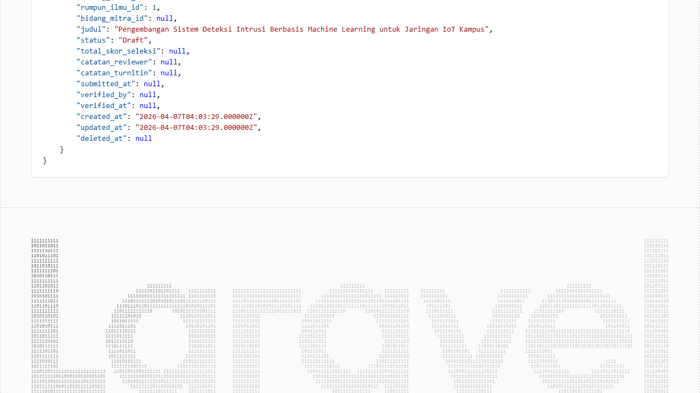
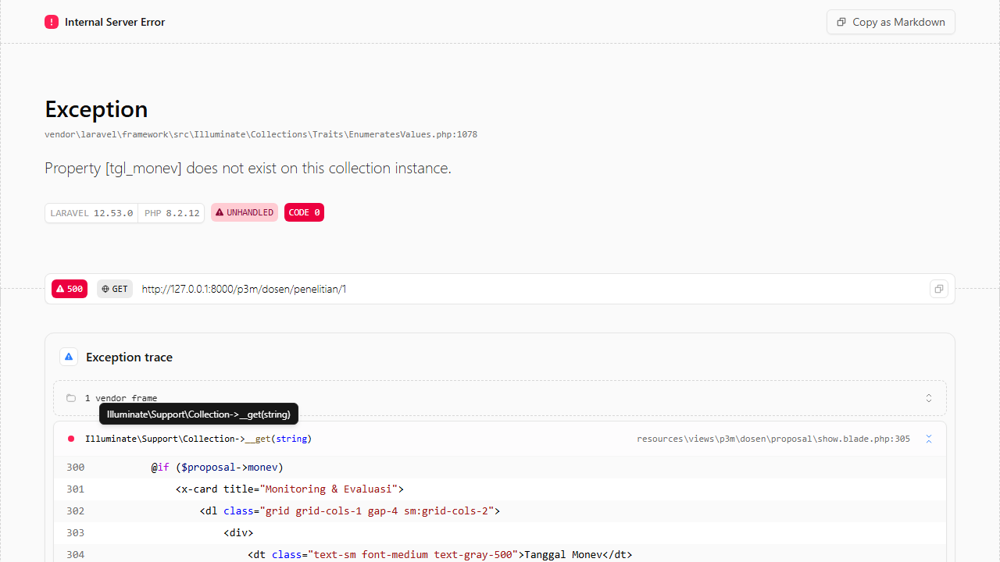
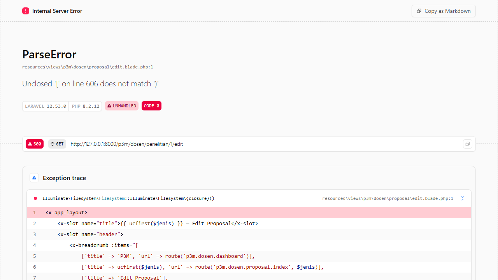

# P3M Dosen - Proposal

**Role:** Dosen

## Deskripsi

Manajemen proposal penelitian dan pengabdian oleh dosen. Dosen dapat membuat, mengedit, dan mensubmit proposal.

## Fitur

- Index Penelitian: Daftar proposal penelitian milik dosen
- Index Pengabdian: Daftar proposal pengabdian milik dosen
- Create: Form buat proposal baru (judul, abstrak, bidang fokus, rumpun ilmu, anggota, RAB, dll)
- Show: Detail proposal lengkap dengan status, penilaian, dokumen
- Edit: Edit proposal (hanya saat status Draft/Ditolak)
- Submit: Kirim proposal untuk seleksi
- Upload Dokumen: Upload file pendukung proposal

## Screenshots

### Proposal penelitian index

### Proposal pengabdian index

### Proposal penelitian create (scrolled)

### Proposal penelitian create

### Proposal penelitian show (scrolled)

### Proposal penelitian show

### Proposal penelitian edit (scrolled)

### Proposal penelitian edit

---
*Generated: 2026-04-13*
