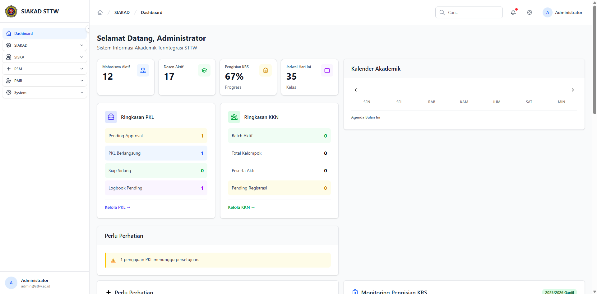
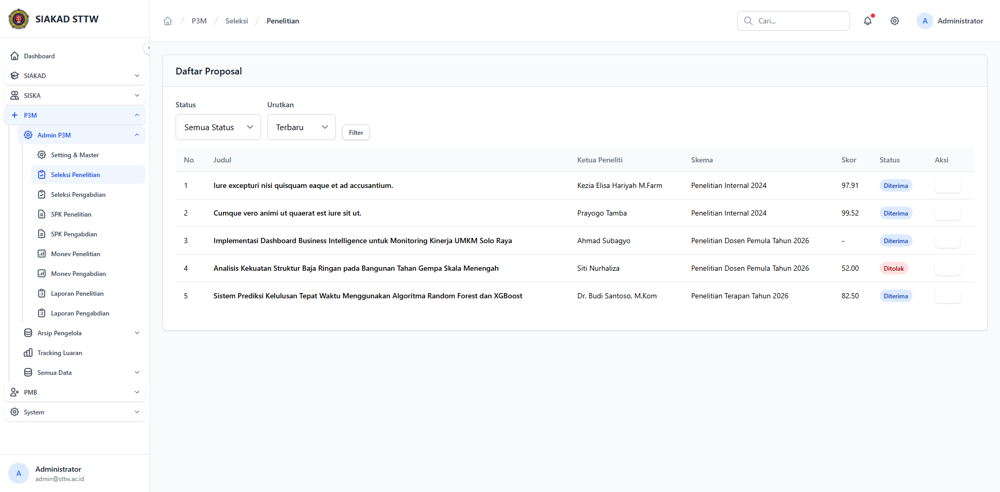
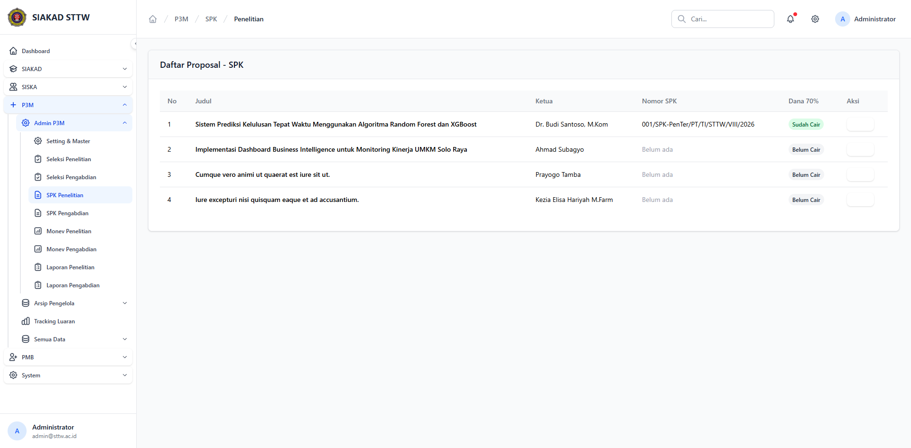
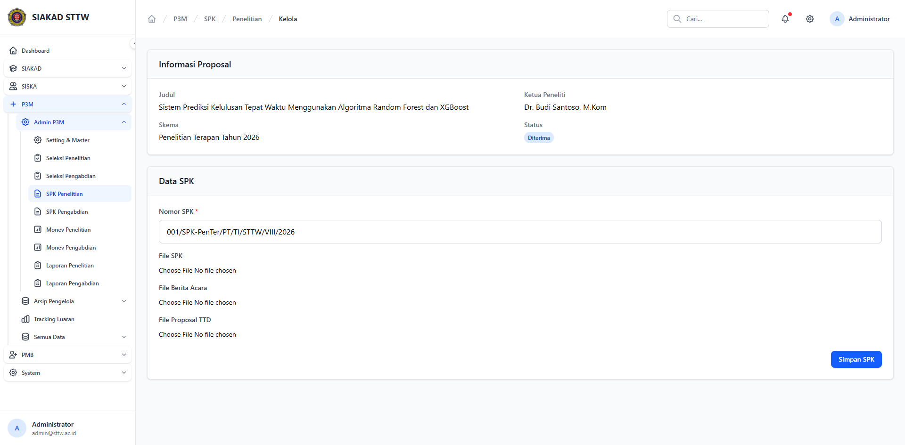
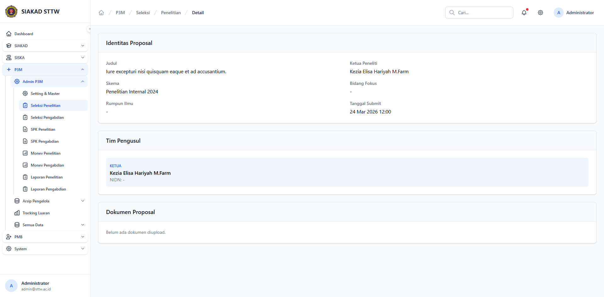
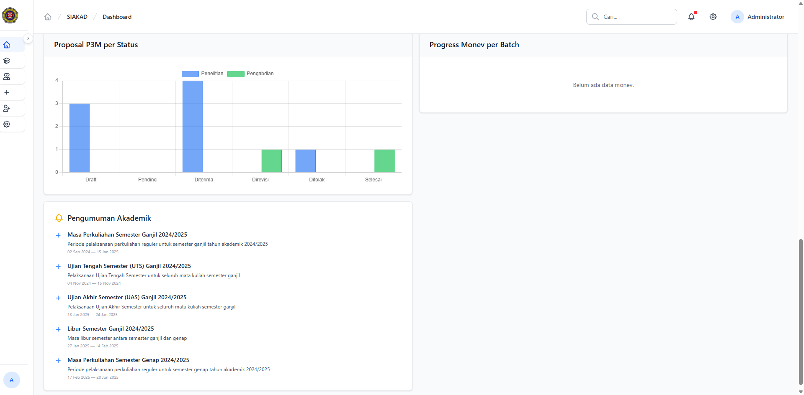

# Workflow Report: P3M Integration (Phase 32Q)

**Tanggal**: 2026-04-01
**Role**: Admin
**Modul**: P3M (Penelitian, Pengabdian & Publikasi Masyarakat)
**Status**: ✅ Berhasil

## Ringkasan

Dokumentasi integrasi modul P3M dengan komponen SIAKAD existing:
1. **PenandatanganService** — Tanda tangan dinamis di dokumen SPK dan Berita Acara
2. **HRM Sync** — Sinkronisasi otomatis proposal Diterima ke tabel HRM
3. **Dashboard Widget** — Chart "Proposal P3M per Status" di dashboard admin
4. **Notifications** — Notifikasi status proposal ke dosen

## Langkah-langkah

### 1. Dashboard Admin — Menu P3M

Admin login dan melihat dashboard dengan menu P3M di sidebar kiri, termasuk sub-menu Admin P3M (Setting & Master, Seleksi, SPK, Monev, Laporan), Arsip Pengelola, Tracking Luaran, dan Semua Data.



### 2. Seleksi Penelitian — Daftar Proposal

Halaman seleksi menampilkan daftar proposal penelitian dengan status (Diterima/Ditolak), skor penilaian, ketua peneliti, dan skema. Keputusan seleksi otomatis men-trigger HRM sync.



### 3. SPK Penelitian — Daftar SPK

Setelah proposal diterima, admin dapat membuat SPK (Surat Perjanjian Kerja) dengan nomor SPK dan status pencairan dana 70%. Tombol cetak menghasilkan PDF dengan tanda tangan Ketua LPPM dari PenandatanganService.



### 4. SPK Detail — Form Kelola SPK

Halaman detail SPK menampilkan informasi proposal (judul, ketua, skema, status Diterima) dan form untuk mengelola data SPK: nomor SPK, file SPK, file berita acara, dan file proposal TTD.



### 5. Seleksi Detail — Identitas Proposal

Halaman detail seleksi menampilkan identitas proposal lengkap: judul, ketua peneliti, skema, bidang fokus, rumpun ilmu, tanggal submit, dan tim pengusul.



### 6. Dashboard P3M Widget — Chart Proposal per Status

Dashboard admin menampilkan widget Chart.js "Proposal P3M per Status" yang menunjukkan distribusi proposal berdasarkan status (Draft, Pending, Diterima, Direvisi, Ditolak, Selesai) untuk jenis Penelitian dan Pengabdian.



## Integrasi Backend (Tanpa Screenshot UI)

### HRM Sync — Artisan Command

```
$ php artisan p3m:sync-hrm 2026
Syncing P3M proposals for year 2026 to HRM...
Done. 3 proposal(s) synced.
```

Data di tabel `hrm_penelitian`:
| ID | Judul | External ID |
|----|-------|-------------|
| 1 | Implementasi Dashboard Business Intelligence untuk Monitoring Kinerja UMKM Solo Raya | p3m-2 |
| 2 | Sistem Prediksi Kelulusan Tepat Waktu Menggunakan Algoritma Random Forest dan XGBoost | p3m-3 |

### PenandatanganService Integration

PDF SPK dan Berita Acara sekarang menggunakan `PenandatanganService::byRole('ketua-lppm')` untuk tanda tangan dinamis. Jika JabatanStaf belum di-setup, fallback ke `PenandatanganService::placeholder('Ketua LPPM')`.

### Test Results

```
$ php artisan test --compact tests/Feature/P3m/
..................................................................   69 passed (136 assertions)
```

10 test integrasi baru:
- ✅ PenandatanganService placeholder returns valid structure
- ✅ syncProposal creates HRM penelitian for accepted research proposal
- ✅ syncProposal creates HRM pengabdian for accepted service proposal
- ✅ syncProposal skips draft proposals
- ✅ syncProposal updates existing HRM entry on re-sync
- ✅ removeProposal deletes HRM entry
- ✅ syncYear syncs all accepted proposals for given year
- ✅ accepting proposal via seleksi auto-syncs to HRM
- ✅ rejecting proposal via seleksi removes HRM entry
- ✅ revising proposal via seleksi also removes HRM entry

## Catatan

- PDF cetak SPK/Berita Acara tidak dapat di-screenshot di headless browser karena DomPDF mengembalikan stream PDF yang trigger download
- Ditemukan bug `strtoupper()` pada enum JenisP3m di view PDF — diperbaiki dengan menambahkan `->value`
- Ditemukan bug filename SPK mengandung `/` — diperbaiki dengan `str_replace(['/', '\\', ' '], '-', ...)`
- HRM sync menggunakan `DB::transaction` untuk atomicity, notification dispatch di luar transaction
- Unique index ditambahkan pada `external_id` di tabel `hrm_penelitian` dan `hrm_pengabdian`
