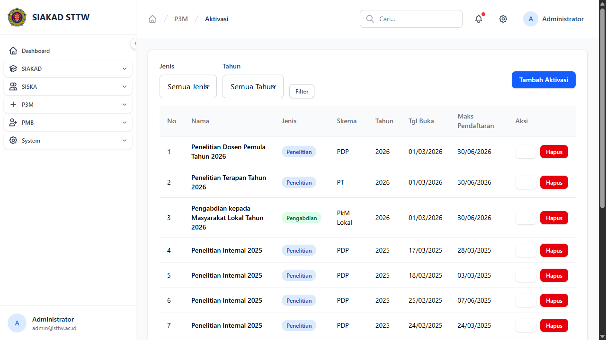
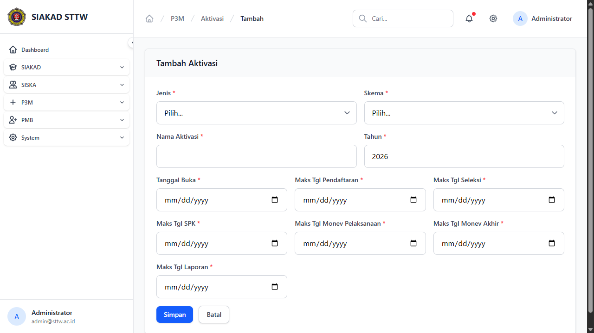
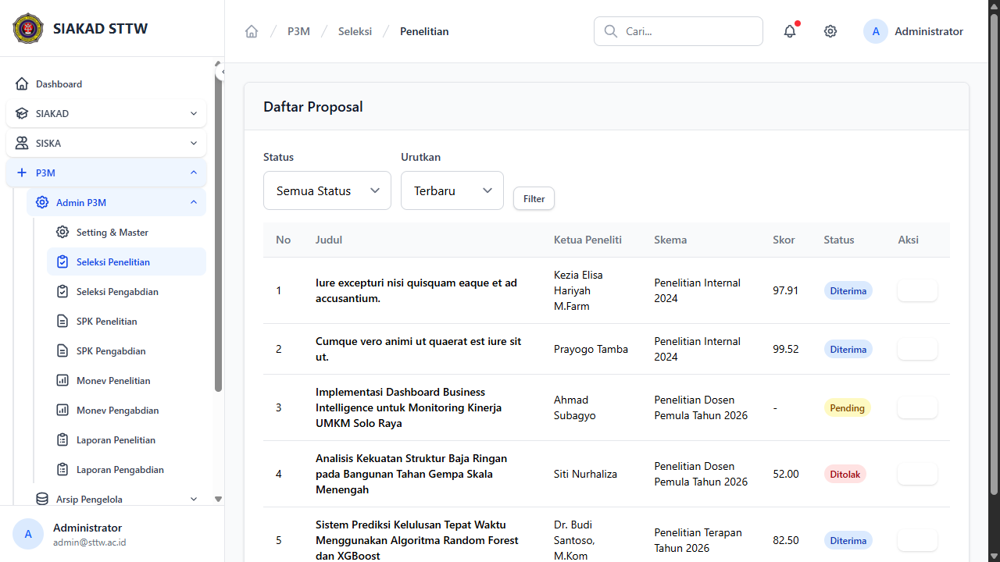
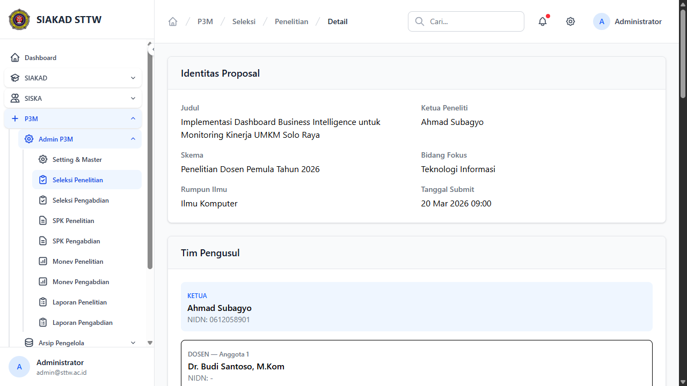
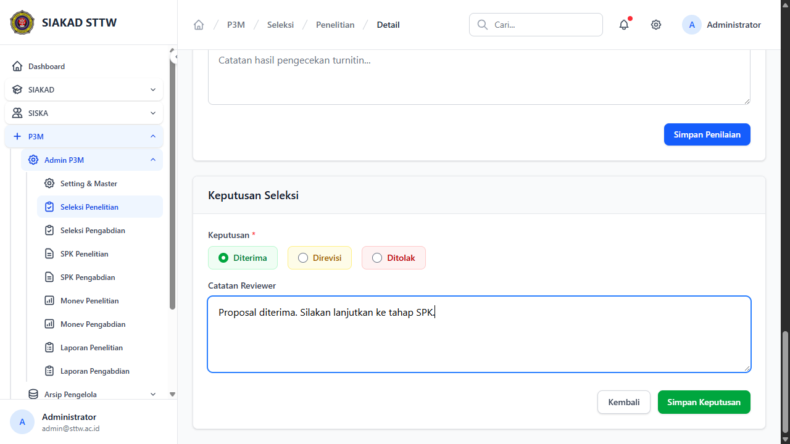
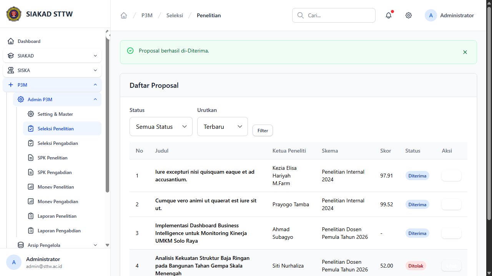

# Workflow Report: P3M Notifications

**Tanggal**: 2026-03-31
**Role**: Admin, Dosen
**Modul**: P3M (Penelitian, Pengabdian & Publikasi Masyarakat)
**Status**: ✅ Berhasil

## Ringkasan

Modul notifikasi P3M mengirimkan pemberitahuan otomatis via email dan database pada setiap tahap lifecycle proposal:
- **P3mProposalSubmitted**: Admin diberitahu saat dosen submit proposal baru
- **P3mProposalStatusChanged**: Dosen diberitahu saat admin memutuskan status proposal (Diterima/Ditolak/Direvisi)
- **P3mBatchOpened**: Semua dosen diberitahu saat batch baru dibuka
- **P3mDeadlineReminder**: Dosen diberitahu H-7 sebelum deadline monev/laporan

Artisan command `p3m:check-deadlines` tersedia untuk auto-lock batch expired dan kirim reminder.

## Langkah-langkah

### 1. Admin — Halaman Aktivasi (Batch Management)

Admin melihat daftar batch aktivasi P3M. Saat membuat batch baru, semua dosen yang memiliki permission akan mendapat notifikasi.



### 2. Admin — Form Buat Aktivasi Baru

Form pembuatan batch baru. Setelah disimpan, notifikasi `P3mBatchOpened` otomatis dikirim ke seluruh dosen yang memiliki permission `p3m.penelitian.dosen` atau `p3m.pengabdian.dosen`.



### 3. Admin — Seleksi Proposal Penelitian

Admin melihat daftar proposal yang masuk. Proposal berstatus "Pending" menunggu keputusan seleksi.



### 4. Admin — Detail Proposal Pending

Admin melihat detail proposal lengkap termasuk identitas, tim pengusul, dokumen, dan form penilaian.



### 5. Admin — Keputusan Seleksi

Admin mengisi keputusan "Diterima" dengan catatan reviewer. Setelah disimpan, notifikasi `P3mProposalStatusChanged` dikirim ke ketua dosen pengusul.



### 6. Admin — Keputusan Tersimpan

Setelah keputusan disimpan, admin kembali ke daftar seleksi. Notifikasi sudah masuk antrian untuk dikirim ke dosen.



## Notification Classes

| Class | Trigger | Penerima | Channel |
|-------|---------|----------|---------|
| `P3mProposalSubmitted` | Dosen submit proposal | Admin (permission: `p3m.{jenis}.manage`) | mail + database |
| `P3mProposalStatusChanged` | Admin decide seleksi | Ketua Dosen | mail + database |
| `P3mBatchOpened` | Admin buat batch baru | Semua dosen (permission: `p3m.{jenis}.dosen`) | mail + database |
| `P3mDeadlineReminder` | Artisan command (daily) | Ketua Dosen yang aktif | mail + database |

## Artisan Command

```bash
php artisan p3m:check-deadlines
```

- Auto-reject draft proposals yang melewati deadline pendaftaran
- Kirim reminder H-7 untuk deadline monev pelaksanaan, monev akhir, dan laporan akhir

## Test Results

```
Tests\Feature\P3m\NotificationTest
✅ admin is notified when dosen submits proposal
✅ dosen is notified when admin accepts proposal
✅ dosen is notified when admin rejects proposal
✅ dosen is notified when admin requests revision
✅ dosen are notified when new batch is created
✅ proposal submitted notification has correct mail content
✅ status changed notification includes keterangan in mail
✅ proposal submitted notification stores correct database array

Tests: 8 passed (19 assertions)
```

## Catatan

- Notifikasi menggunakan queue (`database` driver), sehingga perlu `queue:work` untuk memproses
- Email dikirim melalui mail driver yang dikonfigurasi (default: `log` di development)
- Untuk production, pastikan `QUEUE_CONNECTION=database` dan jalankan queue worker
- Deadline reminder sebaiknya dijadwalkan via Laravel Scheduler: `$schedule->command('p3m:check-deadlines')->daily();`
