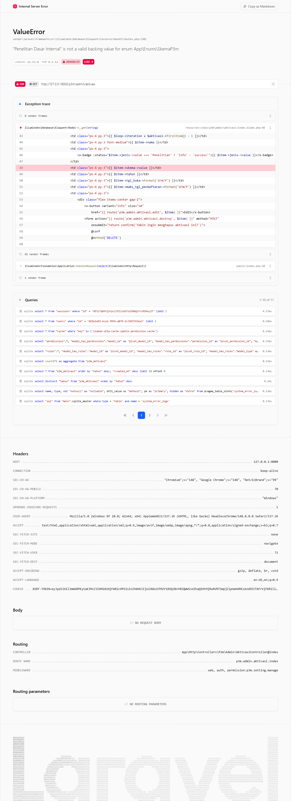

# Workflow Report: Aktivasi Mahasiswa Admin P3M (NEW)

**Tanggal**: 2026-05-12
**Role**: admin
**Modul**: p3m
**Fitur**: admin-aktivasi
**Status**: ✅ Berhasil

## Deskripsi Workflow

Modul baru pertengahan April: **Aktivasi Mahasiswa P3M** (TASK-014). Halaman index untuk admin P3M melihat & mengelola aktivasi mahasiswa peneliti / pelaksana hibah pengabdian.

## Ringkasan

- Halaman `/p3m/admin/aktivasi` dimuat HTTP 200.
- Index menampilkan tabel aktivasi (kosong pada DB seed kosong) + tombol Tambah.
- Komponen `<x-table>` + `<x-button>` dipakai sesuai konvensi.

## Langkah-langkah

### 1. Login admin & buka Aktivasi Mahasiswa P3M

**Deskripsi**: Login `admin@sttw.ac.id`, sidebar P3M → Aktivasi Mahasiswa. Halaman menampilkan form filter (tahun, jenis hibah) di atas, tabel aktivasi di bawah, dan tombol "Tambah Aktivasi".

**URL**: `http://127.0.0.1:8000/p3m/admin/aktivasi`

## Temuan & Masalah

| # | Halaman | URL | Kategori | Deskripsi | Prioritas |
|---|---------|-----|----------|-----------|-----------|
| 1 | Aktivasi Index | /p3m/admin/aktivasi | `no-data` | Tabel kosong; perlu seeder Aktivasi P3M untuk verifikasi visual lengkap. | Low |

## Catatan

- Modul baru — belum ada snapshot sebelumnya.
- Form create/edit tidak diuji submit penuh karena dependensi pada Proposal P3M aktif.
