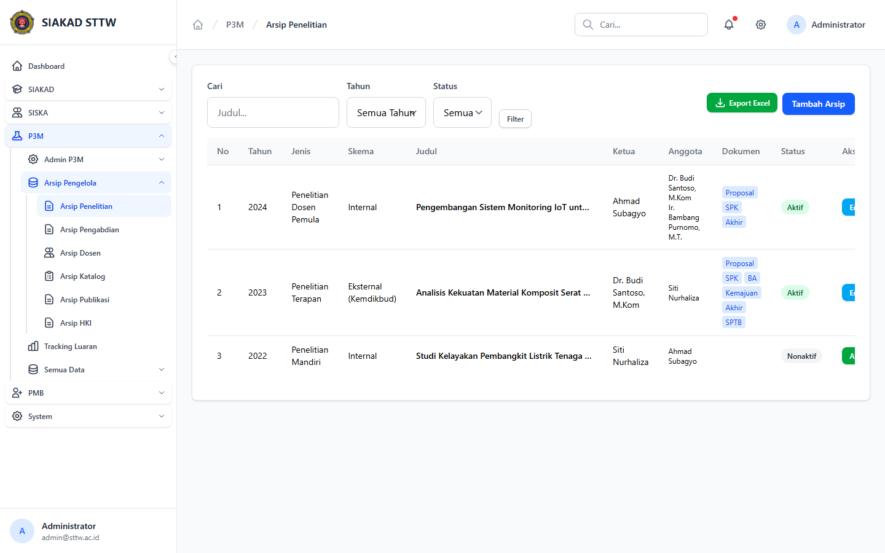
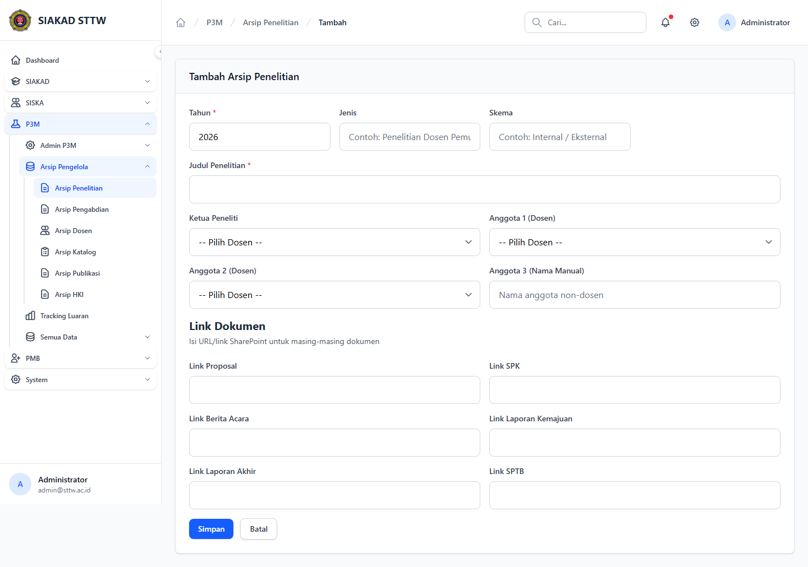
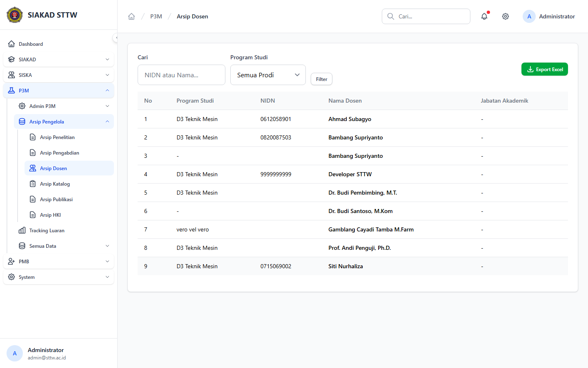
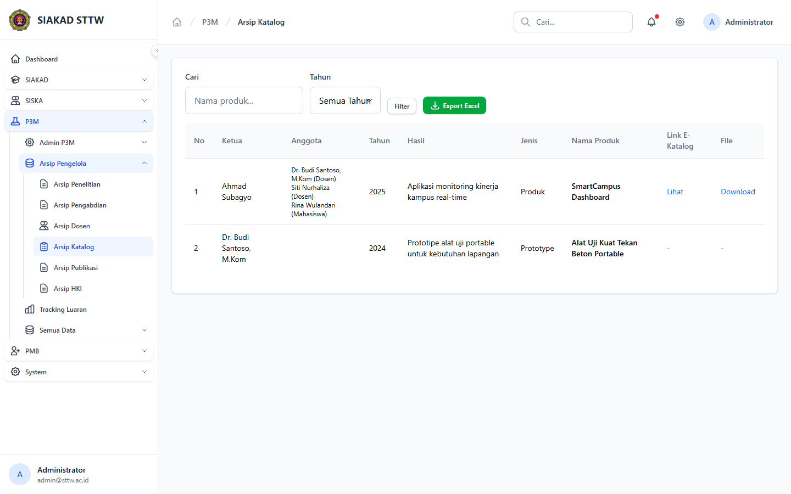

# Workflow Report: Arsip Pengelola P3M

**Tanggal**: 2026-04-19  
**Role**: Administrator P3M  
**Modul**: P3M > Arsip Pengelola  
**Fitur**: Arsip Pengelola P3M  
**Status**: ⚠️ Partial

## Deskripsi Workflow

Arsip penelitian, pengabdian, dosen, katalog, publikasi, dan HKI yang dikelola dari sisi admin.

## Ringkasan

8 langkah berhasil, 0 langkah gagal, dan 1 temuan warning tercatat.

## Langkah-langkah

### 1. Arsip Penelitian

**Deskripsi**: Halaman ini merekam tampilan utama arsip penelitian sebagai bagian dari alur arsip pengelola p3m.

**Akun**: Administrator P3M

**URL**: `http://127.0.0.1:8000/p3m/admin/arsip-penelitian`

### 2. Form Tambah Arsip Penelitian

**Deskripsi**: Form dibuka tanpa submit untuk memverifikasi field wajib, struktur input, dan tombol aksi pada arsip pengelola p3m.

**Akun**: Administrator P3M

**URL**: `http://127.0.0.1:8000/p3m/admin/arsip-penelitian/create`

### 3. Arsip Pengabdian

**Deskripsi**: Halaman ini merekam tampilan utama arsip pengabdian sebagai bagian dari alur arsip pengelola p3m.

**Akun**: Administrator P3M

**URL**: `http://127.0.0.1:8000/p3m/admin/arsip-pengabdian`

### 4. Form Tambah Arsip Pengabdian

**Deskripsi**: Form dibuka tanpa submit untuk memverifikasi field wajib, struktur input, dan tombol aksi pada arsip pengelola p3m.

**Akun**: Administrator P3M

**URL**: `http://127.0.0.1:8000/p3m/admin/arsip-pengabdian/create`

### 5. Arsip Dosen

**Deskripsi**: Arsip penelitian, pengabdian, dosen, katalog, publikasi, dan HKI yang dikelola dari sisi admin. Langkah ini difokuskan pada tampilan arsip dosen.

**Akun**: Administrator P3M

**URL**: `http://127.0.0.1:8000/p3m/admin/arsip-dosen`

### 6. Arsip Katalog

**Deskripsi**: Arsip penelitian, pengabdian, dosen, katalog, publikasi, dan HKI yang dikelola dari sisi admin. Langkah ini difokuskan pada tampilan arsip katalog.

**Akun**: Administrator P3M

**URL**: `http://127.0.0.1:8000/p3m/admin/arsip-katalog`

### 7. Arsip Publikasi

**Deskripsi**: Arsip penelitian, pengabdian, dosen, katalog, publikasi, dan HKI yang dikelola dari sisi admin. Langkah ini difokuskan pada tampilan arsip publikasi.

**Akun**: Administrator P3M

**URL**: `http://127.0.0.1:8000/p3m/admin/arsip-publikasi`

### 8. Arsip HKI

**Deskripsi**: Arsip penelitian, pengabdian, dosen, katalog, publikasi, dan HKI yang dikelola dari sisi admin. Langkah ini difokuskan pada tampilan arsip hki.

**Akun**: Administrator P3M

**URL**: `http://127.0.0.1:8000/p3m/admin/arsip-hki`

**Catatan langkah**: incomplete-data: Halaman menunjukkan data atau integrasi belum lengkap.

## Temuan & Masalah

| # | Halaman | URL | Kategori | Deskripsi | Screenshot | Prioritas |
|---|---------|-----|----------|-----------|------------|-----------|
| 1 | Arsip HKI | `http://127.0.0.1:8000/p3m/admin/arsip-hki` | `incomplete-data` | Halaman menunjukkan data atau integrasi belum lengkap. | [Lihat](screenshots/08_arsip_hki.png) | Medium |

## Catatan

- Screenshot diambil otomatis menggunakan Playwright dengan full-page capture.
- Navigasi utama diprioritaskan melalui sidebar; jika sebuah halaman hanya bisa dicapai dari quick action atau tombol sekunder, report akan menandainya sebagai `missing-sidebar`.
- Form pada report ini dibuka untuk verifikasi visual dan field wajib, tidak disubmit secara destruktif agar hasil scan tidak memalsukan status sukses.
- Data yang tampil mengikuti seeder P3M yang aktif saat scan dijalankan.
