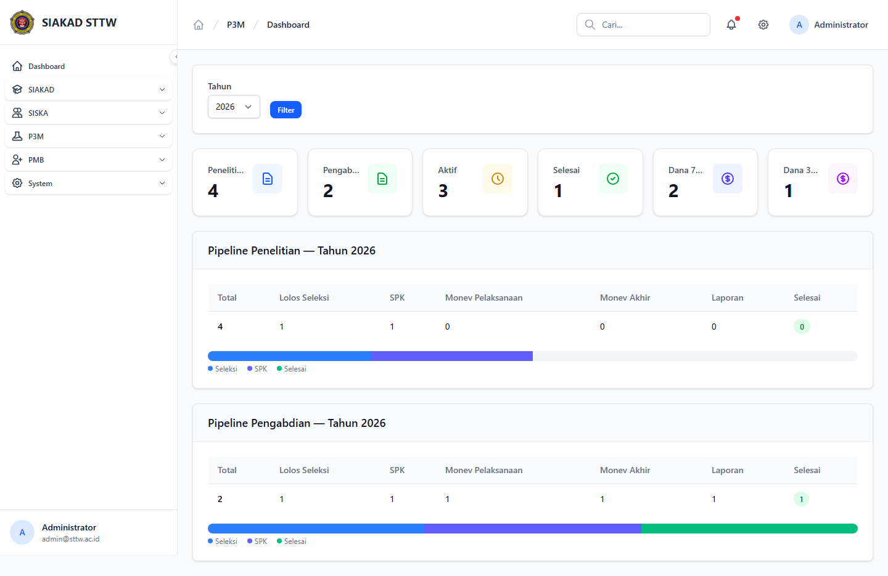

# Workflow Report: Dashboard Admin P3M

**Tanggal**: 2026-04-19  
**Role**: Administrator P3M  
**Modul**: P3M  
**Fitur**: Dashboard Admin P3M  
**Status**: ✅ Berhasil

## Deskripsi Workflow

Ringkasan statistik proposal, monev, laporan, dan akses cepat modul P3M untuk pengelola.

## Ringkasan

Semua 1 langkah pada scan ini lolos tanpa error maupun warning.

## Langkah-langkah

### 1. Dashboard Admin P3M

**Deskripsi**: Halaman dashboard untuk ringkasan statistik proposal, monev, laporan, dan akses cepat modul p3m untuk pengelola. Screenshot diambil setelah halaman selesai dimuat penuh.

**Akun**: Administrator P3M

**URL**: `http://127.0.0.1:8000/p3m/admin/dashboard`

## Temuan & Masalah

Tidak ada temuan kritis maupun warning pada scan ini.

## Catatan

- Screenshot diambil otomatis menggunakan Playwright dengan full-page capture.
- Navigasi utama diprioritaskan melalui sidebar; jika sebuah halaman hanya bisa dicapai dari quick action atau tombol sekunder, report akan menandainya sebagai `missing-sidebar`.
- Form pada report ini dibuka untuk verifikasi visual dan field wajib, tidak disubmit secara destruktif agar hasil scan tidak memalsukan status sukses.
- Data yang tampil mengikuti seeder P3M yang aktif saat scan dijalankan.
