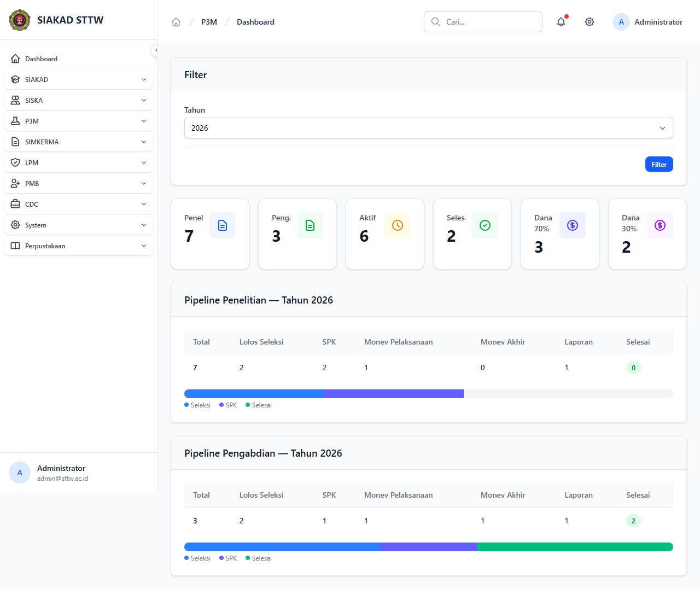

# Workflow Report: Dashboard Admin P3M (Refresh Filter Tahun + Monev Tracker)

**Tanggal**: 2026-05-12
**Role**: admin
**Modul**: p3m
**Fitur**: admin-dashboard
**Status**: ✅ Berhasil

## Deskripsi Workflow

Verifikasi ulang Dashboard P3M setelah dua perubahan delta pertengahan April:

1. **TASK-080** — Penambahan filter tahun pada widget statistik (komit pertengahan April pada `app/Http/Controllers/P3m/Admin/DashboardController.php`).
2. **TASK-081** — Komponen tracker monev (`<x-dashboard.p3m-monev-tracker>`) yang menampilkan progres monev per proposal dengan canvas chart.

Tujuan refresh: memastikan tampilan dashboard tetap konsisten setelah dua patch tersebut, serta mengarsipkan dua snapshot sebelumnya (`2026-04-13` dan `2026-04-19`) sebagai histori.

## Ringkasan

- Dashboard dimuat HTTP 200 dengan judul `Dashboard P3M - SIAKAD STTW`.
- Filter tahun aktif berfungsi (default tahun berjalan, opsi tahun tersedia di kontrol filter).
- Widget monev tracker dirender tanpa error JS.
- Tidak ada temuan baru — semua kartu statistik dirender sebagai komponen `<x-stats-card>` dan `<x-card>`.

## Langkah-langkah

### 1. Login admin & buka Dashboard P3M

**Deskripsi**: Login sebagai `admin@sttw.ac.id`, navigasi sidebar ke grup P3M → Dashboard. Halaman menampilkan ringkasan proposal, filter tahun, dan tracker monev.

**URL**: `http://127.0.0.1:8000/p3m/admin/dashboard`

## Temuan & Masalah

Tidak ada temuan baru pada batch refresh ini.

## Catatan

- Snapshot lama diarsipkan: `2026-04-13_REPORT.md` (dashboard awal) dan `2026-04-19_REPORT.md` (sebelum filter tahun).
- Refresh ini membungkus penyelesaian dua issue yang sudah terlihat dampaknya di UI; tidak ada regresi.
