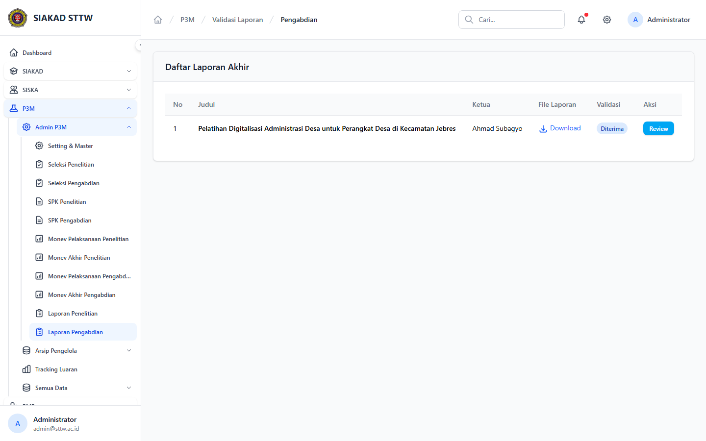

# Workflow Report: Validasi Laporan Akhir P3M

**Tanggal**: 2026-04-19  
**Role**: Administrator P3M  
**Modul**: P3M > Admin P3M  
**Fitur**: Validasi Laporan Akhir P3M  
**Status**: ✅ Berhasil

## Deskripsi Workflow

Daftar laporan akhir proposal penelitian dan pengabdian, termasuk halaman review laporan yang masuk.

## Ringkasan

2 langkah berhasil, 0 langkah gagal, dan tidak ada temuan blocking pada rescan ini.

## Langkah-langkah

### 1. Laporan Penelitian

**Deskripsi**: Halaman validasi laporan akhir penelitian berhasil dibuka dari sidebar admin P3M dan menampilkan laporan penelitian yang sudah masuk ke tahap review admin.

**Akun**: Administrator P3M

**URL**: `http://127.0.0.1:8000/p3m/admin/validasi-laporan/penelitian`

### 2. Laporan Pengabdian

**Deskripsi**: Halaman validasi laporan akhir pengabdian berhasil dibuka dari sidebar admin P3M dan menampilkan laporan pengabdian beserta status validasinya.

**Akun**: Administrator P3M

**URL**: `http://127.0.0.1:8000/p3m/admin/validasi-laporan/pengabdian`

## Temuan & Masalah

Tidak ada temuan blocking pada halaman validasi laporan akhir setelah data workflow diperbarui dan rescan dijalankan.

## Catatan

- Screenshot diambil otomatis menggunakan Playwright dengan full-page capture.
- Navigasi utama diprioritaskan melalui sidebar; jika sebuah halaman hanya bisa dicapai dari quick action atau tombol sekunder, report akan menandainya sebagai `missing-sidebar`.
- Form pada report ini dibuka untuk verifikasi visual dan field wajib, tidak disubmit secara destruktif agar hasil scan tidak memalsukan status sukses.
- Data yang tampil mengikuti seeder P3M yang aktif saat scan dijalankan.
