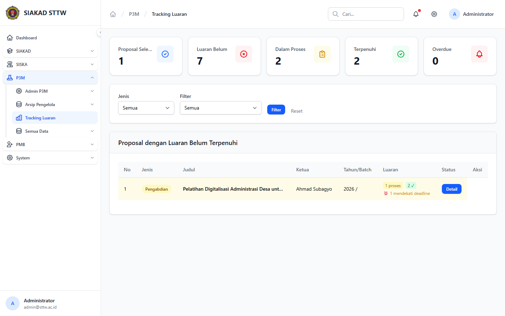

# Workflow Report: Tracking Luaran P3M

**Tanggal**: 2026-04-19  
**Role**: Administrator P3M  
**Modul**: P3M  
**Fitur**: Tracking Luaran P3M  
**Status**: ✅ Berhasil

## Deskripsi Workflow

Monitoring proposal yang belum memenuhi luaran dan halaman detail target luaran per proposal.

## Ringkasan

Semua 2 langkah pada scan ini lolos tanpa error maupun warning.

## Langkah-langkah

### 1. Tracking Luaran

**Deskripsi**: Monitoring proposal yang belum memenuhi luaran dan halaman detail target luaran per proposal. Langkah ini difokuskan pada tampilan tracking luaran.

**Akun**: Administrator P3M

**URL**: `http://127.0.0.1:8000/p3m/admin/luaran`

### 2. Detail Tracking Luaran

**Deskripsi**: Monitoring proposal yang belum memenuhi luaran dan halaman detail target luaran per proposal. Langkah ini difokuskan pada tampilan detail tracking luaran.

**Akun**: Administrator P3M

**URL**: `http://127.0.0.1:8000/p3m/admin/luaran/5`

## Temuan & Masalah

Tidak ada temuan kritis maupun warning pada scan ini.

## Catatan

- Screenshot diambil otomatis menggunakan Playwright dengan full-page capture.
- Navigasi utama diprioritaskan melalui sidebar; jika sebuah halaman hanya bisa dicapai dari quick action atau tombol sekunder, report akan menandainya sebagai `missing-sidebar`.
- Form pada report ini dibuka untuk verifikasi visual dan field wajib, tidak disubmit secara destruktif agar hasil scan tidak memalsukan status sukses.
- Data yang tampil mengikuti seeder P3M yang aktif saat scan dijalankan.
