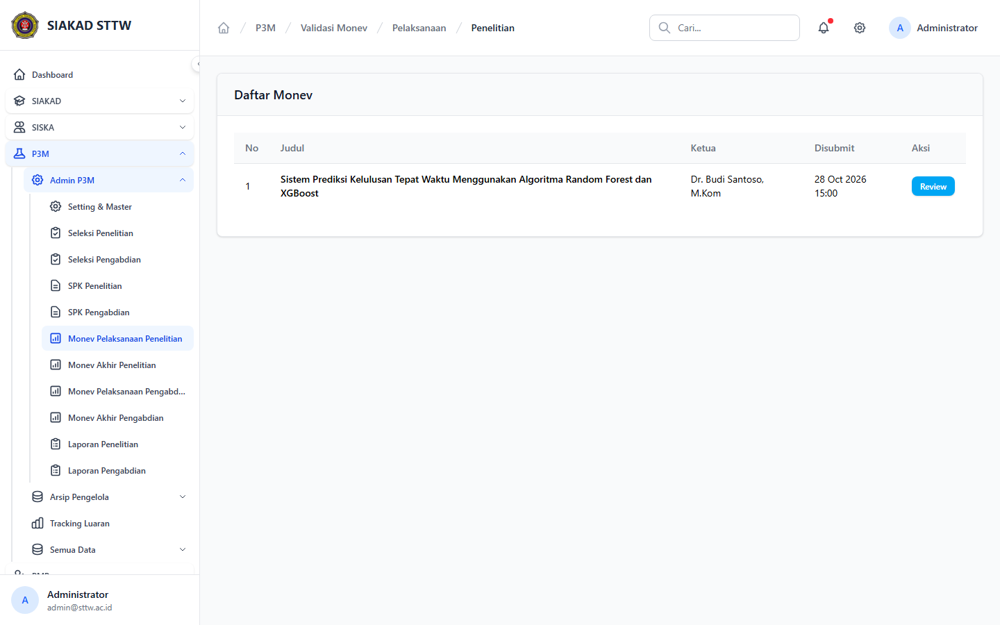
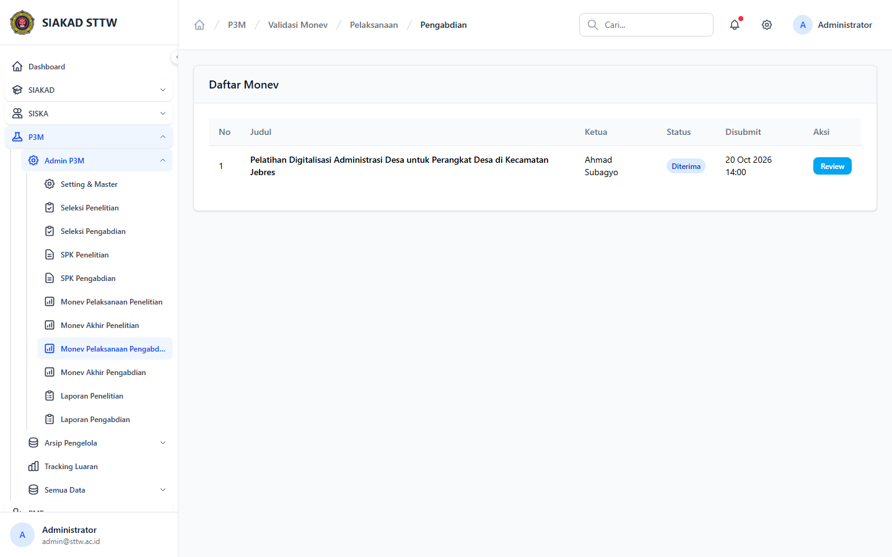
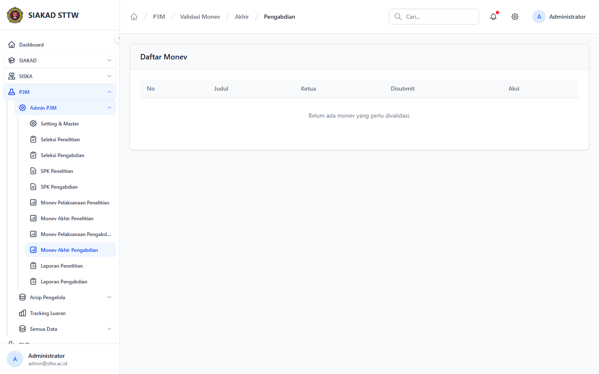

# Workflow Report: Validasi Monev P3M

**Tanggal**: 2026-04-19  
**Role**: Administrator P3M  
**Modul**: P3M > Admin P3M  
**Fitur**: Validasi Monev P3M  
**Status**: ⚠️ Partial

## Deskripsi Workflow

Navigasi halaman validasi monev dari sidebar admin P3M untuk penelitian dan pengabdian pada tahap pelaksanaan maupun tahap akhir.

## Ringkasan

5 langkah berhasil, 0 langkah gagal, dan 3 temuan warning tercatat.

## Langkah-langkah

### 1. Daftar Monev Pelaksanaan Penelitian

**Deskripsi**: Halaman daftar validasi monev pelaksanaan penelitian berhasil dibuka dari sidebar dan menampilkan proposal yang siap direview.

**Akun**: Administrator P3M

**URL**: `http://127.0.0.1:8000/p3m/admin/validasi-monev/penelitian/pelaksanaan`

### 2. Detail Monev Pelaksanaan Penelitian

**Deskripsi**: Detail monev pelaksanaan penelitian berhasil dibuka dari aksi tabel dan menampilkan data proposal, komponen luaran, serta form verifikasi admin.

**Akun**: Administrator P3M

**URL**: `http://127.0.0.1:8000/p3m/admin/validasi-monev/penelitian/pelaksanaan/3`

### 3. Daftar Monev Akhir Penelitian

**Deskripsi**: Halaman validasi monev akhir penelitian berhasil dibuka dari sidebar, namun saat retest belum ada data yang perlu divalidasi.

**Akun**: Administrator P3M

**URL**: `http://127.0.0.1:8000/p3m/admin/validasi-monev/penelitian/akhir`

**Catatan langkah**: no-data: Halaman tampil normal tetapi tabel validasi masih kosong.

### 4. Daftar Monev Pelaksanaan Pengabdian

**Deskripsi**: Halaman validasi monev pelaksanaan pengabdian berhasil dibuka dari sidebar, namun saat retest belum ada data yang perlu divalidasi.

**Akun**: Administrator P3M

**URL**: `http://127.0.0.1:8000/p3m/admin/validasi-monev/pengabdian/pelaksanaan`

**Catatan langkah**: no-data: Halaman tampil normal tetapi tabel validasi masih kosong.

### 5. Daftar Monev Akhir Pengabdian

**Deskripsi**: Halaman validasi monev akhir pengabdian berhasil dibuka dari sidebar, namun saat retest belum ada data yang perlu divalidasi.

**Akun**: Administrator P3M

**URL**: `http://127.0.0.1:8000/p3m/admin/validasi-monev/pengabdian/akhir`

**Catatan langkah**: no-data: Halaman tampil normal tetapi tabel validasi masih kosong.

## Temuan & Masalah

| # | Halaman | URL | Kategori | Deskripsi | Screenshot | Prioritas |
|---|---------|-----|----------|-----------|------------|-----------|
| 1 | Daftar Monev Akhir Penelitian | `http://127.0.0.1:8000/p3m/admin/validasi-monev/penelitian/akhir` | `no-data` | Halaman validasi dapat diakses dari sidebar, tetapi belum ada data monev akhir penelitian yang perlu divalidasi. | [Lihat](screenshots/08_penelitian_akhir_index_sidebar.png) | Low |
| 2 | Daftar Monev Pelaksanaan Pengabdian | `http://127.0.0.1:8000/p3m/admin/validasi-monev/pengabdian/pelaksanaan` | `no-data` | Halaman validasi dapat diakses dari sidebar, tetapi belum ada data monev pelaksanaan pengabdian yang perlu divalidasi. | [Lihat](screenshots/10_pengabdian_pelaksanaan_index_sidebar.png) | Low |
| 3 | Daftar Monev Akhir Pengabdian | `http://127.0.0.1:8000/p3m/admin/validasi-monev/pengabdian/akhir` | `no-data` | Halaman validasi dapat diakses dari sidebar, tetapi belum ada data monev akhir pengabdian yang perlu divalidasi. | [Lihat](screenshots/11_pengabdian_akhir_index_sidebar.png) | Low |

## Catatan

- Screenshot diambil otomatis menggunakan Playwright dengan full-page capture.
- Navigasi utama dilakukan melalui sidebar admin P3M; halaman detail dicapai dari aksi tabel setelah daftar terbuka.
- Temuan `missing-sidebar` pada scan sebelumnya sudah tidak ditemukan lagi setelah item menu monev ditambahkan ke sidebar admin.
