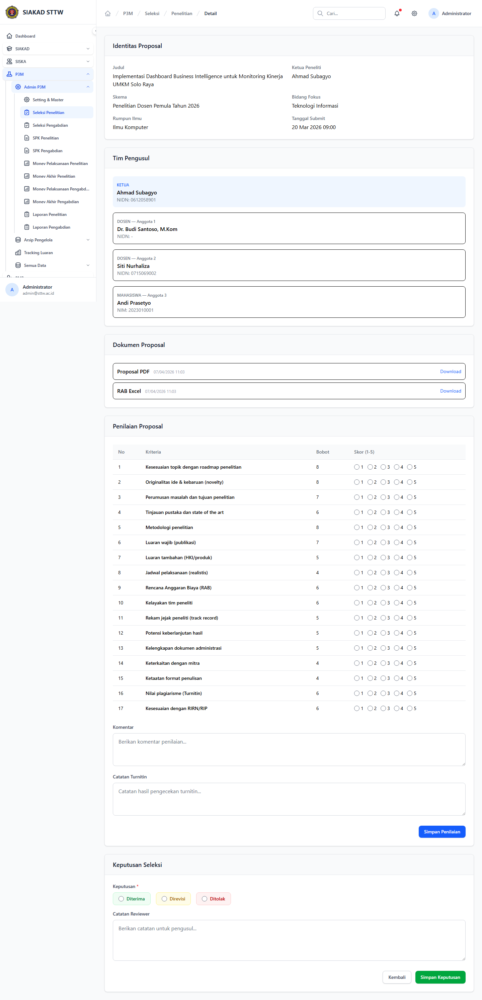
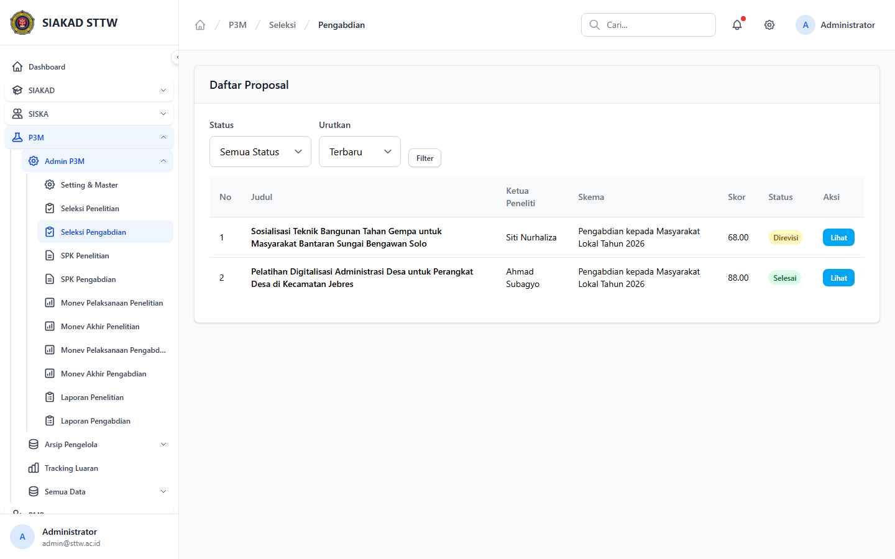
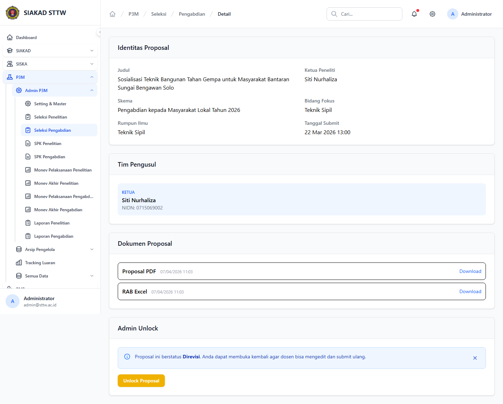

# Workflow Report: Seleksi Proposal P3M

**Tanggal**: 2026-04-19  
**Role**: Administrator P3M  
**Modul**: P3M > Admin P3M  
**Fitur**: Seleksi Proposal P3M  
**Status**: ✅ Berhasil

## Deskripsi Workflow

Daftar proposal penelitian dan pengabdian yang masuk proses seleksi beserta halaman review detailnya.

## Ringkasan

Semua 4 langkah pada scan ini lolos tanpa error maupun warning.

## Langkah-langkah

### 1. Seleksi Penelitian

**Deskripsi**: Halaman ini merekam tampilan utama seleksi penelitian sebagai bagian dari alur seleksi proposal p3m.

**Akun**: Administrator P3M

**URL**: `http://127.0.0.1:8000/p3m/admin/seleksi/penelitian`

### 2. Detail Seleksi Penelitian

**Deskripsi**: Halaman ini merekam tampilan utama detail seleksi penelitian sebagai bagian dari alur seleksi proposal p3m.

**Akun**: Administrator P3M

**URL**: `http://127.0.0.1:8000/p3m/admin/seleksi/penelitian/2`

### 3. Seleksi Pengabdian

**Deskripsi**: Halaman ini merekam tampilan utama seleksi pengabdian sebagai bagian dari alur seleksi proposal p3m.

**Akun**: Administrator P3M

**URL**: `http://127.0.0.1:8000/p3m/admin/seleksi/pengabdian`

### 4. Detail Seleksi Pengabdian

**Deskripsi**: Halaman ini merekam tampilan utama detail seleksi pengabdian sebagai bagian dari alur seleksi proposal p3m.

**Akun**: Administrator P3M

**URL**: `http://127.0.0.1:8000/p3m/admin/seleksi/pengabdian/6`

## Temuan & Masalah

Tidak ada temuan kritis maupun warning pada scan ini.

## Catatan

- Screenshot diambil otomatis menggunakan Playwright dengan full-page capture.
- Navigasi utama diprioritaskan melalui sidebar; jika sebuah halaman hanya bisa dicapai dari quick action atau tombol sekunder, report akan menandainya sebagai `missing-sidebar`.
- Form pada report ini dibuka untuk verifikasi visual dan field wajib, tidak disubmit secara destruktif agar hasil scan tidak memalsukan status sukses.
- Data yang tampil mengikuti seeder P3M yang aktif saat scan dijalankan.
