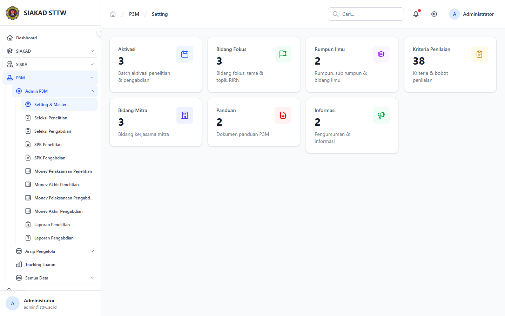
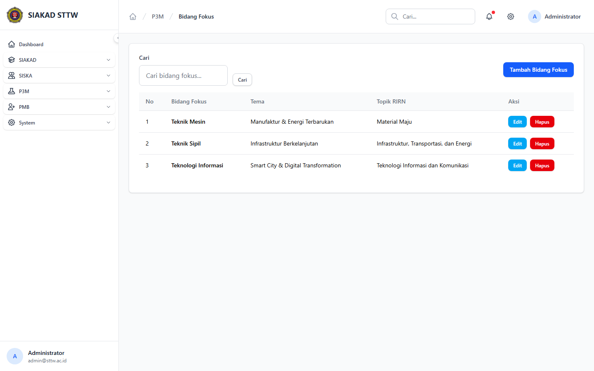
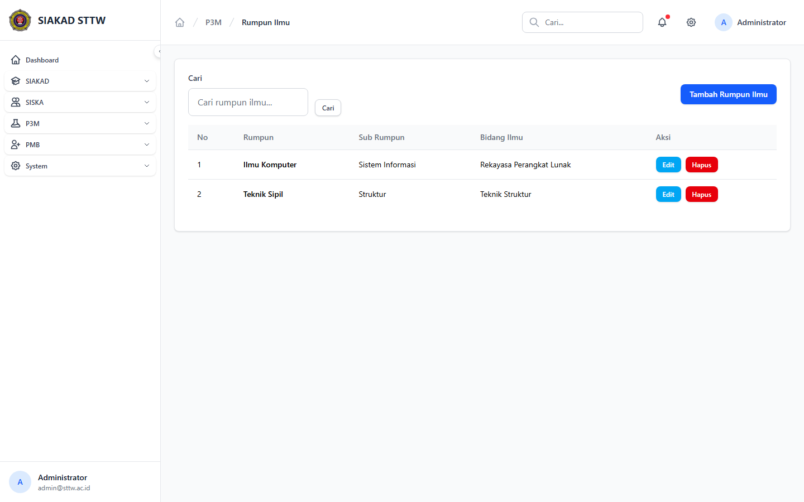
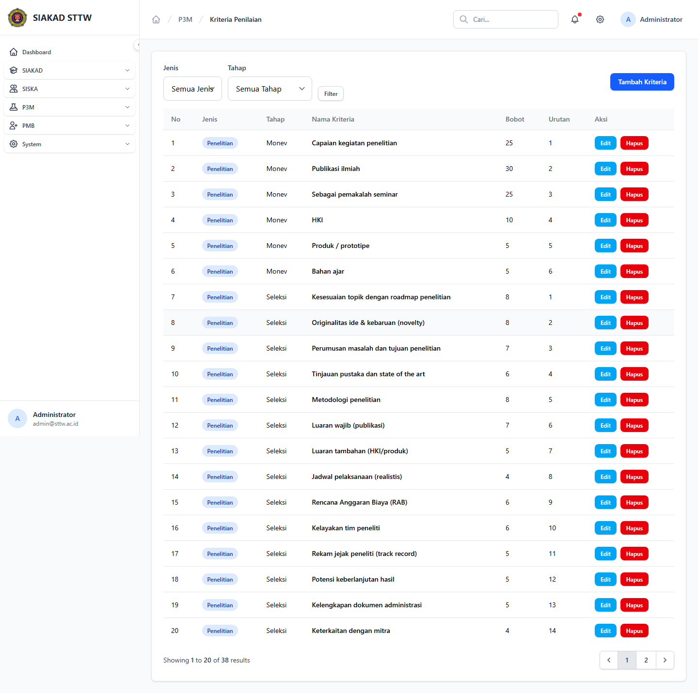
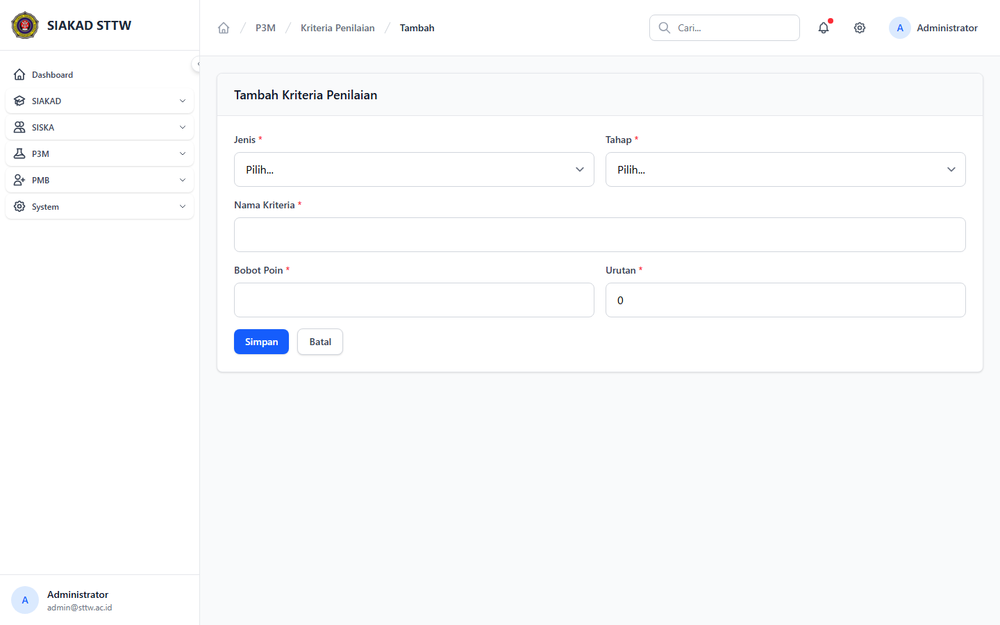
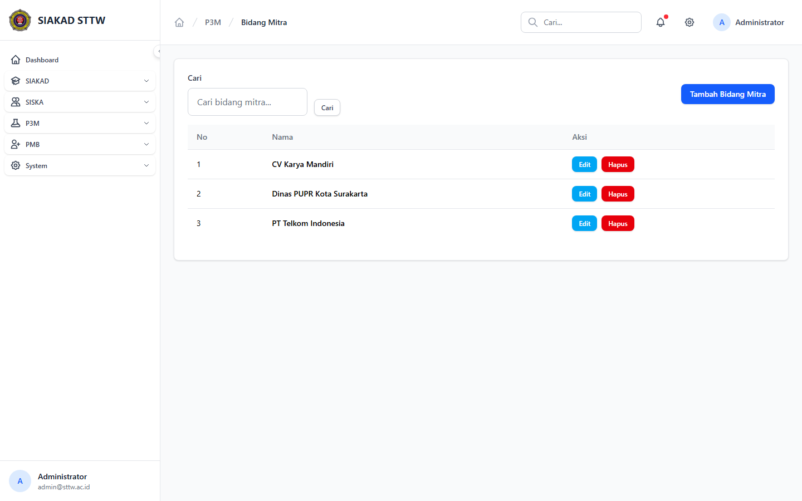
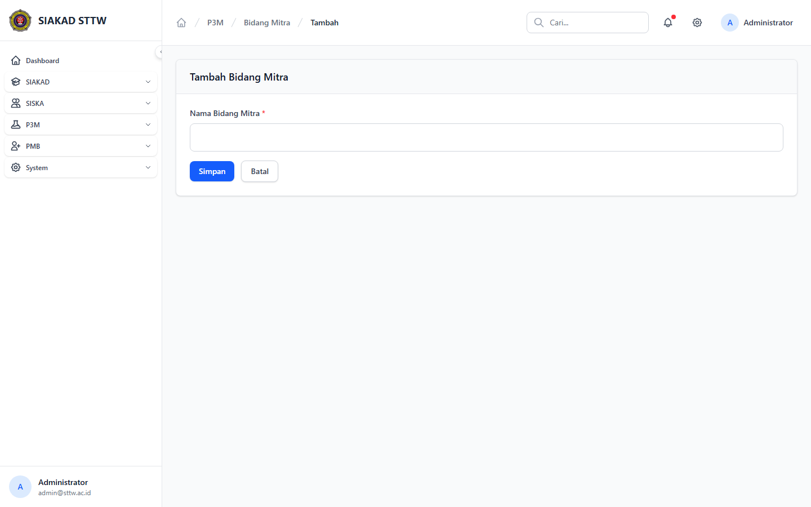
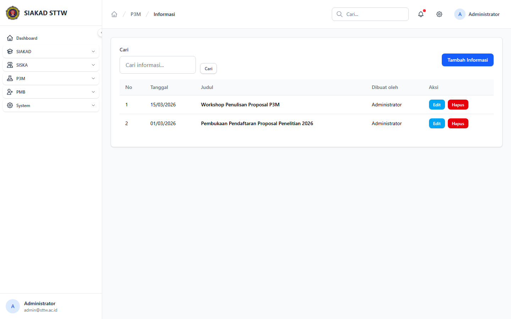

# Workflow Report: Master Data & Setting P3M

**Tanggal**: 2026-04-19  
**Role**: Administrator P3M  
**Modul**: P3M > Admin P3M  
**Fitur**: Master Data & Setting P3M  
**Status**: ⚠️ Partial

## Deskripsi Workflow

Hub setting P3M dan halaman master bidang fokus, rumpun ilmu, kriteria penilaian, bidang mitra, panduan, serta informasi.

## Ringkasan

13 langkah berhasil, 0 langkah gagal, dan 1 temuan warning tercatat.

## Langkah-langkah

### 1. Setting & Master

**Deskripsi**: Hub setting P3M dan halaman master bidang fokus, rumpun ilmu, kriteria penilaian, bidang mitra, panduan, serta informasi. Langkah ini difokuskan pada tampilan setting & master.

**Akun**: Administrator P3M

**URL**: `http://127.0.0.1:8000/p3m/admin/setting`

### 2. Daftar Bidang Fokus

**Deskripsi**: Halaman ini merekam tampilan utama daftar bidang fokus sebagai bagian dari alur master data & setting p3m.

**Akun**: Administrator P3M

**URL**: `http://127.0.0.1:8000/p3m/admin/bidang-fokus`

### 3. Form Tambah Bidang Fokus

**Deskripsi**: Form dibuka tanpa submit untuk memverifikasi field wajib, struktur input, dan tombol aksi pada master data & setting p3m.

**Akun**: Administrator P3M

**URL**: `http://127.0.0.1:8000/p3m/admin/bidang-fokus/create`

### 4. Daftar Rumpun Ilmu

**Deskripsi**: Halaman ini merekam tampilan utama daftar rumpun ilmu sebagai bagian dari alur master data & setting p3m.

**Akun**: Administrator P3M

**URL**: `http://127.0.0.1:8000/p3m/admin/rumpun-ilmu`

### 5. Form Tambah Rumpun Ilmu

**Deskripsi**: Form dibuka tanpa submit untuk memverifikasi field wajib, struktur input, dan tombol aksi pada master data & setting p3m.

**Akun**: Administrator P3M

**URL**: `http://127.0.0.1:8000/p3m/admin/rumpun-ilmu/create`

### 6. Daftar Kriteria Penilaian

**Deskripsi**: Halaman ini merekam tampilan utama daftar kriteria penilaian sebagai bagian dari alur master data & setting p3m.

**Akun**: Administrator P3M

**URL**: `http://127.0.0.1:8000/p3m/admin/kriteria-penilaian`

### 7. Form Tambah Kriteria Penilaian

**Deskripsi**: Form dibuka tanpa submit untuk memverifikasi field wajib, struktur input, dan tombol aksi pada master data & setting p3m.

**Akun**: Administrator P3M

**URL**: `http://127.0.0.1:8000/p3m/admin/kriteria-penilaian/create`

### 8. Daftar Bidang Mitra

**Deskripsi**: Halaman ini merekam tampilan utama daftar bidang mitra sebagai bagian dari alur master data & setting p3m.

**Akun**: Administrator P3M

**URL**: `http://127.0.0.1:8000/p3m/admin/bidang-mitra`

### 9. Form Tambah Bidang Mitra

**Deskripsi**: Form dibuka tanpa submit untuk memverifikasi field wajib, struktur input, dan tombol aksi pada master data & setting p3m.

**Akun**: Administrator P3M

**URL**: `http://127.0.0.1:8000/p3m/admin/bidang-mitra/create`

### 10. Daftar Panduan

**Deskripsi**: Halaman ini merekam tampilan utama daftar panduan sebagai bagian dari alur master data & setting p3m.

**Akun**: Administrator P3M

**URL**: `http://127.0.0.1:8000/p3m/admin/panduan`

**Catatan langkah**: no-data: Halaman tampil tetapi data yang ditampilkan masih kosong atau belum tersedia.

### 11. Form Tambah Panduan

**Deskripsi**: Form dibuka tanpa submit untuk memverifikasi field wajib, struktur input, dan tombol aksi pada master data & setting p3m.

**Akun**: Administrator P3M

**URL**: `http://127.0.0.1:8000/p3m/admin/panduan/create`

### 12. Daftar Informasi

**Deskripsi**: Halaman ini merekam tampilan utama daftar informasi sebagai bagian dari alur master data & setting p3m.

**Akun**: Administrator P3M

**URL**: `http://127.0.0.1:8000/p3m/admin/informasi`

### 13. Form Tambah Informasi

**Deskripsi**: Form dibuka tanpa submit untuk memverifikasi field wajib, struktur input, dan tombol aksi pada master data & setting p3m.

**Akun**: Administrator P3M

**URL**: `http://127.0.0.1:8000/p3m/admin/informasi/create`

## Temuan & Masalah

| # | Halaman | URL | Kategori | Deskripsi | Screenshot | Prioritas |
|---|---------|-----|----------|-----------|------------|-----------|
| 1 | Daftar Panduan | `http://127.0.0.1:8000/p3m/admin/panduan` | `no-data` | Halaman tampil tetapi data yang ditampilkan masih kosong atau belum tersedia. | [Lihat](screenshots/10_panduan.png) | Low |

## Catatan

- Screenshot diambil otomatis menggunakan Playwright dengan full-page capture.
- Navigasi utama diprioritaskan melalui sidebar; jika sebuah halaman hanya bisa dicapai dari quick action atau tombol sekunder, report akan menandainya sebagai `missing-sidebar`.
- Form pada report ini dibuka untuk verifikasi visual dan field wajib, tidak disubmit secara destruktif agar hasil scan tidak memalsukan status sukses.
- Data yang tampil mengikuti seeder P3M yang aktif saat scan dijalankan.
