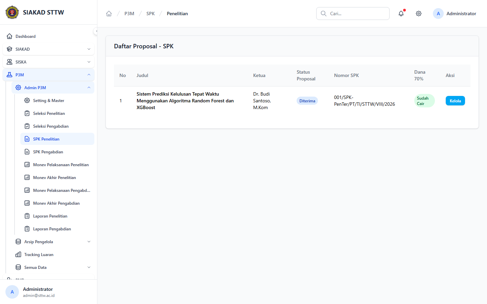
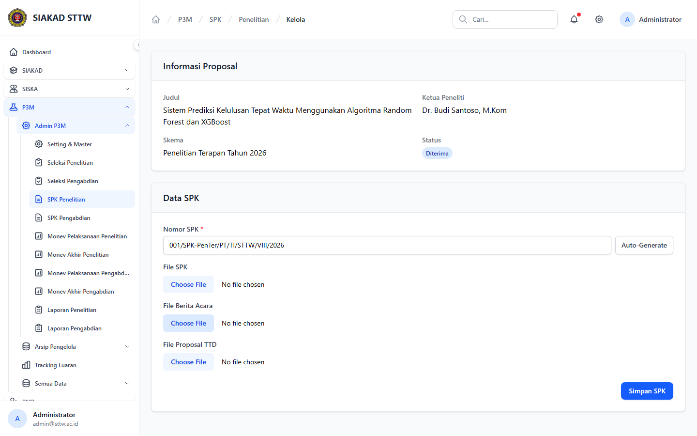

# Workflow Report: Kelola SPK P3M

**Tanggal**: 2026-04-19  
**Role**: Administrator P3M  
**Modul**: P3M > Admin P3M  
**Fitur**: Kelola SPK P3M  
**Status**: ✅ Berhasil

## Deskripsi Workflow

Daftar proposal yang sudah lolos untuk proses SPK dan halaman pengelolaan dokumen per proposal.

## Ringkasan

3 langkah berhasil, 0 langkah gagal, dan tidak ada temuan blocking pada rescan ini.

## Langkah-langkah

### 1. SPK Penelitian

**Deskripsi**: Halaman ini merekam tampilan utama spk penelitian sebagai bagian dari alur kelola spk p3m.

**Akun**: Administrator P3M

**URL**: `http://127.0.0.1:8000/p3m/admin/spk/penelitian`

### 2. Detail SPK Penelitian

**Deskripsi**: Halaman ini merekam tampilan utama detail spk penelitian sebagai bagian dari alur kelola spk p3m.

**Akun**: Administrator P3M

**URL**: `http://127.0.0.1:8000/p3m/admin/spk/penelitian/3`

### 3. SPK Pengabdian

**Deskripsi**: Halaman SPK pengabdian berhasil dibuka dari sidebar admin P3M dan menampilkan proposal pengabdian yang sudah memiliki data SPK.

**Akun**: Administrator P3M

**URL**: `http://127.0.0.1:8000/p3m/admin/spk/pengabdian`

## Temuan & Masalah

Tidak ada temuan blocking pada halaman kelola SPK setelah daftar proposal diperluas untuk menampilkan proposal yang sudah memiliki SPK.

## Catatan

- Screenshot diambil otomatis menggunakan Playwright dengan full-page capture.
- Navigasi utama diprioritaskan melalui sidebar; jika sebuah halaman hanya bisa dicapai dari quick action atau tombol sekunder, report akan menandainya sebagai `missing-sidebar`.
- Form pada report ini dibuka untuk verifikasi visual dan field wajib, tidak disubmit secara destruktif agar hasil scan tidak memalsukan status sukses.
- Data yang tampil mengikuti seeder P3M yang aktif saat scan dijalankan.
