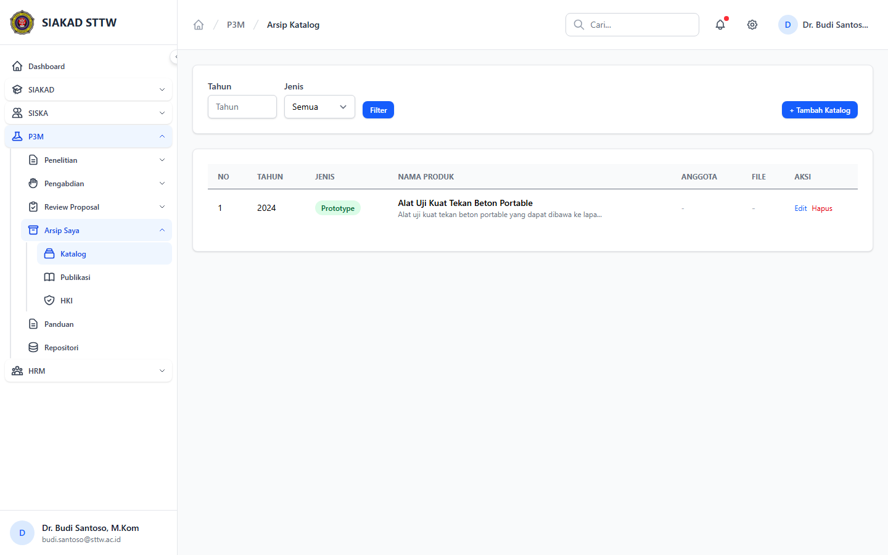
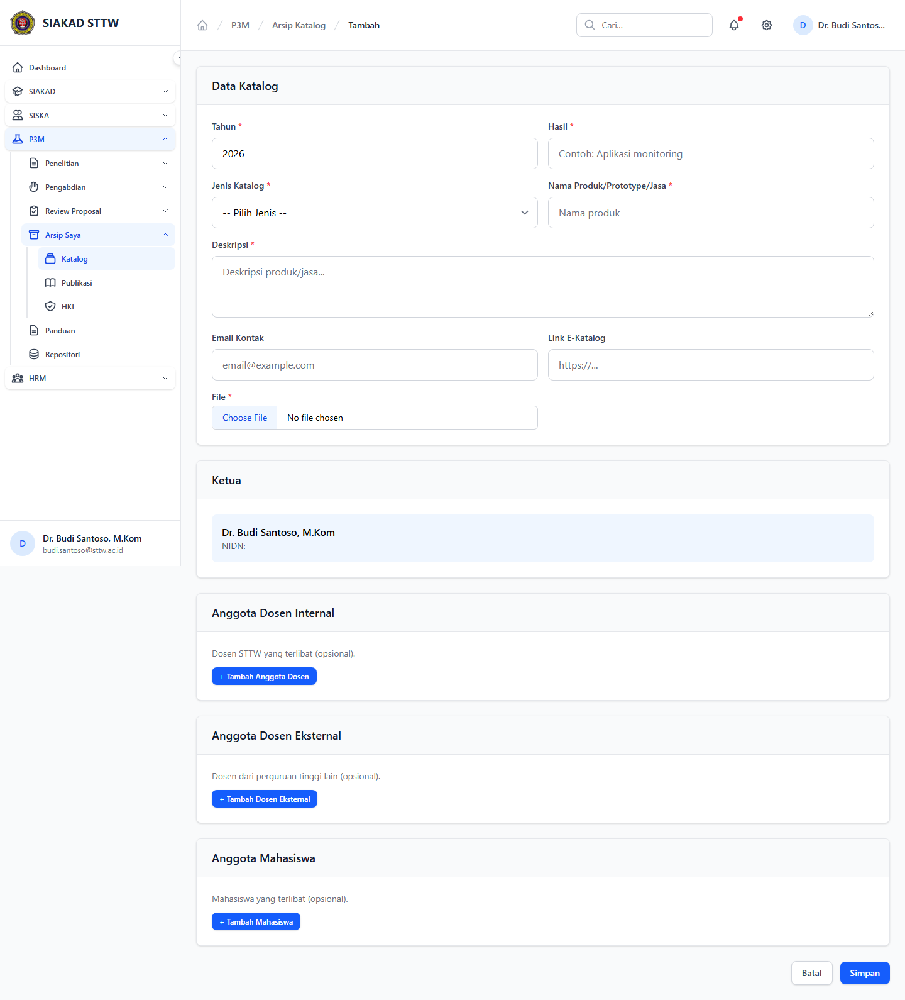
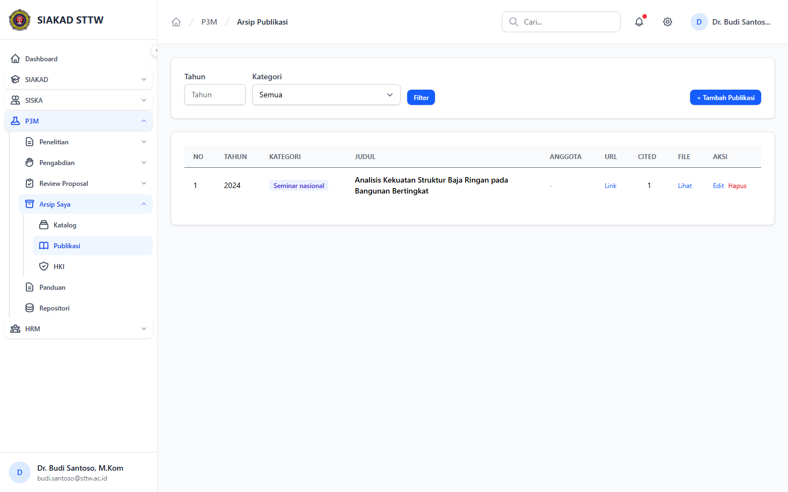
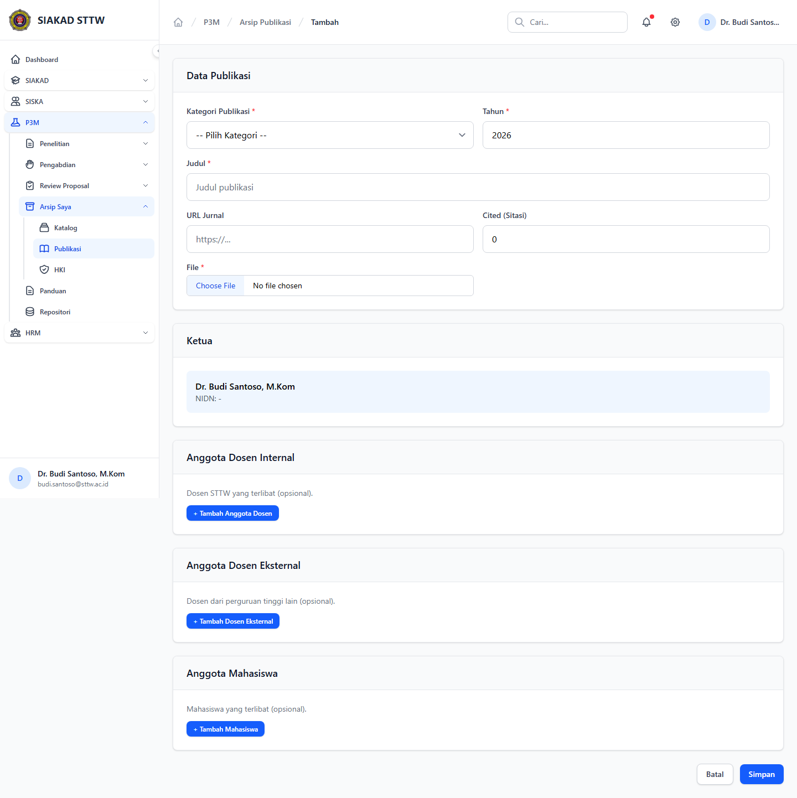
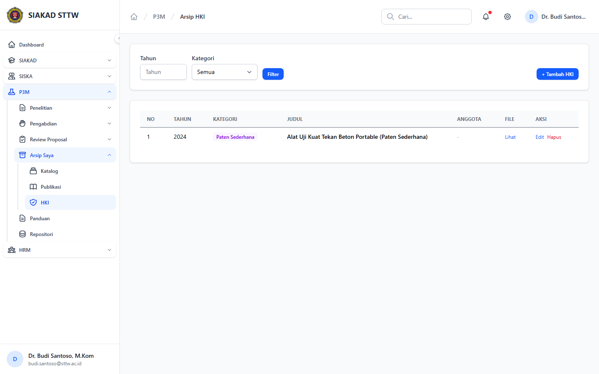
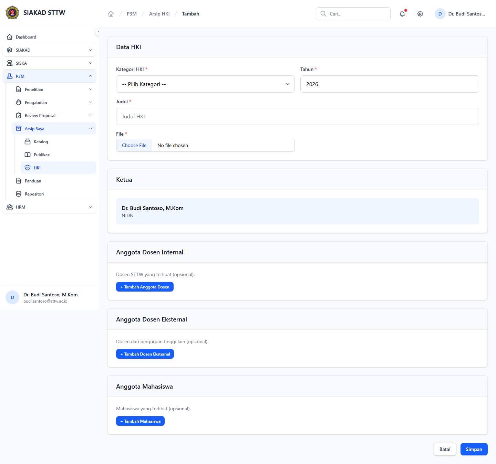

# Workflow Report: Arsip Dosen P3M

**Tanggal**: 2026-04-19  
**Role**: Dosen  
**Modul**: P3M > Arsip Saya  
**Fitur**: Arsip Dosen P3M  
**Status**: ✅ Berhasil

## Deskripsi Workflow

Pengelolaan katalog, publikasi, dan HKI milik dosen dari portal P3M.

## Ringkasan

Semua 6 langkah pada scan ini lolos tanpa error maupun warning.

## Langkah-langkah

### 1. Arsip Katalog

**Deskripsi**: Pengelolaan katalog, publikasi, dan HKI milik dosen dari portal P3M. Langkah ini difokuskan pada tampilan arsip katalog.

**Akun**: Portal Dosen - Budi Santoso

**URL**: `http://127.0.0.1:8000/p3m/dosen/katalog`

### 2. Form Tambah Katalog

**Deskripsi**: Form dibuka tanpa submit untuk memverifikasi field wajib, struktur input, dan tombol aksi pada arsip dosen p3m.

**Akun**: Portal Dosen - Budi Santoso

**URL**: `http://127.0.0.1:8000/p3m/dosen/katalog/create`

### 3. Arsip Publikasi

**Deskripsi**: Pengelolaan katalog, publikasi, dan HKI milik dosen dari portal P3M. Langkah ini difokuskan pada tampilan arsip publikasi.

**Akun**: Portal Dosen - Budi Santoso

**URL**: `http://127.0.0.1:8000/p3m/dosen/publikasi`

### 4. Form Tambah Publikasi

**Deskripsi**: Form dibuka tanpa submit untuk memverifikasi field wajib, struktur input, dan tombol aksi pada arsip dosen p3m.

**Akun**: Portal Dosen - Budi Santoso

**URL**: `http://127.0.0.1:8000/p3m/dosen/publikasi/create`

### 5. Arsip HKI

**Deskripsi**: Pengelolaan katalog, publikasi, dan HKI milik dosen dari portal P3M. Langkah ini difokuskan pada tampilan arsip hki.

**Akun**: Portal Dosen - Budi Santoso

**URL**: `http://127.0.0.1:8000/p3m/dosen/hki`

### 6. Form Tambah HKI

**Deskripsi**: Form dibuka tanpa submit untuk memverifikasi field wajib, struktur input, dan tombol aksi pada arsip dosen p3m.

**Akun**: Portal Dosen - Budi Santoso

**URL**: `http://127.0.0.1:8000/p3m/dosen/hki/create`

## Temuan & Masalah

Tidak ada temuan kritis maupun warning pada scan ini.

## Catatan

- Screenshot diambil otomatis menggunakan Playwright dengan full-page capture.
- Navigasi utama diprioritaskan melalui sidebar; jika sebuah halaman hanya bisa dicapai dari quick action atau tombol sekunder, report akan menandainya sebagai `missing-sidebar`.
- Form pada report ini dibuka untuk verifikasi visual dan field wajib, tidak disubmit secara destruktif agar hasil scan tidak memalsukan status sukses.
- Data yang tampil mengikuti seeder P3M yang aktif saat scan dijalankan.
