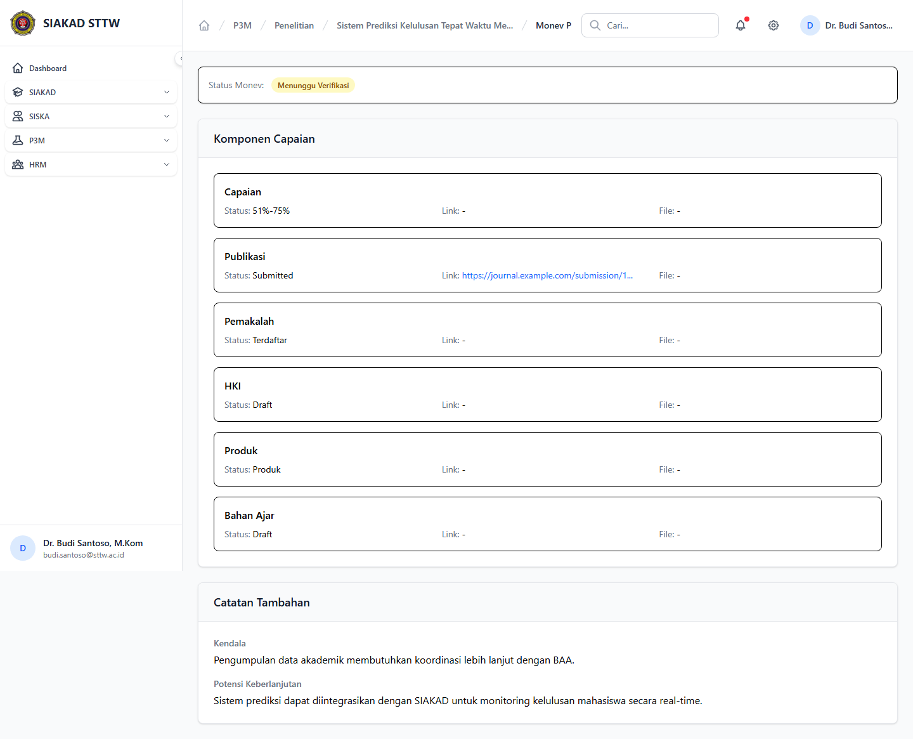
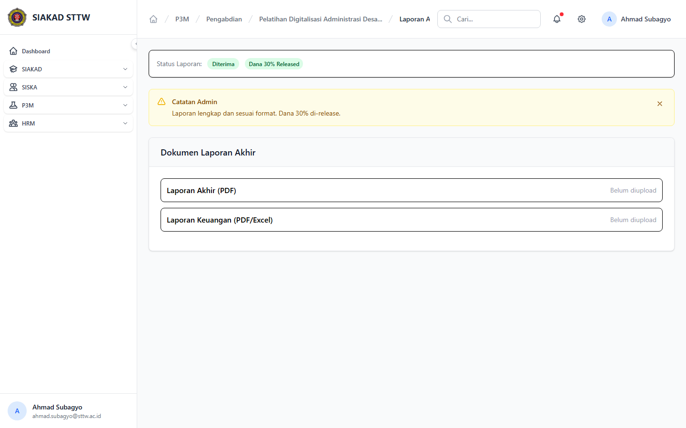

# Workflow Report: Monev & Laporan Dosen P3M

**Tanggal**: 2026-04-19  
**Role**: Dosen  
**Modul**: P3M > Portal Dosen  
**Fitur**: Monev & Laporan Dosen P3M  
**Status**: ⚠️ Partial

## Deskripsi Workflow

Halaman monev dan laporan akhir dosen yang saat ini hanya dapat diakses lewat URL khusus proposal.

## Ringkasan

3 langkah berhasil, 0 langkah gagal, dan 4 temuan warning tercatat.

## Langkah-langkah

### 1. Monev Pelaksanaan Penelitian

**Deskripsi**: Halaman ini merekam tampilan utama monev pelaksanaan penelitian sebagai bagian dari alur monev & laporan dosen p3m.

**Akun**: Portal Dosen - Budi Santoso

**URL**: `http://127.0.0.1:8000/p3m/dosen/penelitian/3/monev/pelaksanaan`

**Catatan langkah**: incomplete-data: Halaman menunjukkan data atau integrasi belum lengkap. missing-sidebar: Halaman ini dicapai lewat quick action atau tombol sekunder karena tidak ada item sidebar langsung.

### 2. Monev Akhir Pengabdian

**Deskripsi**: Halaman ini merekam tampilan utama monev akhir pengabdian sebagai bagian dari alur monev & laporan dosen p3m.

**Akun**: Portal Dosen - Ahmad Subagyo

**URL**: `http://127.0.0.1:8000/p3m/dosen/pengabdian/5/monev/akhir`

**Catatan langkah**: missing-sidebar: Halaman ini dicapai lewat quick action atau tombol sekunder karena tidak ada item sidebar langsung.

### 3. Laporan Akhir Pengabdian

**Deskripsi**: Halaman ini merekam tampilan utama laporan akhir pengabdian sebagai bagian dari alur monev & laporan dosen p3m.

**Akun**: Portal Dosen - Ahmad Subagyo

**URL**: `http://127.0.0.1:8000/p3m/dosen/pengabdian/5/laporan-akhir`

**Catatan langkah**: missing-sidebar: Halaman ini dicapai lewat quick action atau tombol sekunder karena tidak ada item sidebar langsung.

## Temuan & Masalah

| # | Halaman | URL | Kategori | Deskripsi | Screenshot | Prioritas |
|---|---------|-----|----------|-----------|------------|-----------|
| 1 | Monev Pelaksanaan Penelitian | `http://127.0.0.1:8000/p3m/dosen/penelitian/3/monev/pelaksanaan` | `incomplete-data` | Halaman menunjukkan data atau integrasi belum lengkap. | [Lihat](screenshots/01_monev_penelitian_pelaksanaan.png) | Medium |
| 2 | Monev Pelaksanaan Penelitian | `http://127.0.0.1:8000/p3m/dosen/penelitian/3/monev/pelaksanaan` | `missing-sidebar` | Halaman ini dicapai lewat quick action atau tombol sekunder karena tidak ada item sidebar langsung. | [Lihat](screenshots/01_monev_penelitian_pelaksanaan.png) | Medium |
| 3 | Monev Akhir Pengabdian | `http://127.0.0.1:8000/p3m/dosen/pengabdian/5/monev/akhir` | `missing-sidebar` | Halaman ini dicapai lewat quick action atau tombol sekunder karena tidak ada item sidebar langsung. | [Lihat](screenshots/02_monev_pengabdian_akhir.png) | Medium |
| 4 | Laporan Akhir Pengabdian | `http://127.0.0.1:8000/p3m/dosen/pengabdian/5/laporan-akhir` | `missing-sidebar` | Halaman ini dicapai lewat quick action atau tombol sekunder karena tidak ada item sidebar langsung. | [Lihat](screenshots/03_laporan_akhir_pengabdian.png) | Medium |

## Catatan

- Screenshot diambil otomatis menggunakan Playwright dengan full-page capture.
- Navigasi utama diprioritaskan melalui sidebar; jika sebuah halaman hanya bisa dicapai dari quick action atau tombol sekunder, report akan menandainya sebagai `missing-sidebar`.
- Form pada report ini dibuka untuk verifikasi visual dan field wajib, tidak disubmit secara destruktif agar hasil scan tidak memalsukan status sukses.
- Data yang tampil mengikuti seeder P3M yang aktif saat scan dijalankan.
