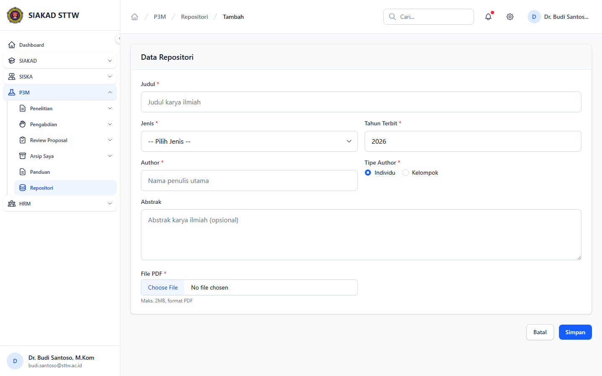

# Workflow Report: Panduan & Repositori Dosen P3M

**Tanggal**: 2026-04-19  
**Role**: Dosen  
**Modul**: P3M > Portal Dosen  
**Fitur**: Panduan & Repositori Dosen P3M  
**Status**: ✅ Berhasil

## Deskripsi Workflow

Navigasi halaman panduan dosen, daftar repositori, dan form tambah repositori dari sidebar portal dosen P3M.

## Ringkasan

3 langkah berhasil, 0 langkah gagal, dan tidak ada temuan blocking pada rescan ini.

## Langkah-langkah

### 1. Panduan P3M

**Deskripsi**: Halaman panduan dosen berhasil dibuka dari sidebar dan menampilkan daftar panduan P3M yang tersedia untuk dosen.

**Akun**: Portal Dosen - Dr. Budi Santoso, M.Kom

**URL**: `http://127.0.0.1:8000/p3m/dosen/panduan`

### 2. Repositori P3M

**Deskripsi**: Halaman repositori dosen berhasil dibuka tanpa error permission dan menampilkan data repositori milik akun dosen yang diuji.

**Akun**: Portal Dosen - Dr. Budi Santoso, M.Kom

**URL**: `http://127.0.0.1:8000/p3m/dosen/repositori`

### 3. Form Tambah Repositori

**Deskripsi**: Form tambah repositori berhasil dibuka untuk memverifikasi field wajib, tipe author, dan upload PDF tanpa melakukan submit.

**Akun**: Portal Dosen - Dr. Budi Santoso, M.Kom

**URL**: `http://127.0.0.1:8000/p3m/dosen/repositori/create`

## Temuan & Masalah

Tidak ada temuan blocking pada halaman panduan dan repositori dosen setelah data workflow ditambahkan ke seeder aktif.

## Catatan

- Screenshot diambil otomatis menggunakan Playwright dengan full-page capture.
- Navigasi utama dilakukan melalui sidebar.
- Form pada report ini hanya dibuka untuk verifikasi visual dan field wajib, tidak disubmit agar report tidak memalsukan status keberhasilan.
- Bug permission pada halaman repositori yang muncul pada scan sebelumnya sudah tidak ditemukan lagi.
