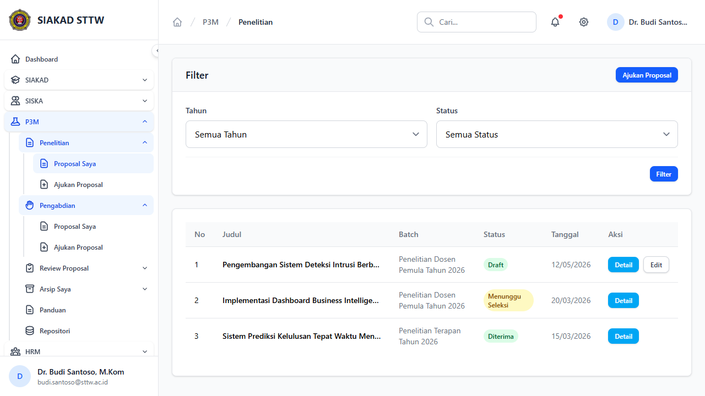

# Workflow Report: Penelitian — Riwayat Proposal Dosen

**Tanggal**: 2026-05-12
**Role**: dosen
**Modul**: p3m
**Fitur**: dosen-penelitian
**Status**: ✅ Berhasil

## Deskripsi Workflow

Daftar proposal penelitian dosen + tab navigasi proposal/RAB (TASK-061: anggota cards reorder, split upload UI 3 slots, min 1 wajib luaran).

## Ringkasan

- HTTP 200, render OK setelah login sebagai `budi.santoso@sttw.ac.id` (role: dosen).
- Komponen Blade standar.
- Tidak ada error yang teridentifikasi pada area visible.

## Langkah-langkah

### 1. Login dosen & buka halaman

**Deskripsi**: Login sebagai dosen, navigasi ke halaman target.

**URL**: `http://127.0.0.1:8000/p3m/dosen/penelitian`

## Temuan & Masalah

Tidak ada temuan baru. Beberapa list dapat tampil kosong karena dosen demo belum punya data terkait.

## Catatan

- Bagian dari batch refresh delta pertengahan April 2026.
