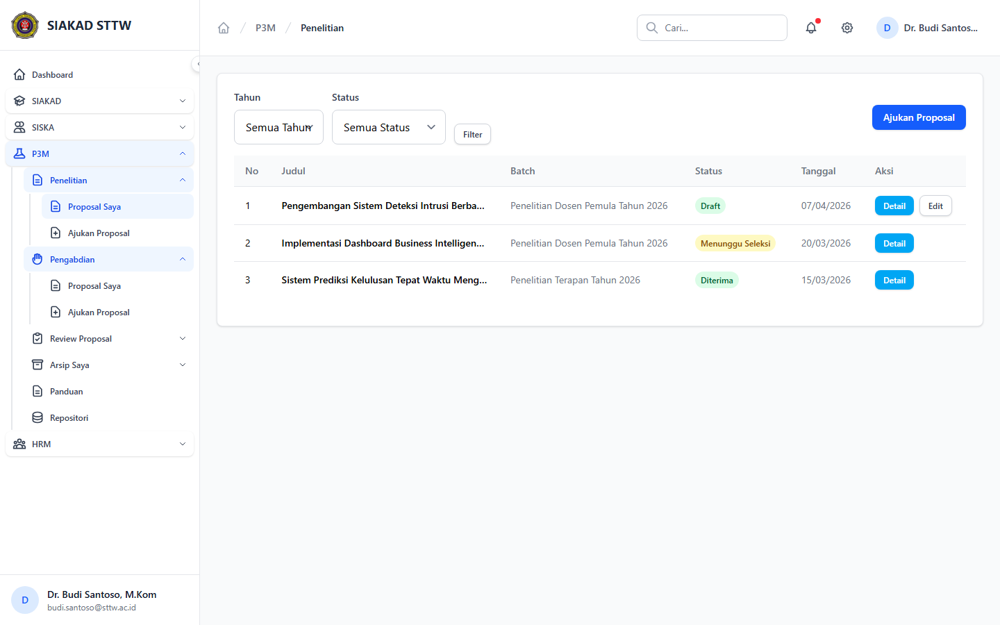
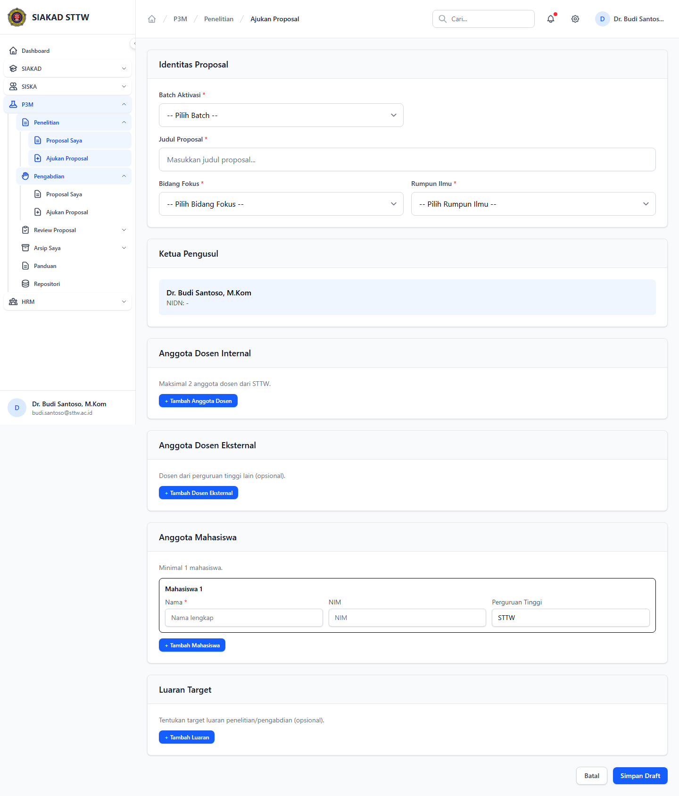
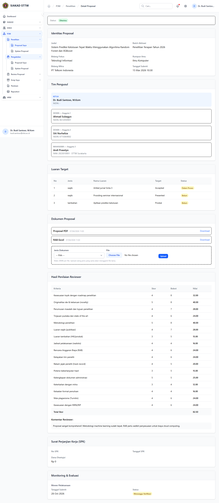

# Workflow Report: Proposal Dosen P3M

**Tanggal**: 2026-04-19  
**Role**: Dosen  
**Modul**: P3M > Portal Dosen  
**Fitur**: Proposal Dosen P3M  
**Status**: ✅ Berhasil

## Deskripsi Workflow

Navigasi proposal penelitian dan pengabdian dari sidebar dosen, termasuk membuka form pengajuan dan meninjau detail proposal yang sudah lolos seleksi.

## Ringkasan

5 langkah berhasil, 0 langkah gagal, dan 0 temuan warning tercatat.

## Langkah-langkah

### 1. Daftar Proposal Penelitian

**Deskripsi**: Halaman riwayat proposal penelitian dosen dengan filter tahun, filter status, tombol ajukan proposal, dan aksi detail/edit sesuai status proposal.

**Akun**: Portal Dosen - Dr. Budi Santoso, M.Kom

**URL**: `http://127.0.0.1:8000/p3m/dosen/penelitian`

### 2. Form Ajukan Proposal Penelitian

**Deskripsi**: Form pengajuan proposal penelitian dibuka dari sidebar untuk memverifikasi field wajib, struktur anggota, dan target luaran tanpa melakukan submit.

**Akun**: Portal Dosen - Dr. Budi Santoso, M.Kom

**URL**: `http://127.0.0.1:8000/p3m/dosen/penelitian/create`

### 3. Detail Proposal Penelitian Diterima

**Deskripsi**: Detail proposal penelitian yang sudah diterima menampilkan identitas proposal, tim pengusul, dokumen, dan hasil penilaian reviewer beserta ringkasan total skornya.

**Akun**: Portal Dosen - Dr. Budi Santoso, M.Kom

**URL**: `http://127.0.0.1:8000/p3m/dosen/penelitian/3`

### 4. Daftar Proposal Pengabdian

**Deskripsi**: Halaman riwayat proposal pengabdian dosen dengan tombol ajukan proposal dan daftar proposal yang sudah pernah disubmit.

**Akun**: Portal Dosen - Dr. Budi Santoso, M.Kom

**URL**: `http://127.0.0.1:8000/p3m/dosen/pengabdian`

### 5. Form Ajukan Proposal Pengabdian

**Deskripsi**: Form pengajuan proposal pengabdian dibuka dari sidebar untuk memverifikasi field wajib, pilihan mitra, dan komposisi anggota tanpa melakukan submit.

**Akun**: Portal Dosen - Dr. Budi Santoso, M.Kom

**URL**: `http://127.0.0.1:8000/p3m/dosen/pengabdian/create`

## Temuan & Masalah

Tidak ada temuan baru pada retest ini. Bug route sidebar proposal penelitian/pengabdian sudah teratasi dan halaman detail proposal tampil normal.

## Catatan

- Screenshot diambil otomatis menggunakan Playwright dengan full-page capture.
- Navigasi utama dilakukan melalui sidebar; halaman detail dicapai dari aksi tabel setelah daftar proposal terbuka.
- Form pada report ini hanya dibuka untuk verifikasi visual dan field wajib, tidak disubmit agar report tidak memalsukan status keberhasilan.
- Data yang tampil mengikuti dummy data P3M yang aktif saat scan dijalankan.
