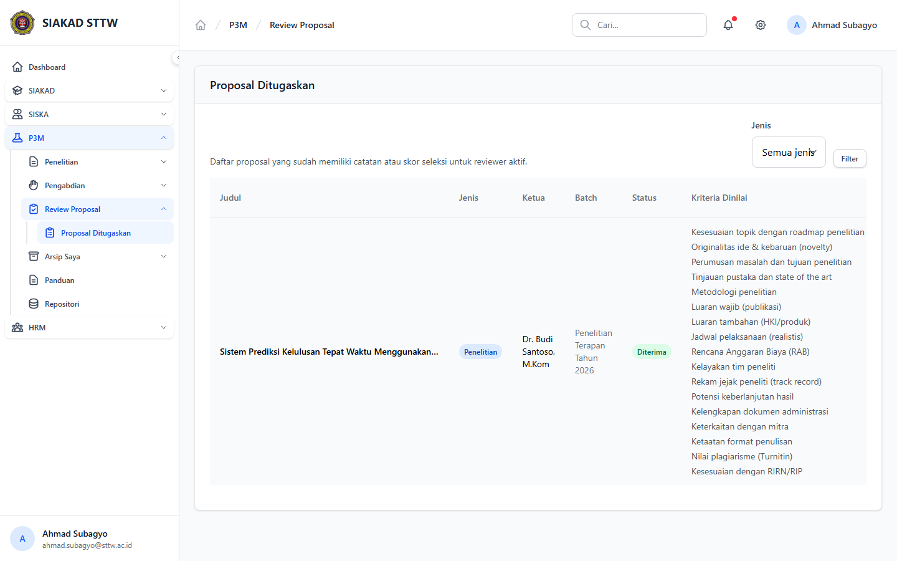

# Workflow Report: Proposal Ditugaskan Reviewer P3M

**Tanggal**: 2026-04-19  
**Role**: Reviewer  
**Modul**: P3M > Review Proposal  
**Fitur**: Proposal Ditugaskan Reviewer P3M  
**Status**: ✅ Berhasil

## Deskripsi Workflow

Menu reviewer untuk melihat proposal yang sudah memiliki skor atau komentar seleksi bagi reviewer aktif.

## Ringkasan

1 langkah berhasil, 0 langkah gagal, dan 0 temuan warning tercatat.

## Langkah-langkah

### 1. Proposal Ditugaskan

**Deskripsi**: Halaman reviewer menampilkan daftar proposal yang ditugaskan, lengkap dengan batch, status, kriteria yang sudah dinilai, total nilai, dan komentar reviewer.

**Akun**: Reviewer - Ahmad Subagyo

**URL**: `http://127.0.0.1:8000/p3m/reviewer`

## Temuan & Masalah

Tidak ada temuan baru pada retest ini. Route reviewer sudah tersedia dan halaman daftar proposal reviewer tampil normal.

## Catatan

- Screenshot diambil otomatis menggunakan Playwright dengan full-page capture.
- Navigasi utama dilakukan melalui sidebar menu reviewer pada modul P3M.
- Data yang tampil mengikuti penilaian seleksi yang memang terhubung ke reviewer aktif.
