# Workflow Report: PKL — Admin

**Tanggal**: 2026-04-14  
**Role**: Admin (admin@sttw.ac.id)  
**Modul**: PKL (Praktek Kerja Lapangan)  
**Status**: ✅ Berhasil

## Ringkasan

Dokumentasi lengkap fitur PKL dari perspektif Admin. Mencakup manajemen pendaftaran PKL, penjadwalan sidang, monitoring logbook, laporan, rekap dosen, dan unggah mandiri. Terdapat 7 pendaftaran PKL, 3 sidang, dan 45 logbook dalam data seeder.

**Data yang tersedia:**
- 7 Registrasi PKL (status: Diajukan, Sedang_berlangsung, Siap_sidang, Lulus, Sidang_dijadwalkan)
- 3 Sidang PKL (dengan jadwal, ruangan, dan penguji)
- 45 Logbook PKL (dari 3 mahasiswa aktif)
- 1 Unggah Mandiri (status: Terverifikasi)

## Temuan / Bug (Sudah Diperbaiki)

| # | Halaman | Masalah | Fix |
|---|---------|---------|-----|
| 1 | Edit Registrasi | `nama_dosen` → `nama_lengkap` di PklRegistrationController | ✅ Fixed |
| 2 | Laporan PKL | Admin 403 — tambah `hasRole('admin')` check di PklLaporanController | ✅ Fixed |

## Langkah-langkah

---

### 1. Halaman Registrasi PKL (Index)

**URL**: `http://127.0.0.1:8000/siska/pkl/registrations`  
**Status**: ✅ Berhasil

Menampilkan daftar seluruh 7 pendaftaran PKL mahasiswa dalam format tabel dengan kolom: Mahasiswa, Judul/Tempat, Pembimbing, Status, dan Aksi (Detail/Edit).

**Status yang tercatat:**
- Diajukan (2 mahasiswa)
- Sedang_berlangsung (2 mahasiswa)
- Siap_sidang (1 mahasiswa)
- Lulus (1 mahasiswa)
- Sidang_dijadwalkan (1 mahasiswa)

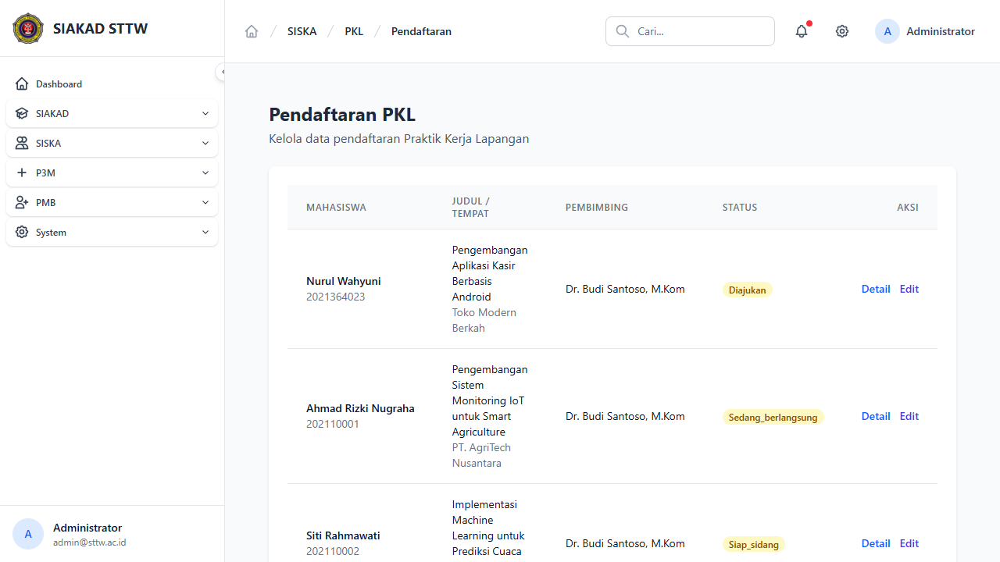

---

### 2. Detail Registrasi PKL

**URL**: `http://127.0.0.1:8000/siska/pkl/registrations/7`  
**Status**: ✅ Berhasil

Menampilkan detail pendaftaran PKL Nurul Wahyuni (NIM: 2021364023) dengan informasi:
- **Data Mahasiswa**: Nama, NIM, Program Studi
- **Informasi PKL**: Judul Laporan, Tempat PKL, Dosen Pembimbing, File Proposal
- **Status Proses**: Timeline 7 langkah (Diajukan → Verif Dosen → Verif Kaprodi → Berlangsung → Selesai PKL → Sidang → Lulus)

Terdapat tombol "Kembali" dan "Validasi / Edit".

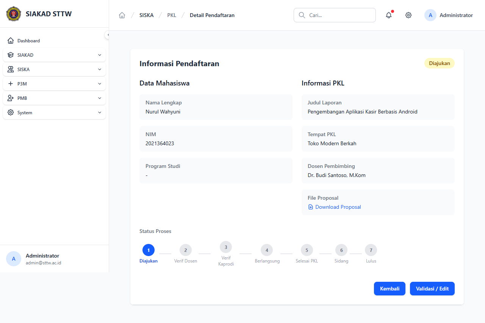

---

### 3. Edit/Validasi Registrasi PKL

**URL**: `http://127.0.0.1:8000/siska/pkl/registrations/1/edit`  
**Status**: ✅ Berhasil

Form validasi pendaftaran PKL oleh admin. Menampilkan data mahasiswa, informasi PKL, serta opsi untuk mengubah status, dosen pembimbing, dan keterangan.

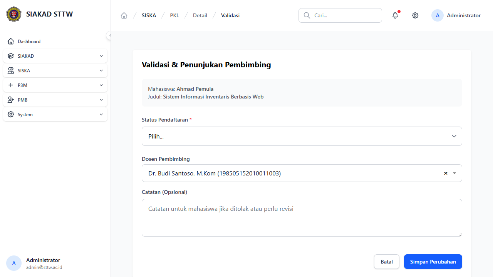

---

### 4. Jadwal Sidang PKL (Index)

**URL**: `http://127.0.0.1:8000/siska/pkl/sidangs`  
**Status**: ✅ Berhasil

Menampilkan daftar 3 pengajuan & jadwal sidang PKL dengan kolom: Mahasiswa, Judul & Pembimbing, Jadwal & Penguji, Status, dan Aksi.

**Sidang yang terdaftar:**
| Mahasiswa | Tanggal | Ruangan | Penguji |
|-----------|---------|---------|---------|
| Siti Rahmawati (202110002) | 21 Apr 2026 | Ruang Kuliah Lantai 1.1 | Ahmad Subagyo |
| Citra Selesai (MHS003) | 10 Apr 2026 | Ruang Sidang Utama | Prof. Andi Penguji, Ph.D. |
| Haris Firmansyah (202210050) | 09 Apr 2026 | Ruang Kuliah Lantai 1.1 | Ahmad Subagyo |

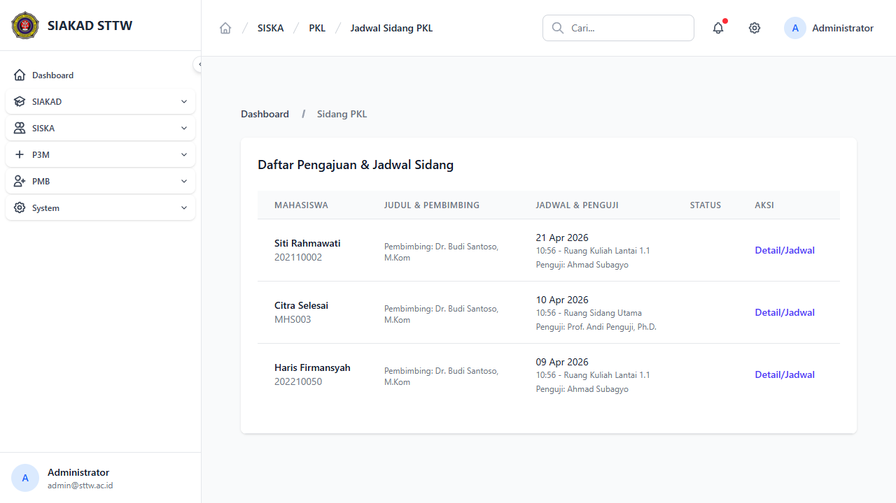

---

### 5. Edit Jadwal Sidang PKL

**URL**: `http://127.0.0.1:8000/siska/pkl/sidangs/2/edit`  
**Status**: ✅ Berhasil

Form edit jadwal sidang untuk Siti Rahmawati dengan field:
- **Data Sidang**: Mahasiswa dan Dosen Penguji (read-only)
- **Edit Jadwal (Admin)**:
  - Tanggal Sidang (date picker)
  - Ruangan (dropdown 19 ruangan tersedia)
  - Jam Mulai dan Jam Selesai
  - Dosen Penguji (dropdown 8 dosen tersedia)
- Tombol "Simpan Perubahan" dan "Batal"

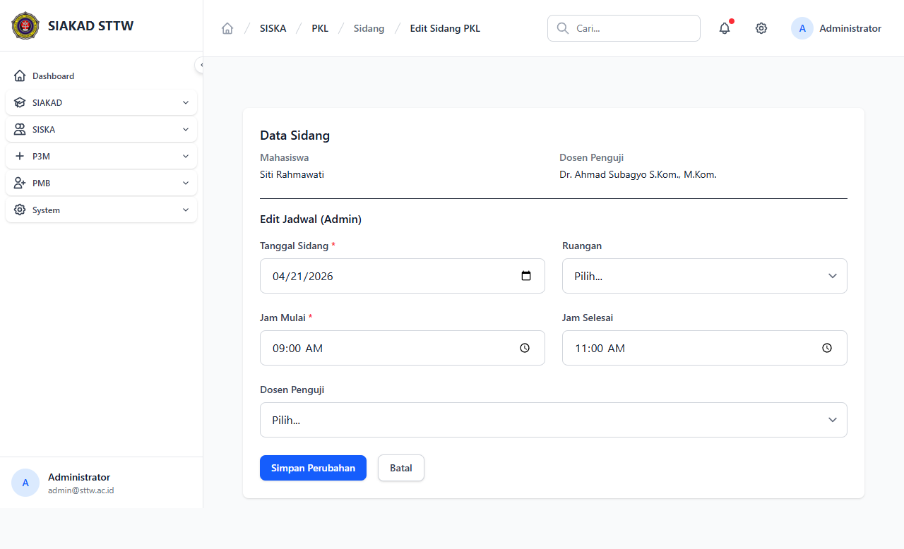

---

### 6. Logbook PKL (Index)

**URL**: `http://127.0.0.1:8000/siska/pkl/logbooks`  
**Status**: ✅ Berhasil

Menampilkan 45 logbook PKL (15 per halaman, 3 halaman) dengan kolom: Tanggal, Mahasiswa, Kegiatan, Jam, Status, dan Aksi.

**Filter tersedia:**
- Status: Semua / Pending / Approved / Rejected
- Cari Mahasiswa (NIM atau nama)
- Tombol Filter dan Reset

**Status logbook:**
- Menunggu (belum direview)
- Aktif (sudah diapprove)

**Mahasiswa dengan logbook:**
- Ahmad Rizki Nugraha (202110001) — 10 logbook
- Siti Rahmawati (202110002) — 15 logbook
- Haris Firmansyah (202210050) — 20 logbook

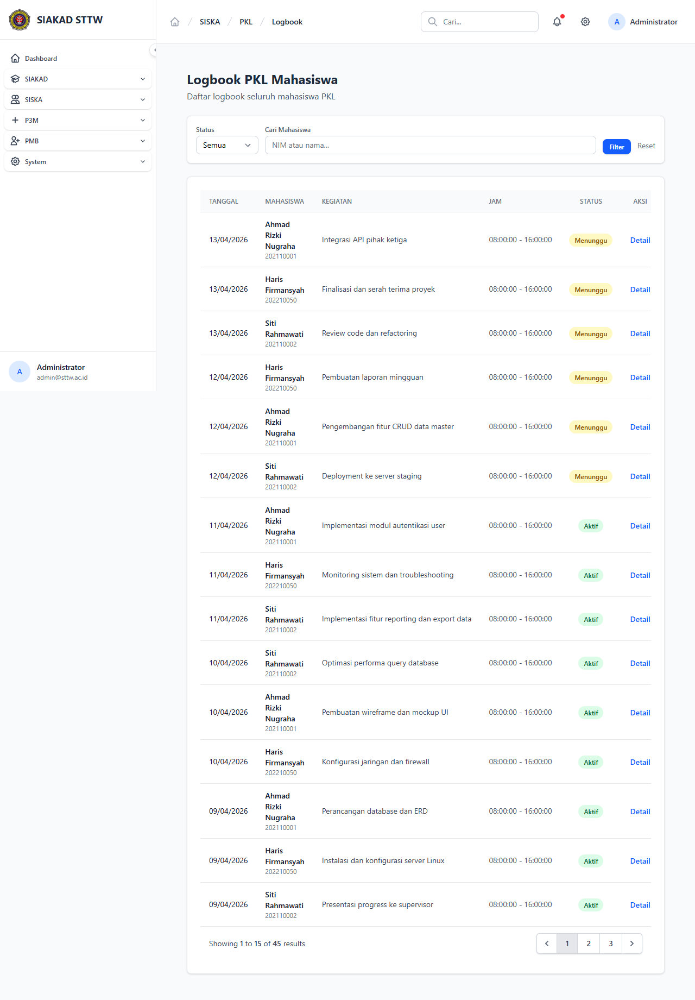

---

### 7. Detail Logbook PKL

**URL**: `http://127.0.0.1:8000/siska/pkl/logbooks/10`  
**Status**: ✅ Berhasil

Menampilkan detail logbook individual — kegiatan "Integrasi API pihak ketiga" oleh Ahmad Rizki Nugraha pada 13/04/2026, jam 08:00-16:00, status: Menunggu.

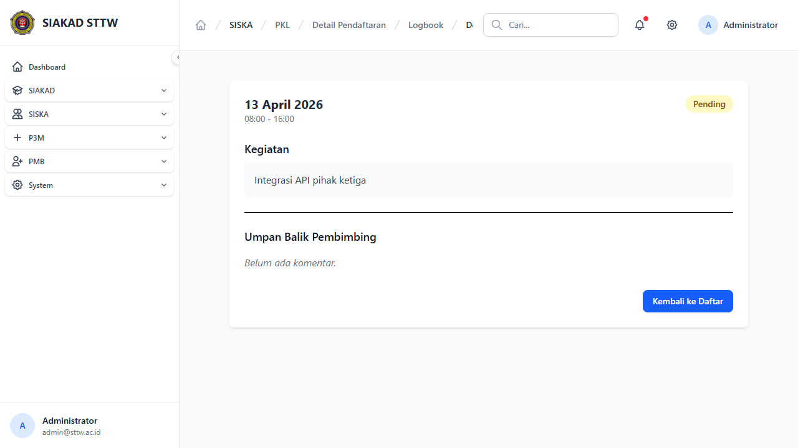

---

### 8. Laporan PKL

**URL**: `http://127.0.0.1:8000/siska/pkl/laporans`  
**Status**: ✅ Berhasil

Menampilkan daftar laporan PKL mahasiswa yang telah diajukan. Admin dapat melihat status dan mereview laporan per bab.

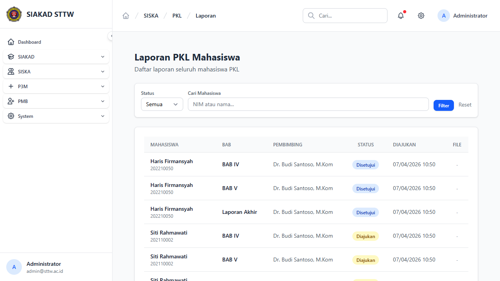

---

### 9. Monitoring PKL

**URL**: `http://127.0.0.1:8000/siska/pkl/monitoring`  
**Status**: ✅ Berhasil

Dashboard monitoring komprehensif dengan:

**Filter:**
- Jenjang (Semua / Diploma / Sarjana)
- Tahun Akademik (multi-periode)
- Program Studi (4 prodi tersedia)

**Tabel Monitoring** (11 kolom):
NIM, Nama, Prodi, Judul, Pembimbing, Tgl Seminar, Ruang, Nilai Instansi, Nilai Sidang, Status, Aksi

| Mahasiswa | Status | Nilai Instansi | Nilai Sidang |
|-----------|--------|---------------|-------------|
| Nurul Wahyuni | Diajukan | - | - |
| Ahmad Rizki Nugraha | Sedang berlangsung | - | - |
| Siti Rahmawati | Siap sidang | - | - |
| Haris Firmansyah | Lulus | 87.50 | 84.00 |
| Ahmad Pemula | Diajukan | - | - |
| Budi Rajin | Sedang berlangsung | - | - |
| Citra Selesai | Sidang dijadwalkan | 90.50 | - |

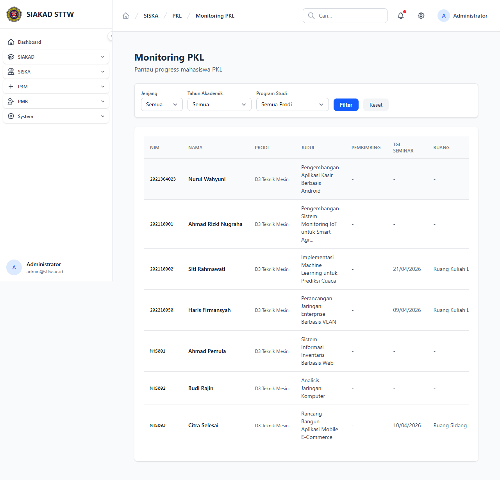

---

### 10. Rekap Dosen Pembimbing PKL

**URL**: `http://127.0.0.1:8000/siska/pkl/rekap-dosen`  
**Status**: ✅ Berhasil

Rekap pembimbingan dosen per periode akademik dengan kolom: No, NIP, Nama Dosen, Total Bimbingan, Berlangsung, Lulus, Ditolak.

**Filter:** Periode Akademik (default: 2025/2026 Ganjil)

**Data Rekap:**
| Dosen | Total | Berlangsung | Lulus | Ditolak |
|-------|-------|-------------|-------|---------|
| Dr. Budi Santoso, M.Kom | 7 | 2 | 1 | 0 |

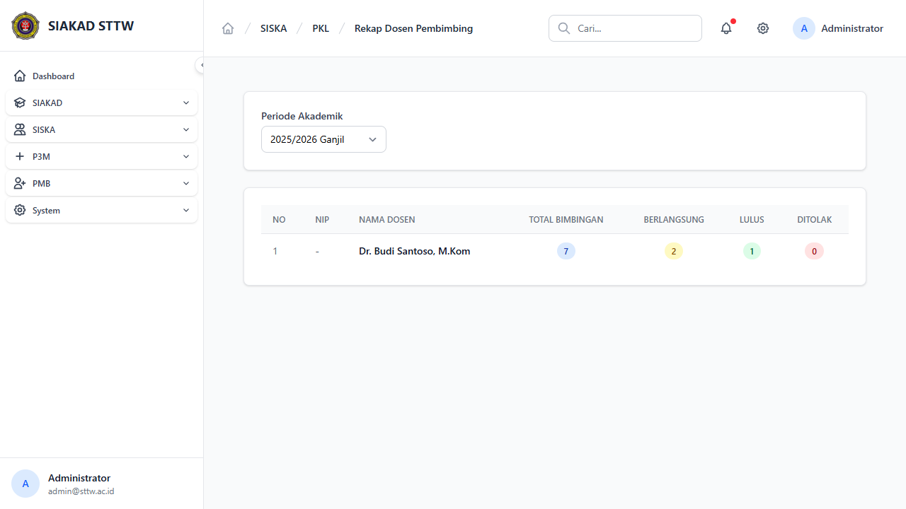

---

### 11. Verifikasi Unggah Mandiri PKL

**URL**: `http://127.0.0.1:8000/siska/pkl/unggah-mandiri-admin`  
**Status**: ✅ Berhasil

Daftar laporan PKL yang perlu diverifikasi perpustakaan dengan kolom: Mahasiswa, Judul PKL, File, Status, Tanggal Upload, Aksi.

**Data:**
| Mahasiswa | Status | File |
|-----------|--------|------|
| Haris Firmansyah (202210050) | Terverifikasi ✅ | Belum ada file |

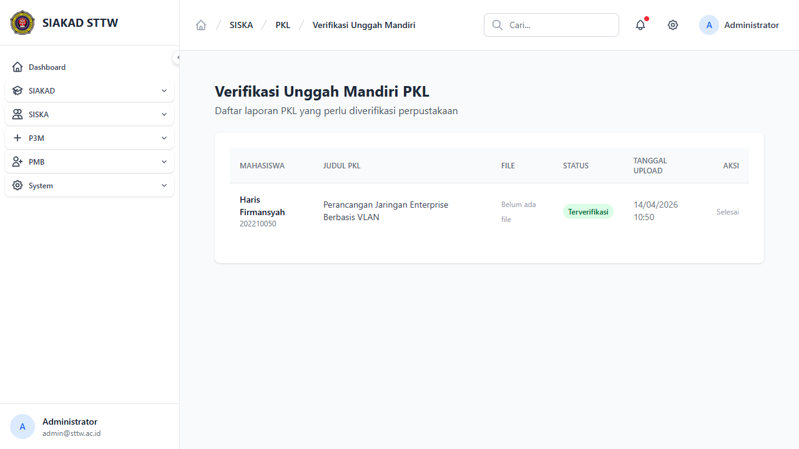

---

## Rangkuman Fitur

| # | Fitur | URL | Status |
|---|-------|-----|--------|
| 1 | Registrasi PKL (Index) | `/siska/pkl/registrations` | ✅ OK |
| 2 | Detail Registrasi | `/siska/pkl/registrations/{id}` | ✅ OK |
| 3 | Edit Registrasi | `/siska/pkl/registrations/{id}/edit` | ✅ OK |
| 4 | Jadwal Sidang (Index) | `/siska/pkl/sidangs` | ✅ OK |
| 5 | Edit Jadwal Sidang | `/siska/pkl/sidangs/{id}/edit` | ✅ OK |
| 6 | Logbook (Index) | `/siska/pkl/logbooks` | ✅ OK |
| 7 | Detail Logbook | `/siska/pkl/logbooks/{id}` | ✅ OK |
| 8 | Laporan PKL | `/siska/pkl/laporans` | ✅ OK |
| 9 | Monitoring PKL | `/siska/pkl/monitoring` | ✅ OK |
| 10 | Rekap Dosen | `/siska/pkl/rekap-dosen` | ✅ OK |
| 11 | Unggah Mandiri Admin | `/siska/pkl/unggah-mandiri-admin` | ✅ OK |

**Skor**: 11/11 halaman berfungsi normal (100%)

## Screenshot Index

| File | Deskripsi |
|------|-----------|
| `01_registrations-index.png` | Daftar pendaftaran PKL |
| `02_registration-detail.png` | Detail pendaftaran PKL |
| `03_registration-edit.png` | Form edit/validasi registrasi |
| `04_sidangs-index.png` | Daftar jadwal sidang PKL |
| `05_sidang-edit-form.png` | Form edit jadwal sidang |
| `06_logbooks-index.png` | Daftar logbook PKL |
| `07_logbook-detail.png` | Detail logbook individual |
| `08_laporans-index.png` | Daftar laporan PKL |
| `09_monitoring-index.png` | Dashboard monitoring PKL |
| `10_rekap-dosen.png` | Rekap dosen pembimbing |
| `11_unggah-mandiri-admin.png` | Verifikasi unggah mandiri |
