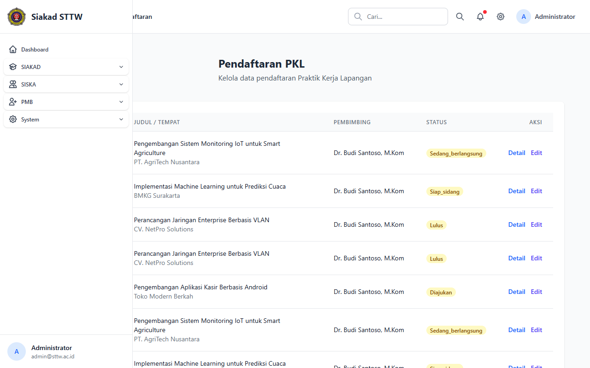
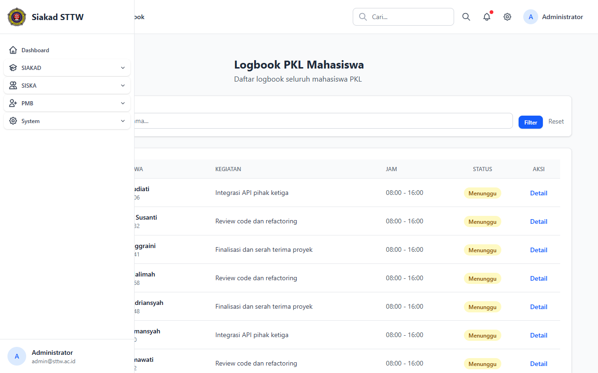
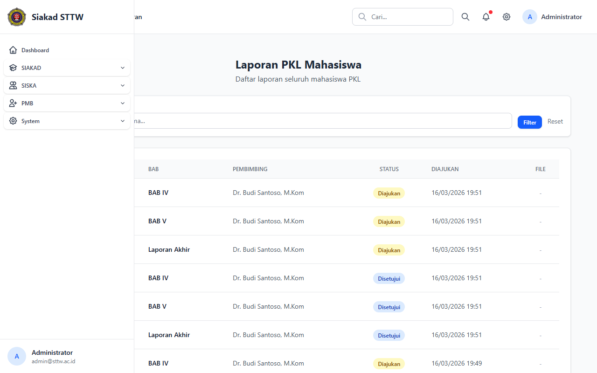
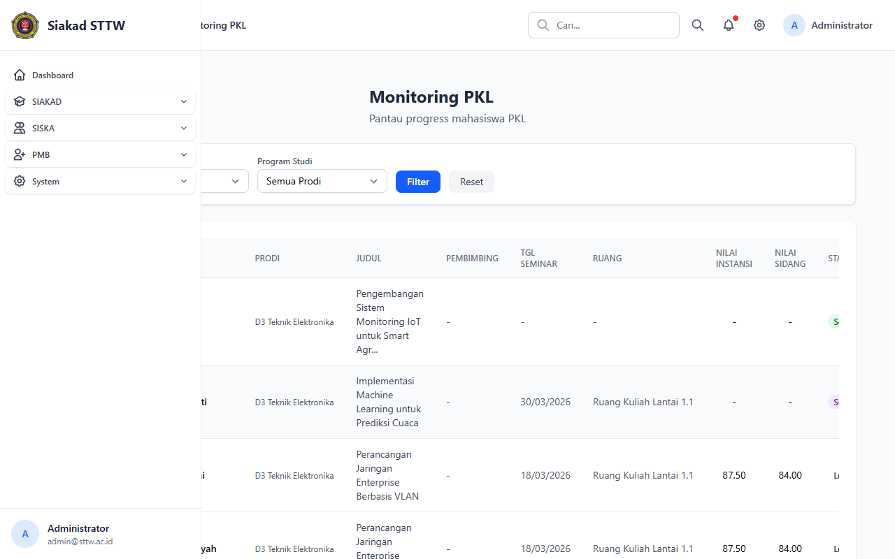
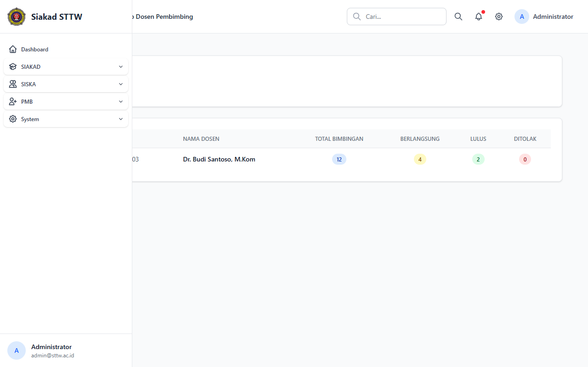

# PKL — Administrator

> Direkam: 2026-03-25  
> Role: **Administrator (admin@sttw.ac.id)**  
> Modul: **PKL (Praktik Kerja Lapangan)**  
> Status: ✅ Berhasil

## Ringkasan

Workflow PKL dari sisi administrator. Menampilkan manajemen pendaftaran PKL, review logbook dan laporan, monitoring progress, serta rekap beban bimbingan dosen. Halaman unggah mandiri tidak tersedia (404).

## Halaman

| # | Halaman | URL | Status |
|---|---------|-----|--------|
| 01 | Pendaftaran PKL | `/siska/pkl/registrations` | ✅ OK |
| 02 | Logbook PKL (Admin) | `/siska/pkl/logbooks` | ✅ OK |
| 03 | Laporan PKL (Admin) | `/siska/pkl/laporans` | ✅ OK |
| 04 | Monitoring PKL | `/siska/pkl/monitoring` | ✅ OK |
| 05 | Rekap Dosen PKL | `/siska/pkl/rekap-dosen` | ✅ OK |

## Screenshots

### 1. Daftar Pendaftaran PKL

Daftar pendaftaran PKL menampilkan semua registrasi mahasiswa PKL dengan status (diajukan, sedang berlangsung, siap sidang, lulus).

### 2. Logbook PKL

Logbook PKL menampilkan daftar logbook semua mahasiswa PKL untuk direview oleh admin.

### 3. Laporan PKL

Laporan PKL menampilkan daftar laporan akhir PKL mahasiswa.

### 4. Monitoring PKL

Dashboard monitoring progress PKL keseluruhan, menampilkan statistik dan status mahasiswa.

### 5. Rekap Dosen Pembimbing PKL

Rekap beban bimbingan per dosen untuk PKL.

## Catatan

- Halaman unggah mandiri tidak tersedia (404)

