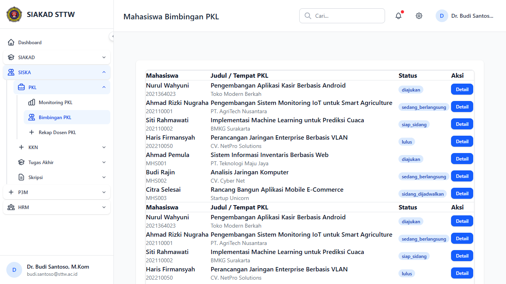
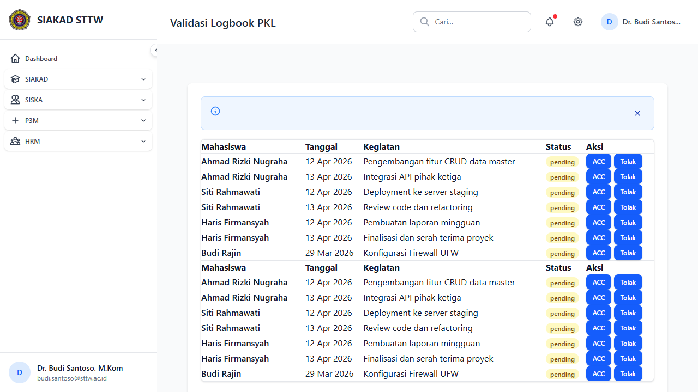
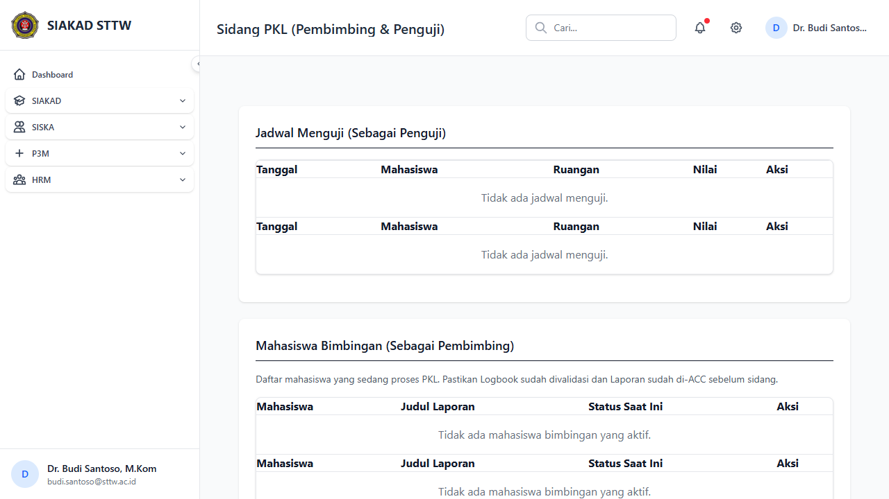
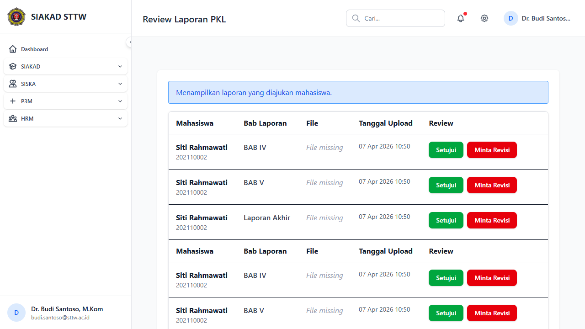

# Workflow Report: PKL — Dosen Pembimbing

**Tanggal**: 2026-04-14  
**Role**: Dosen (budi.santoso@sttw.ac.id)  
**Modul**: PKL (Praktek Kerja Lapangan)  
**Status**: ✅ Berhasil

## Ringkasan

Dokumentasi fitur PKL dari perspektif Dosen Pembimbing (Dr. Budi Santoso, M.Kom). Modul ini mencakup manajemen bimbingan mahasiswa PKL, review logbook, jadwal sidang, dan review laporan. Dosen memiliki 7 mahasiswa bimbingan PKL dengan berbagai status progres.

## Langkah-langkah

### 1. Bimbingan PKL — Daftar Mahasiswa Bimbingan

Halaman **Mahasiswa Bimbingan PKL** menampilkan seluruh mahasiswa yang dibimbing oleh dosen ini. Terdapat 7 mahasiswa dengan informasi:
- **Nama & NIM** mahasiswa
- **Judul PKL** dan **Tempat PKL**
- **Status** progres: `diajukan`, `sedang_berlangsung`, `siap_sidang`, `lulus`, `sidang_dijadwalkan`
- Tombol **Detail** untuk melihat informasi lengkap tiap mahasiswa

Mahasiswa yang ditampilkan:
| Mahasiswa | Tempat PKL | Status |
|-----------|-----------|--------|
| Nurul Wahyuni (2021364023) | Toko Modern Berkah | diajukan |
| Ahmad Rizki Nugraha (202110001) | PT. AgriTech Nusantara | sedang_berlangsung |
| Siti Rahmawati (202110002) | BMKG Surakarta | siap_sidang |
| Haris Firmansyah (202210050) | CV. NetPro Solutions | lulus |
| Ahmad Pemula (MHS001) | PT. Teknologi Maju Jaya | diajukan |
| Budi Rajin (MHS002) | CV. Cyber Net | sedang_berlangsung |
| Citra Selesai (MHS003) | Startup Unicorn | sidang_dijadwalkan |

### 2. Validasi Logbook PKL — Review Logbook Mahasiswa

Halaman **Validasi Logbook PKL** menampilkan daftar logbook yang perlu divalidasi oleh dosen pembimbing. Setiap entry menampilkan:
- **Nama mahasiswa**
- **Tanggal** kegiatan
- **Kegiatan** yang dilakukan
- **Status** (semua `pending` — menunggu validasi)
- Tombol **ACC** (hijau) untuk menyetujui dan **Tolak** (kuning) untuk menolak

Logbook yang ditampilkan berasal dari beberapa mahasiswa:
- **Ahmad Rizki Nugraha** — Pengembangan fitur CRUD data master, Integrasi API pihak ketiga
- **Siti Rahmawati** — Deployment ke server staging, Review code dan refactoring
- **Haris Firmansyah** — Pembuatan laporan mingguan, Finalisasi dan serah terima proyek
- **Budi Rajin** — Konfigurasi Firewall UFW

### 3. Sidang PKL — Jadwal Sidang Pembimbing & Penguji

Halaman **Sidang PKL (Pembimbing & Penguji)** memiliki dua bagian utama:

1. **Jadwal Menguji (Sebagai Penguji)** — Menampilkan jadwal sidang dimana dosen berperan sebagai penguji. Kolom: Tanggal, Mahasiswa, Ruangan, Nilai, Aksi. Saat ini menampilkan "Tidak ada jadwal menguji."

2. **Mahasiswa Bimbingan (Sebagai Pembimbing)** — Menampilkan mahasiswa bimbingan yang sedang dalam proses PKL untuk persiapan sidang. Terdapat pesan panduan: *"Pastikan Logbook sudah divalidasi dan Laporan sudah di-ACC sebelum sidang."* Kolom: Mahasiswa, Judul Laporan, Status Saat Ini, Aksi. Saat ini menampilkan "Tidak ada mahasiswa bimbingan yang aktif."

> **Catatan**: Halaman sidang kosong karena belum ada mahasiswa dengan status `siap_sidang` yang telah dijadwalkan melalui admin. Data sidang (3 record) mungkin di-assign ke penguji lain, atau mahasiswa belum memenuhi prasyarat sidang.

### 4. Review Laporan PKL — Validasi Laporan Mahasiswa

Halaman **Review Laporan PKL** menampilkan laporan yang diajukan mahasiswa untuk direview oleh dosen pembimbing. Terdapat info banner: *"Menampilkan laporan yang diajukan mahasiswa."*

Laporan yang ditampilkan berasal dari **Siti Rahmawati (202110002)** dengan 3 bab:
| Bab Laporan | Tanggal Upload | File | Aksi |
|-------------|---------------|------|------|
| BAB IV | 07 Apr 2026 10:50 | *File missing* | Setujui / Minta Revisi |
| BAB V | 07 Apr 2026 10:50 | *File missing* | Setujui / Minta Revisi |
| Laporan Akhir | 07 Apr 2026 10:50 | *File missing* | Setujui / Minta Revisi |

Dosen dapat menekan tombol **Setujui** (hijau) untuk menyetujui laporan atau **Minta Revisi** (merah) untuk meminta perbaikan.

> **Catatan**: File laporan ditampilkan sebagai *"File missing"* karena file fisik belum diunggah (dummy data dari seeder). Fungsionalitas tombol Setujui dan Minta Revisi tetap tersedia.

## Catatan

- Semua halaman berhasil dimuat tanpa error (200 OK)
- Sidebar navigasi SISKA menampilkan sub-menu PKL dengan benar: Monitoring PKL, Bimbingan PKL, Rekap Dosen PKL
- Halaman Bimbingan menampilkan 7 mahasiswa sesuai data seeder
- Logbook menampilkan entry dengan tombol ACC/Tolak yang fungsional
- Sidang menampilkan halaman kosong — dosen ini belum memiliki jadwal menguji dan belum ada mahasiswa bimbingan yang memenuhi prasyarat sidang aktif
- Laporan menampilkan data Siti Rahmawati dengan 3 bab, namun file fisik belum tersedia (seeder data only)
- UI konsisten: layout sidebar, header, badge status, dan tombol aksi seragam di semua halaman
