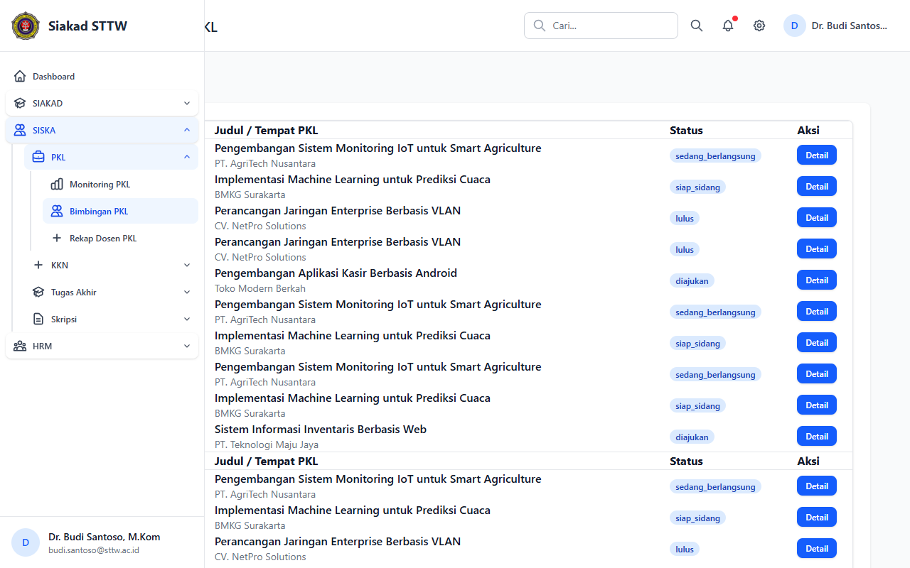
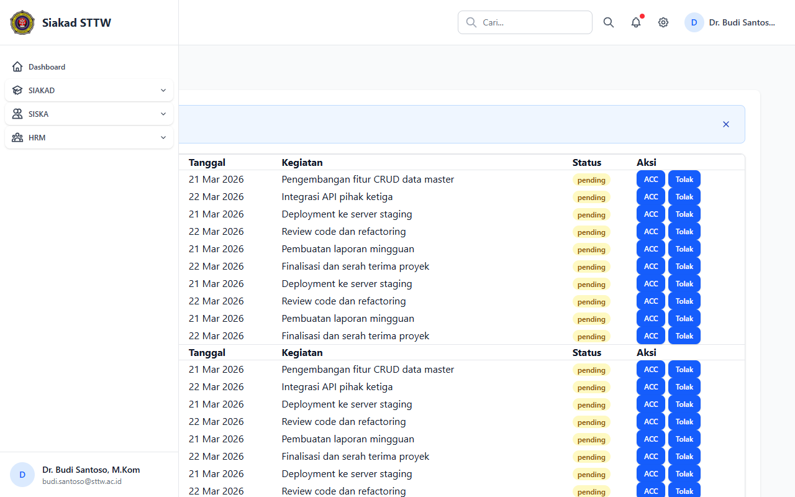
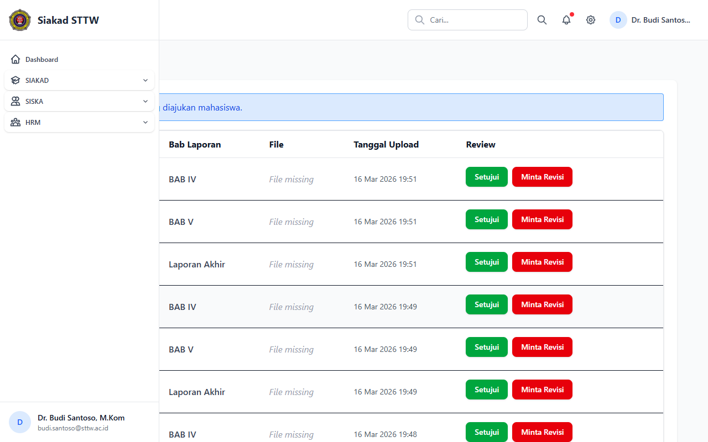
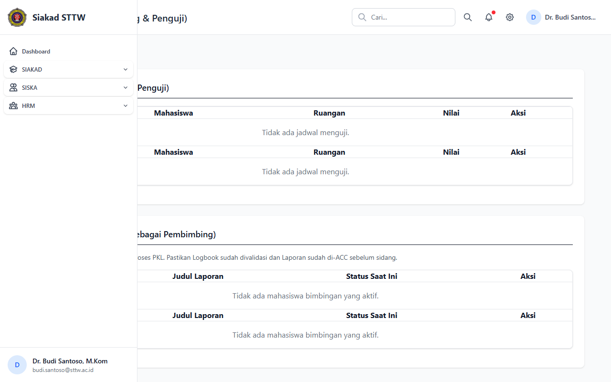

# PKL — Dosen (Dr. Budi Santoso, M.Kom)

> Direkam: 2026-03-25  
> Role: **Dosen (budi.santoso@sttw.ac.id)**  
> Modul: **PKL**  
> Status: ✅ Berhasil

## Ringkasan

Workflow PKL dari sisi dosen pembimbing. Menampilkan daftar mahasiswa bimbingan, review logbook dan laporan, serta jadwal sidang PKL.

## Halaman

| # | Halaman | URL | Status |
|---|---------|-----|--------|
| 01 | Mahasiswa Bimbingan PKL | `/siska/dosen/pkl/bimbingan` | ✅ OK |
| 02 | Review Logbook PKL | `/siska/dosen/pkl/logbooks` | ✅ OK |
| 03 | Review Laporan PKL | `/siska/dosen/pkl/laporans` | ✅ OK |
| 04 | Sidang PKL | `/siska/dosen/pkl/sidangs` | ✅ OK |

## Screenshots

### 1. Mahasiswa Bimbingan PKL

Daftar mahasiswa yang dibimbing untuk PKL.

### 2. Review Logbook PKL

Daftar logbook mahasiswa untuk direview oleh dosen pembimbing.

### 3. Review Laporan PKL

Daftar laporan mahasiswa untuk direview oleh dosen pembimbing.

### 4. Sidang PKL

Daftar jadwal sidang PKL.

