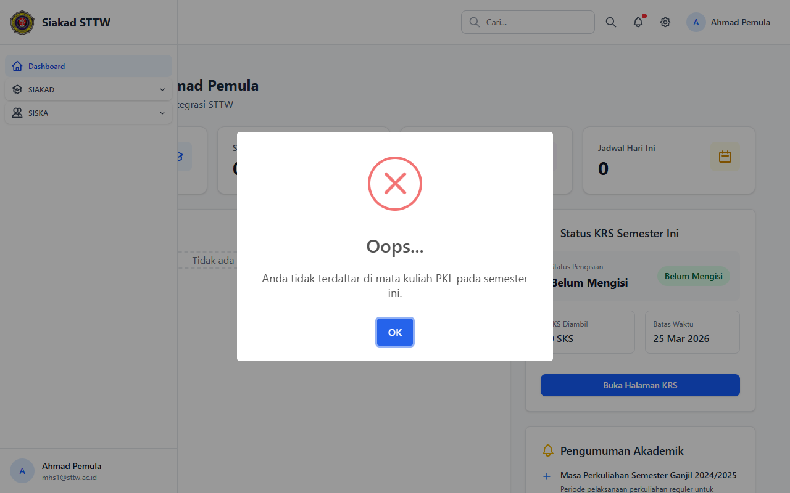

# PKL — Mahasiswa (Ahmad Pemula)

> Direkam: 2026-03-25  
> Role: **Mahasiswa (mhs1@sttw.ac.id)**  
> Modul: **PKL (Praktik Kerja Lapangan)**  
> Status: ⚠️ Tidak Eligible

## Ringkasan

Workflow PKL dari sisi mahasiswa. Mahasiswa tidak dapat mengakses modul PKL karena belum memiliki KRS yang disetujui untuk mata kuliah PKL/Kerja Praktek/Praktik Kerja Lapangan. Middleware `EnsureSiskaEligible` mencegah akses.

## Halaman

| # | Halaman | URL | Status |
|---|---------|-----|--------|
| 01 | Cek Eligibilitas PKL | `/siska/pkl` | ⚠️ Tidak Eligible |

## Screenshots

### 1. Cek Eligibilitas PKL

Muncul dialog "Anda tidak terdaftar di mata kuliah PKL pada semester ini" yang mencegah mahasiswa mengakses fitur PKL.

## Catatan

- Mahasiswa ini belum memiliki KRS yang disetujui untuk mata kuliah PKL/Kerja Praktek/Praktik Kerja Lapangan
- Middleware `EnsureSiskaEligible` mencegah akses
