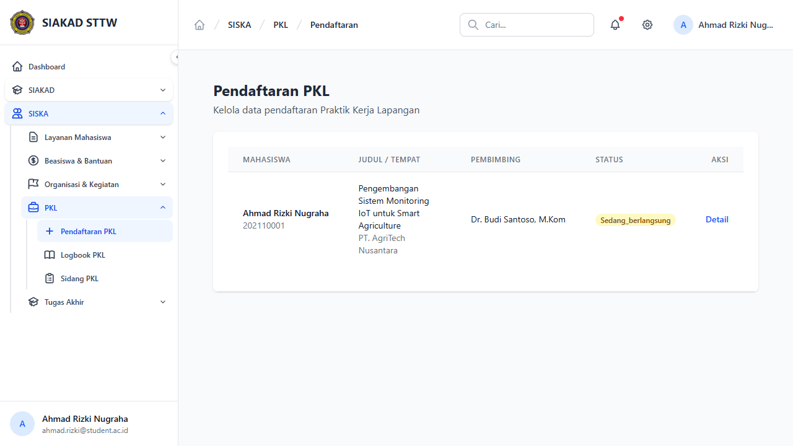
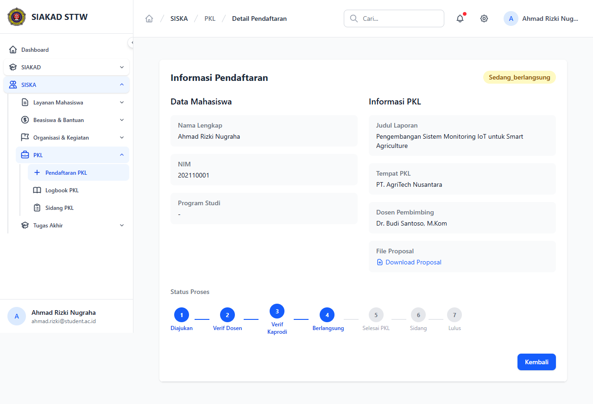
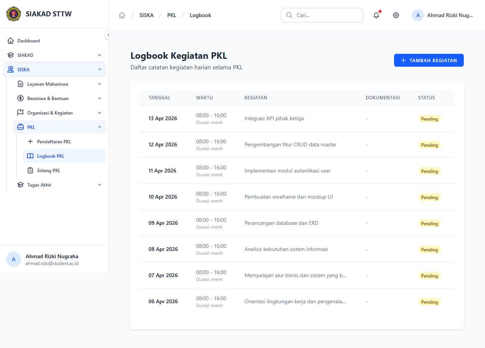
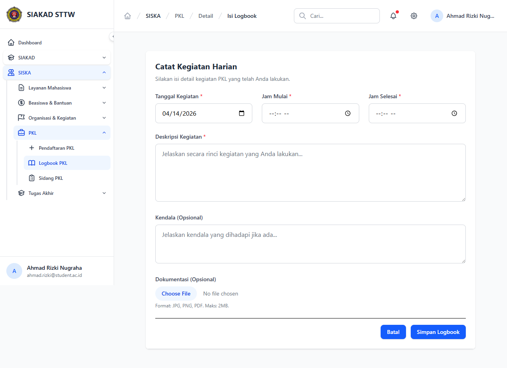
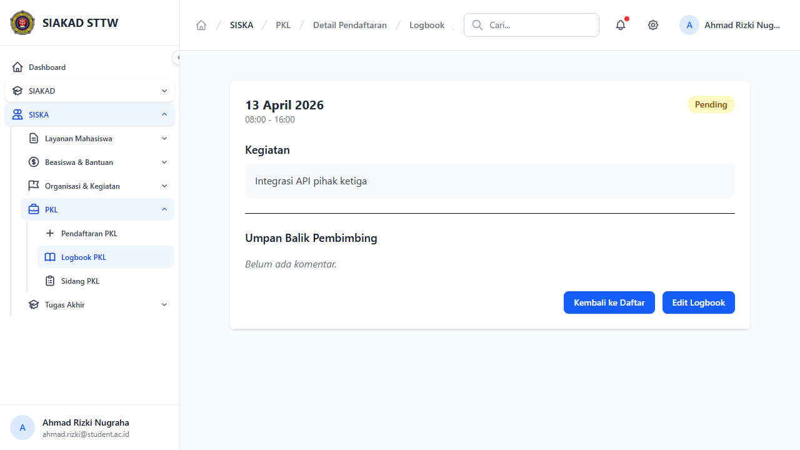
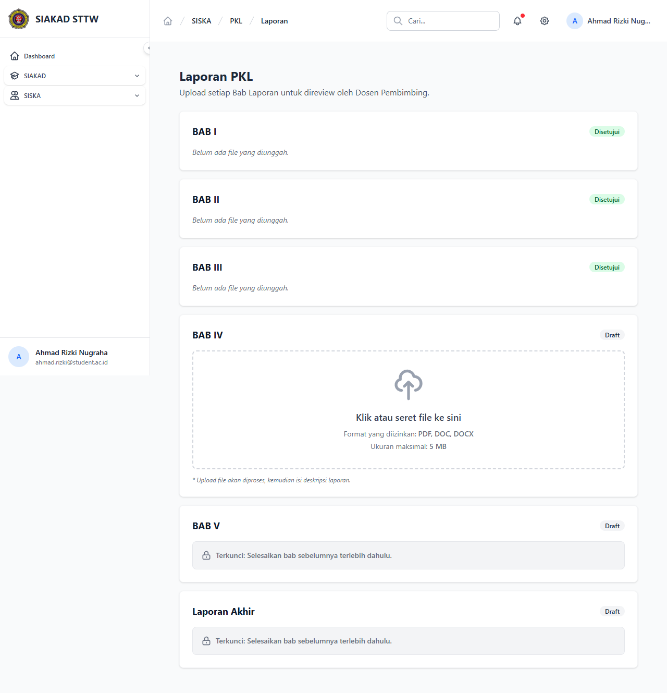
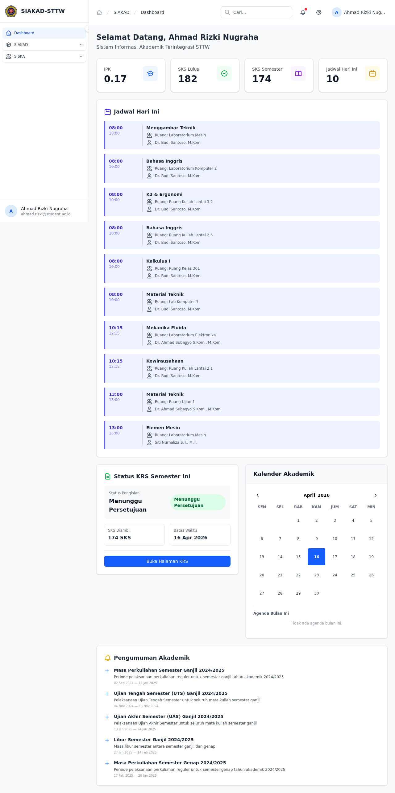

# Workflow Report: PKL — Mahasiswa

**Tanggal**: 2026-04-14  
**Role**: Mahasiswa (ahmad.rizki@student.ac.id)  
**Modul**: PKL (Praktek Kerja Lapangan)  
**Status**: ✅ Berhasil (6/6 halaman berfungsi)

## Ringkasan

Dokumentasi fitur PKL dari perspektif Mahasiswa. Modul PKL memungkinkan mahasiswa untuk mendaftar PKL, mencatat kegiatan harian melalui logbook, mengunggah laporan per bab untuk direview dosen pembimbing, serta mengunggah laporan akhir ke perpustakaan (unggah mandiri) setelah dinyatakan lulus.

Mahasiswa yang diuji: **Ahmad Rizki Nugraha** (NIM: 202110001) dengan PKL di **PT. AgriTech Nusantara**, judul *"Pengembangan Sistem Monitoring IoT untuk Smart Agriculture"*, pembimbing **Dr. Budi Santoso, M.Kom**, status **Sedang Berlangsung**.

---

## Langkah-langkah

### 1. Halaman Daftar Pendaftaran PKL

Halaman index pendaftaran PKL menampilkan tabel berisi data pendaftaran mahasiswa. Terdapat kolom Mahasiswa (nama + NIM), Judul/Tempat PKL, Pembimbing, Status, dan Aksi. Mahasiswa Ahmad Rizki Nugraha memiliki satu pendaftaran dengan status **Sedang_berlangsung**.

Navigasi sidebar SISKA > PKL menampilkan sub-menu: Pendaftaran PKL, Logbook PKL, dan Sidang PKL.

---

### 2. Detail Pendaftaran PKL

Halaman detail menampilkan informasi lengkap pendaftaran yang terbagi menjadi dua kolom:

- **Data Mahasiswa**: Nama Lengkap, NIM, Program Studi
- **Informasi PKL**: Judul Laporan, Tempat PKL, Dosen Pembimbing, File Proposal (dengan link download)

Di bagian bawah terdapat **Status Proses** berupa stepper 7 langkah:
1. ✅ Diajukan
2. ✅ Verif Dosen
3. ✅ Verif Kaprodi
4. ✅ **Berlangsung** (posisi saat ini)
5. ⬜ Selesai PKL
6. ⬜ Sidang
7. ⬜ Lulus

---

### 3. Daftar Logbook Kegiatan PKL

Halaman logbook menampilkan catatan kegiatan harian mahasiswa selama PKL dalam bentuk tabel. Kolom yang tersedia: Tanggal, Waktu (jam mulai - selesai + durasi), Kegiatan, Dokumentasi, dan Status.

Terdapat tombol **"+ Tambah Kegiatan"** di pojok kanan atas untuk menambah entri logbook baru. Setiap baris memiliki link **Detail** dan **Edit**.

Tercatat 8+ entri logbook dari 06 April 2026 hingga 13 April 2026, semuanya berstatus **Pending** (menunggu validasi dosen pembimbing).

Contoh kegiatan yang tercatat:
- Integrasi API pihak ketiga
- Pengembangan fitur CRUD data master
- Implementasi modul autentikasi user
- Pembuatan wireframe dan mockup UI
- Perancangan database dan ERD

---

### 4. Form Tambah Logbook

Halaman form untuk mencatat kegiatan harian baru. Field yang tersedia:

| Field | Tipe | Wajib |
|-------|------|-------|
| Tanggal Kegiatan | Date picker (default: hari ini) | ✅ |
| Jam Mulai | Time picker | ✅ |
| Jam Selesai | Time picker | ✅ |
| Deskripsi Kegiatan | Textarea | ✅ |
| Kendala | Textarea | ❌ (Opsional) |
| Dokumentasi | File upload (JPG, PNG, PDF, maks 2MB) | ❌ (Opsional) |

Terdapat tombol **"Simpan Logbook"** dan **"Batal"** di bagian bawah.

---

### 5. Detail Logbook

Halaman detail logbook menampilkan informasi lengkap satu entri logbook:

- **Tanggal**: 13 April 2026
- **Waktu**: 08:00 - 16:00
- **Status**: Pending (badge kuning di pojok kanan)
- **Kegiatan**: Integrasi API pihak ketiga
- **Umpan Balik Pembimbing**: *"Belum ada komentar."* (menunggu validasi dosen)

Terdapat tombol **"Kembali ke Daftar"** dan **"Edit Logbook"** di bagian bawah.

---

### 6. Laporan PKL (Upload per Bab)

Halaman laporan menampilkan sistem upload **bab per bab** yang harus diselesaikan secara berurutan. Setiap bab memiliki status masing-masing:

| Bab | Status | Keterangan |
|-----|--------|------------|
| BAB I | ✅ Disetujui | Sudah disetujui dosen pembimbing |
| BAB II | ✅ Disetujui | Sudah disetujui dosen pembimbing |
| BAB III | ✅ Disetujui | Sudah disetujui dosen pembimbing |
| BAB IV | 📝 Draft | **Aktif** — menampilkan area upload drag-and-drop |
| BAB V | 🔒 Draft | Terkunci: "Selesaikan bab sebelumnya terlebih dahulu" |
| Laporan Akhir | 🔒 Draft | Terkunci: "Selesaikan bab sebelumnya terlebih dahulu" |

BAB IV yang sedang aktif menampilkan area upload with criteria:
- Format: PDF, DOC, DOCX
- Ukuran maksimal: 5 MB
- Catatan: *"Upload file akan diproses, kemudian isi deskripsi laporan."*

---

### 7. Unggah Mandiri (Perpustakaan)

Halaman unggah berkas PKL mandiri untuk perpustakaan. Halaman ini digunakan mahasiswa untuk mengunggah file laporan akhir yang sudah direvisi pasca-sidang PKL (diperlukan status khusus agar dapat melakukan unggah berkas akhir).

---

## Rangkuman Fitur

| No | Fitur | Halaman | Status | Catatan |
|----|-------|---------|--------|---------|
| 1 | Daftar Pendaftaran PKL | `/siska/pkl/registrations` | ✅ Berfungsi | Tabel pendaftaran dengan status |
| 2 | Detail Pendaftaran PKL | `/siska/pkl/registrations/{id}` | ✅ Berfungsi | Stepper 7 langkah, info lengkap |
| 3 | Daftar Logbook | `/siska/pkl/logbooks` | ✅ Berfungsi | Tabel logbook harian + CRUD |
| 4 | Tambah Logbook | `/siska/pkl/logbooks/create` | ✅ Berfungsi | Form lengkap dengan upload foto |
| 5 | Detail Logbook | `/siska/pkl/logbooks/{id}` | ✅ Berfungsi | Detail + umpan balik pembimbing |
| 6 | Laporan per Bab | `/siska/pkl/laporans` | ✅ Berfungsi | Upload berurutan, BAB I–V + Akhir |
| 7 | Unggah Mandiri | `/siska/pkl/unggah-mandiri` | ✅ Berfungsi | Berfungsi normal |

## Catatan

- **Middleware `siska.eligible:pkl`**: Mahasiswa harus memiliki mata kuliah PKL yang disetujui di KRS periode aktif untuk mengakses modul PKL.
- **Bug ditemukan & diperbaiki**: Middleware `EnsureSiskaEligible` menggunakan kolom `nilai_akhir` yang tidak ada di tabel `nilai_mahasiswa`. Diperbaiki menjadi `nilai_angka`.
- **Logbook status**: Semua logbook berstatus "Pending" menunggu validasi dari Dosen Pembimbing.
- **Laporan sequential**: Sistem laporan menggunakan mekanisme penguncian — bab berikutnya baru bisa diunggah setelah bab sebelumnya disetujui.
