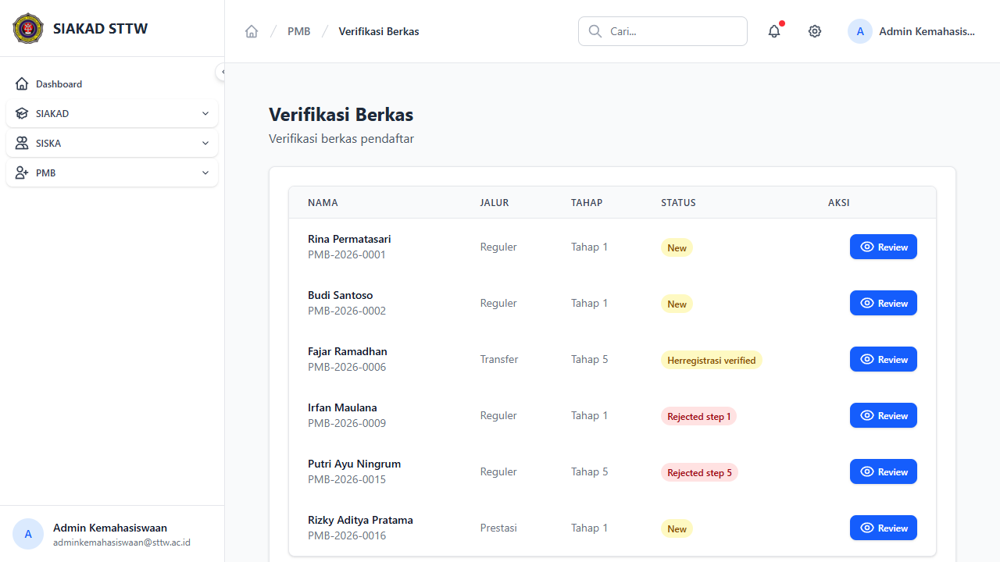
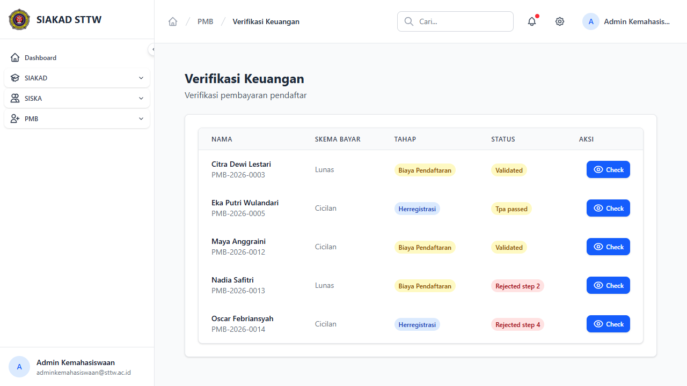
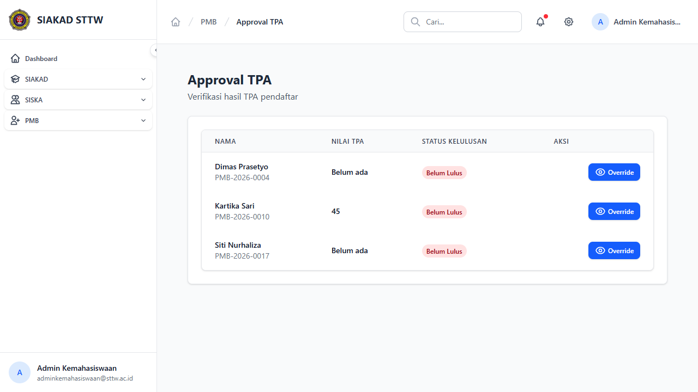

# Workflow Report: Approval PMB

**Tanggal**: 2026-04-13
**Role**: Admin Kemahasiswaan
**Modul**: PMB — Approval (Verifikasi)
**Status**: ✅ Berhasil

## Ringkasan

Halaman approval PMB terdiri dari 3 tab verifikasi: Verifikasi Berkas (tahap 1), Verifikasi Keuangan (tahap 2), dan Verifikasi TPA (tahap 3). Setiap tab menampilkan daftar pendaftar yang perlu diverifikasi dengan tombol Review.

## Langkah-langkah

### 1. Verifikasi Berkas

Halaman verifikasi berkas menampilkan daftar pendaftar yang perlu verifikasi dokumen. Tabel memiliki kolom Nama, Jalur, Tahap, Status, dan tombol Aksi (Review). Menampilkan pendaftar dengan berbagai status (New, Herregistrasi verified, Rejected step 1/5).

### 2. Verifikasi Keuangan

Halaman verifikasi keuangan menampilkan daftar pendaftar yang perlu verifikasi pembayaran. Pendaftar di tahap 2 dengan status Validated dan Rejected step 2 ditampilkan.

### 3. Verifikasi TPA

Halaman verifikasi TPA menampilkan daftar pendaftar yang perlu verifikasi nilai TPA. Pendaftar di tahap 3 dengan status Payment verified dan Rejected step 3 ditampilkan.

## Catatan

- Setiap tab approval menampilkan pendaftar yang relevan dengan tahap tersebut
- Tombol "Review" mengarah ke halaman detail pendaftar untuk melakukan approval/reject
- Status ditampilkan dengan badge berwarna sesuai kondisi
- Pendaftar yang sudah ditolak juga muncul di tab terkait untuk kemungkinan re-review
