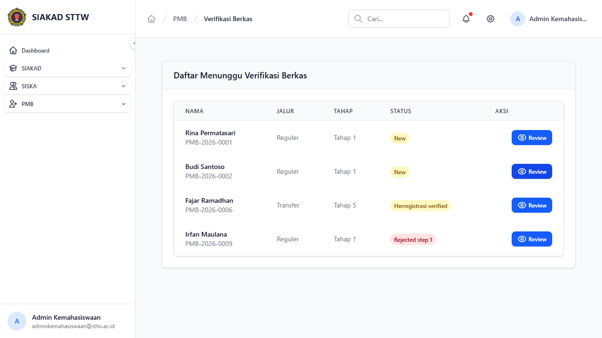
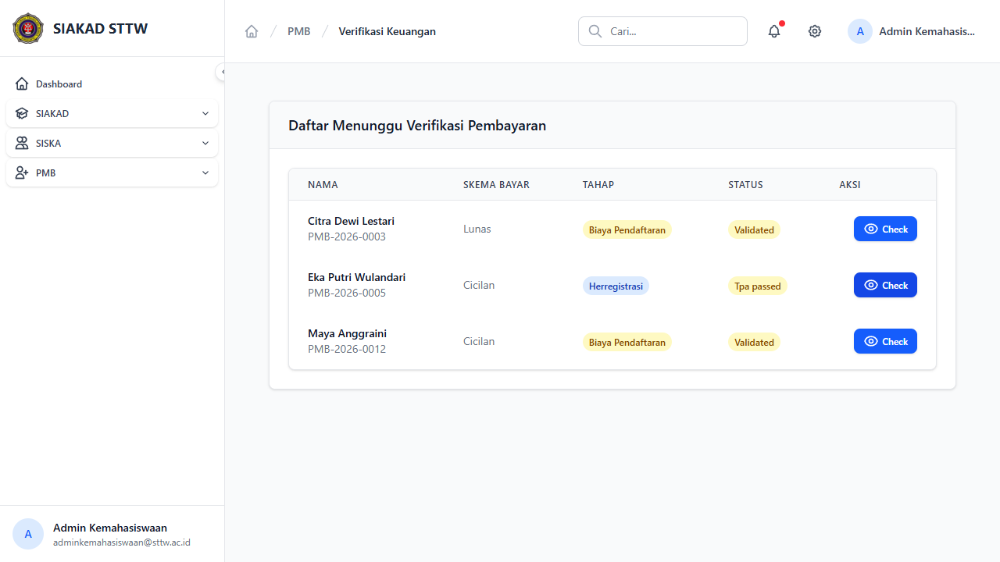
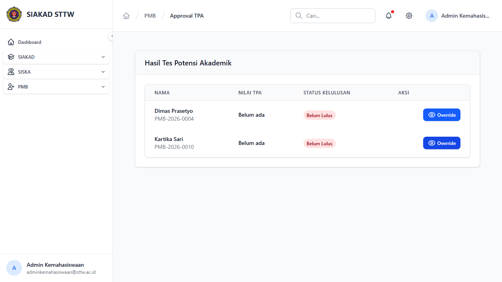
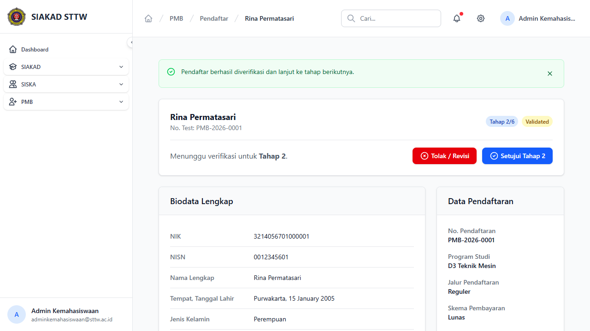
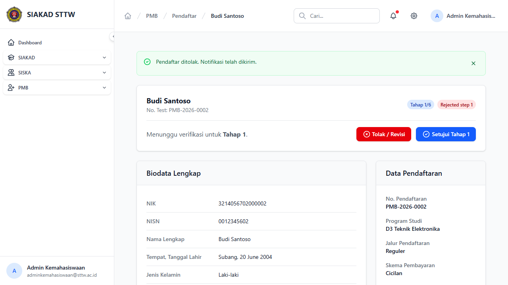

# Workflow Report: Approval & Verifikasi PMB

**Tanggal**: 2026-04-13
**Role**: Admin Kemahasiswaan
**Modul**: PMB — Approval (Berkas, Keuangan, TPA)
**Status**: ✅ Berhasil

## Ringkasan

Workflow approval/verifikasi pendaftar melalui 3 jalur: verifikasi berkas (tahap 1), verifikasi keuangan (tahap 2 & 4), dan approval TPA (tahap 3). Termasuk aksi approve dan reject dengan feedback.

## Langkah-langkah

### 1. Verifikasi Berkas

Daftar pendaftar yang menunggu verifikasi berkas:
- Kolom: Nama, Jalur, Tahap, Status, Aksi
- 4 pendaftar ditampilkan: 2 New (tahap 1), 1 Herregistrasi Verified (tahap 5), 1 Rejected Step 1
- Tombol "Review" untuk membuka detail pendaftar

### 2. Verifikasi Keuangan

Daftar pendaftar yang menunggu verifikasi pembayaran:
- Kolom: Nama, Skema Bayar, Tahap (Biaya Pendaftaran/Herregistrasi), Status, Aksi
- 3 pendaftar: Citra Dewi (Lunas, Biaya Pendaftaran), Eka Putri (Cicilan, Herregistrasi), Maya Anggraini (Cicilan, Biaya Pendaftaran)
- Tombol "Check" untuk verifikasi pembayaran

### 3. Approval TPA (Tes Potensi Akademik)

Daftar pendaftar yang perlu approval hasil TPA:
- Kolom: Nama, Nilai TPA, Status Kelulusan, Aksi
- 2 pendaftar: Dimas Prasetyo dan Kartika Sari — keduanya "Belum ada" nilai, "Belum Lulus"
- Tombol "Override" untuk meloloskan secara manual

### 4. Aksi: Approve Tahap 1 (Setujui)

Skenario approve Rina Permatasari dari Tahap 1 → Tahap 2:
- Klik "Setujui Tahap 1" pada detail pendaftar
- Muncul pesan sukses: "Pendaftar berhasil diverifikasi dan lanjut ke tahap berikutnya."
- Status berubah: Tahap 1/6 New → **Tahap 2/6 Validated**
- Tombol berubah menjadi "Setujui Tahap 2"

### 5. Aksi: Tolak Pendaftar (Reject)

Skenario reject Budi Santoso di Tahap 1:
- Klik "Tolak / Revisi" pada detail pendaftar
- Muncul pesan: "Pendaftar ditolak. Notifikasi telah dikirim."
- Status berubah: Tahap 1/6 New → **Tahap 1/6 Rejected step 1**
- Tombol aksi tetap tersedia untuk re-approve jika diperlukan

## Catatan

- Verifikasi berkas menampilkan semua pendaftar yang perlu review dokumen
- Verifikasi keuangan menampilkan pendaftar yang menunggu konfirmasi pembayaran (pendaftaran/herregistrasi)
- TPA override memungkinkan admin meloloskan calon tanpa ujian TPA (untuk kasus khusus)
- Setelah approve, pendaftar otomatis naik tahap dan statusnya berubah
- Pendaftar yang ditolak masih bisa di-approve ulang (tidak permanen)
