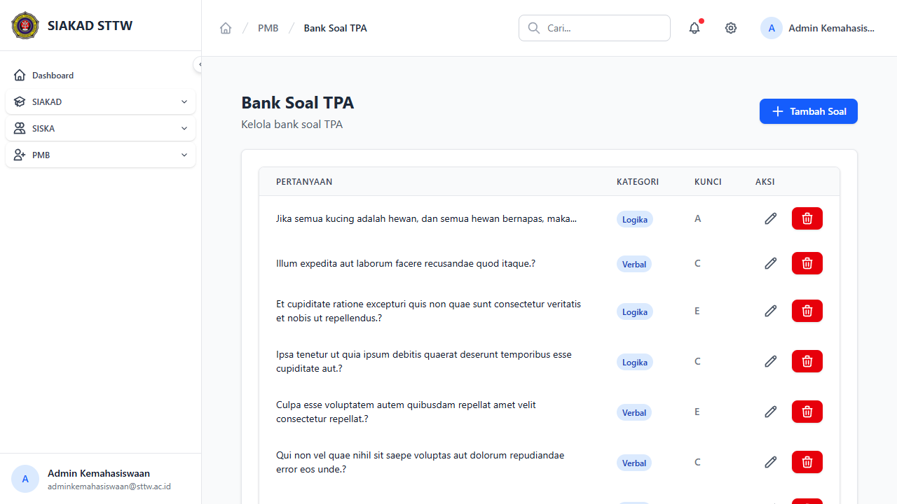
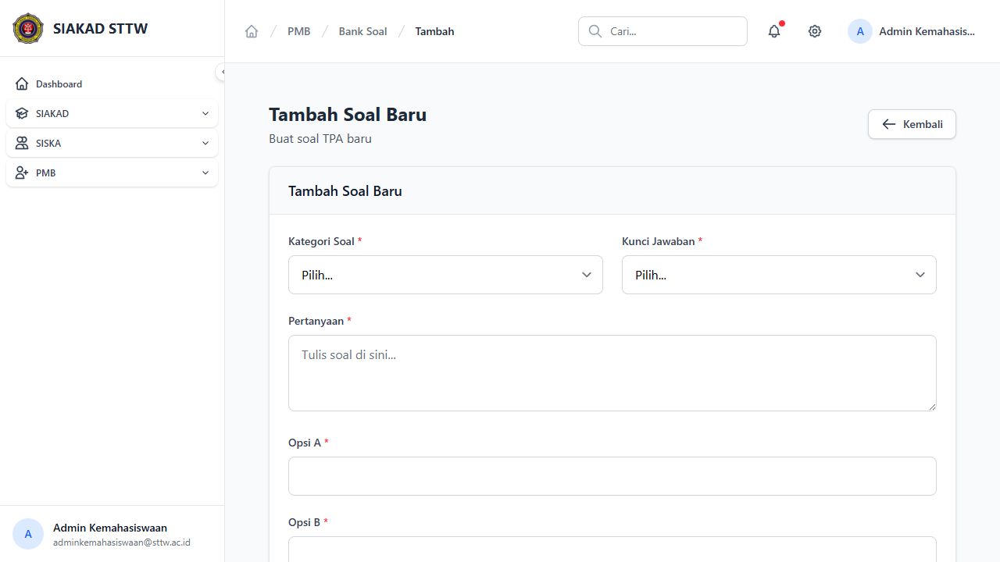
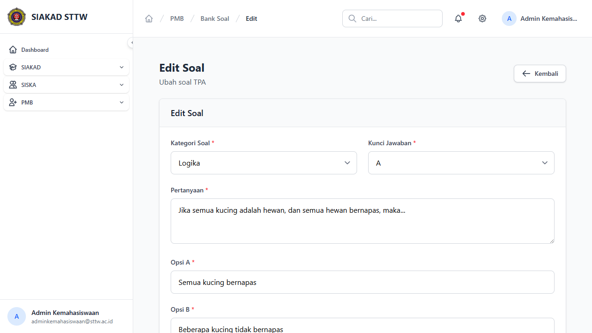

# Workflow Report: Bank Soal PMB

**Tanggal**: 2026-04-13
**Role**: Admin Kemahasiswaan
**Modul**: PMB — Bank Soal
**Status**: ✅ Berhasil

## Ringkasan

Halaman bank soal untuk mengelola soal-soal TPA (Tes Potensi Akademik) yang digunakan dalam ujian PMB.

## Langkah-langkah

### 1. Daftar Bank Soal

Halaman index menampilkan tabel soal dengan kolom Pertanyaan, Jenis, Tingkat Kesulitan, dan tombol Aksi. Terdapat tombol "Tambah Soal" di header.

### 2. Form Tambah Soal

Form create untuk menambah soal baru dengan field pertanyaan, pilihan jawaban (A–D), jawaban benar, jenis soal, dan tingkat kesulitan.

### 3. Form Edit Soal

Form edit untuk mengubah soal yang sudah ada dengan data terisi.

## Catatan

- Soal digunakan untuk ujian TPA pada tahap 3
- Mendukung multiple choice (A, B, C, D) dengan jawaban benar
- Terdapat kategori jenis soal dan tingkat kesulitan
